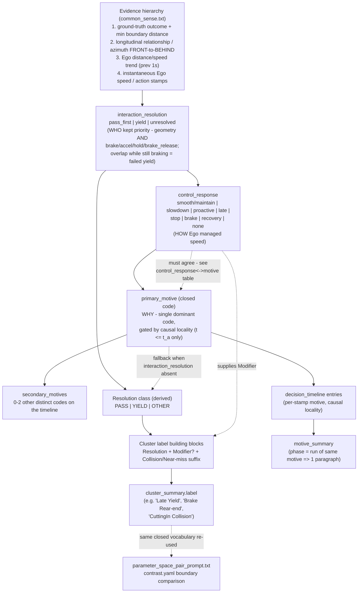

# Prompt Taxonomy Reference

**Not fed to the LLM.** This is engineering documentation for humans working on
`common_sense.txt`, `medoid_trial_prompt.txt`, `cluster_summary_prompt.txt`, and
`parameter_space_pair_prompt.txt`. Prompts are loaded by explicit filename
(`llm_pipeline/paths.py` → `PROMPT_TEMPLATES_DIR / name`), never by globbing this
folder, so adding this `.md` file here is safe and will never leak into a prompt.

Companion file: `app/llm_pipeline/docs/motive_schema_and_causal_locality.md` is the
dated **change log** (why each code was added/renamed, with the exact card that
triggered it). This file is the **current-state snapshot** — read this first to
understand the taxonomy as it stands; read the change log when you need the history
of *why* a specific value exists.

Paper referenced throughout: Chiu, Lin, Wang, Hu, Wang, *"Behavior-Centric Visual
Analytics for Scenario-Based Safety Evaluation of Autonomous Vehicles,"* IEEE T-ITS
2026 (submitted/in review) — local copy:
`gpl-odd-project/_IEEE_ITS_2026__Behavior_Centric_Visual_Analytics_for_Scenario_Based_Safety_Evaluation_of_Autonomous_Vehicles.pdf`,
plaintext extraction:
`gpl-odd-project/_IEEE_ITS_2026__Behavior_Centric_Visual_Analytics_for_Scenario_Based_Safety_Evaluation_of_Autonomous_Vehicles.txt`.
Citations below use `[Section/Fig, ~p.N]` (page numbers are approximate — the PDF's
two-column layout reorders in plain-text extraction — plus `[.txt L###-###]` pointing
at the exact, reproducible line range in the local extraction file so anyone can
jump straight to the source sentence.

---

## 1. Why a *closed* taxonomy at all

Two problems motivate a closed vocabulary instead of free-text motive descriptions:

1. **Comparability at scale.** The paper's own Design Goal G1 is "scalable and
   interpretable analysis of AV behaviors" — summaries must be comparable across
   thousands of trials, not one-off prose per trial
   `[Sec. II-D/III-A "G1", ~p.2-3, .txt L177-207]`. A free-text motive field cannot
   be aggregated, diffed across neighbors, or turned into a deterministic cluster
   `label`; a closed code can.
2. **Making unnamed behavior visible instead of hiding it in `unclear`.** This
   project's own history (see change-log §1 and §9) found that `unclear` was
   silently absorbing several *recurring, well-understood* patterns
   (`assertive_gap_acceptance`, `brake_release`, `post_clear_adjustment`,
   `post_clear_hard_brake`) simply because no code existed yet for them. Adding a
   named code each time is intentional — "the enum doing its job": an unnamed
   behavior becomes visible and auditable instead of being buried in prose.

The paper itself only defines a taxonomy at the **cluster** level (a human analyst
names a whole heatmap-confirmed cluster, e.g. "late-yield", after visual inspection —
`[Sec. III-D "Replayer"/IV, ~p.4,6-11]`). Our LLM pipeline needs a finer,
**per-timestamp** taxonomy at the single-trial level so that the cluster-level label
can later be *derived bottom-up* from the trial's timeline instead of being
freehanded. That per-timestamp layer (`primary_motive` / `secondary_motives`) is our
own design, built to be able to reconstruct every cluster label the paper uses. See
§3.3's "Origin" column for which codes are paper-derived and which are our
extension.

---

## 2. Logic graph — one medoid trial, field by field

Decision order matters: each field is constrained by the ones before it. This
mirrors `common_sense.txt`'s *"Filling `interaction_resolution` /
`control_response` / `primary_motive` / `secondary_motives` together"* section and
the fill-order note directly above the YAML fence in `medoid_trial_prompt.txt`.



ASCII fallback (identical structure, for viewers without Mermaid support):

```
Evidence hierarchy (ground truth > geometry > speed trend > instantaneous speed)
        │
        ▼
interaction_resolution (pass_first | yield | unresolved)   ── WHO ──┐
        │                                                          │
        ▼                                                          ▼
control_response (smooth/slowdown/proactive/late/stop/brake/   Resolution class
   recovery/none)                          ── HOW ──┐            (PASS/YIELD/OTHER)
        │                                            │                │
        │  (must agree — control_response<->motive   │                │
        │   table in common_sense.txt)                ▼                │
        └───────────────────────────────────►  primary_motive           │
                                                (closed code)  ── WHY ──┘
                                                    │
                                    ┌───────────────┼─────────────────┐
                                    ▼               ▼                 ▼
                          secondary_motives   decision_timeline   Cluster label
                          (0-2 other codes)   entries (per-stamp,  building blocks
                                               causal locality)   (Resolution +
                                                    │              Modifier? +
                                                    ▼              Collision suffix)
                                             motive_summary              │
                                          (1 paragraph per phase)        ▼
                                                                  cluster_summary.label
                                                                  (same closed vocabulary
                                                                   reused by
                                                                   parameter_space_pair_prompt.txt)
```

---

## 3. Field-by-field reference

### 3.1 `interaction_resolution` (medoid_trial.yaml) — WHO kept priority

| Value | Meaning | Paper anchor |
| --- | --- | --- |
| `pass_first` | Ego proceeds through: named vehicle behind, hold/accel into the gap, brake_release then continue, or FRONT→BEHIND while continuing. Covers paper's `pass-first`, `smooth-pass`, `pass-slowdown`, and post-pass `braking-rear-end`. Overlap while still braking is **not** this. | Case Study 1 C1 "pass-first" — angle shift green→pink, front-right→rear-left `[Sec. IV-A, ~p.6, .txt L611-613, Fig.6 caption ~p.7 L677-684]` |
| `yield` | Ego decelerates/stops to give way and named vehicle is not behind. Includes completed stay-ahead **and** failed yield (overlap/collision while still braking). Covers `proactive-yield`, `late-yield`, `yield`, `yield-stop-collision`. | Case Study 1 C3/C4 "proactive-yield"/"late-yield" — angle shift green→blue `[Sec. IV-A, ~p.6, .txt L615-622]`; Case Study 2 C3 "yield" `[Sec. IV-B, ~p.9, .txt L826-827, L936-940]`; Case Study 3 C3/C5 "yield"/"yield-stop-collision" `[Sec. IV-C, ~p.9-10, .txt L916-918, L1052-1054]` |
| `unresolved` | Conflict ends without a clear pass or yield state. | Our extension — not a named paper cluster; needed because some trials genuinely end ambiguous (e.g. collision mid-approach before any pass/yield state stabilizes). |

### 3.2 `control_response` (medoid_trial.yaml) — HOW Ego managed speed

| Value | Meaning | Paper anchor |
| --- | --- | --- |
| `smooth` / `maintain` | Little/no brake through or after the pass. | "smooth-pass" (C1, Case Study 3) — high speed maintained, gap widening `[Sec. IV-C, ~p.9, .txt L1044-1046, Fig.11 caption ~p.11 L1041-1056]` |
| `slowdown` | Gradual decelerate, still passes. | "pass-slowdown" (C6, Case Study 3) `[Sec. IV-C, ~p.9-10, .txt L917-918, L1049-1050]` |
| `proactive` | Brakes while named vehicle still far/early. | "proactive-yield" (C3, Case Study 1) — earlier braking, larger gaps than C4 `[Sec. IV-A, ~p.6, .txt L618-620, Fig.9 caption ~p.9 L897-906]` |
| `late` | Brakes only near peak. | "late-yield" (C4, Case Study 1) — later braking, smaller gaps `[Sec. IV-A, ~p.6, .txt L621-622]` |
| `stop` | Decelerates to near-zero. | "yield-stop-collision" (C5, Case Study 3) `[Sec. IV-C, ~p.9-10, .txt L917-918, L1052-1054]` |
| `brake` | Severe/abrupt brake, often post-pass. | "braking-rear-end" (C4, Case Study 3) — abrupt stop after passing, triggered by a projected-boundary collision-check against a *third* object, not the passed vehicle `[Sec. IV-C + Appendix D, ~p.9-10 & ~p.14-15, .txt L916-918, L1697-1731, Fig.15 ~p.15 L1753-1797]` |
| `recovery` | Post-clear accelerate / heading recover. | Implied by `post_clear_recovery` motive; not a named paper cluster label but appears as the resuming-speed segment inside "pass-first" arcs. |
| `none` | No distinctive control. | Our extension, for timelines with no brake stamp at all (needed as a safe default so `control_response` is never left unset). |

### 3.3 `primary_motive` / `secondary_motives` — closed motive codes (WHY)

This is the finer, **per-timestamp** layer the paper does not define directly (it
only labels whole clusters after the fact). Each code is designed so that, rolled
up across a medoid's timeline, it reconstructs one of the paper's cluster labels.

| Code | Meaning | Origin |
| --- | --- | --- |
| `yield_to_vehicle` | Ego decelerates/stops and the named vehicle keeps priority (relationship stays "named vehicle ahead"). | Paper-derived — rolls up into "yield" / "proactive-yield" / "late-yield" `[Sec. IV-A/B, ~p.6&9]` |
| `early_brake` | Sustained decelerate begins while TTC > 3.5 s or vehicle outside conflict zone, Ego stays behind. | Paper-derived — the mechanism behind "proactive-yield" `[Sec. IV-A, ~p.6, .txt L618-620]` |
| `late_reaction` | First strong decelerate/EMERGENCY_BRAKE only near peak, Ego stays behind. | Paper-derived — the mechanism behind "late-yield" `[Sec. IV-A, ~p.6, .txt L621-622]` |
| `gap_acceptance_creep` | Ego keeps a low non-zero speed into the conflict instead of stopping. | Our extension (project data pattern; distinguishes "still moving, still yielding" from a full `stop`). |
| `assertive_gap_acceptance` | Ego holds/increases speed into a closing gap before peak, no brake. | Our extension — added after batch9/cluster1 had no legal code for "accelerates into a closing gap, ttc_min=0.36s" and fell to `unclear` (change-log §1). Rolls up into "pass-first"/"smooth-pass". |
| `maintain_through` | \|Δv\| ≲ 2 m/s across the conflict window, no brake. | Paper-derived — "smooth-pass" mechanism `[Sec. IV-C, ~p.9, .txt L1044-1046]` |
| `post_clear_recovery` | Accelerate or same-lane turn after peak, vehicle already behind. | Paper-adjacent — the "resuming speed" segment implicit in "pass-first" arcs; not a standalone paper label but needed to distinguish resuming from a new conflict. |
| `post_clear_hard_brake` | Severe/abrupt decelerate strictly after peak, unrelated to the passed vehicle re-closing — creates rear-end risk. | **Paper-derived, added 2026-08-29.** Names the exact Case Study 3 "braking-rear-end" (C4) mechanism, including its *root cause* (a projected right-boundary check against a static obstacle, not the just-passed vehicle) `[Sec. IV-C + Appendix D, ~p.9-10 & ~p.14-15, .txt L916-918, L1697-1731]`. Gap found by re-reading the paper for this doc; see change-log §10. |
| `vehicle_driven_swerve` | Same-lane TURN_* inside the conflict window, moderate+ lateral effect. | Our extension (project data pattern; paper's case studies are longitudinal-dominant). |
| `brake_release` | Ego ends/eases an active decelerate **before** peak/outcome while still near/very-close. | Our extension — added after 2 of 3 medoid cards in `batch8/3_cluster_s=0.8032` showed this exact pattern falling to `unclear` (change-log §9); renamed from `unresolved_brake_release` for clarity. Direct precursor to a collision. |
| `post_clear_adjustment` | Light/moderate decelerate (or short accelerate) strictly after peak, vehicle not re-closing. | Our extension — same review as `brake_release`; distinguishes ordinary follow-distance correction from `post_clear_recovery` (change-log §9). |
| `unclear` | Metrics/BEV genuinely disagree, or evidence is missing. | Fallback of last resort — gated behind the full precedence list above so it is never used just because an action "doesn't feel assertive or recovery." |

### 3.4 Resolution class (derived, closed set — used to build `cluster_summary.label`)

| Source | Resolution class | Paper anchor |
| --- | --- | --- |
| `interaction_resolution=pass_first` | PASS | See §3.1 |
| `interaction_resolution=yield` | YIELD | See §3.1 |
| `assertive_gap_acceptance` / `maintain_through` / `post_clear_recovery` | PASS | fallback when `interaction_resolution` absent |
| `post_clear_hard_brake` | PASS (risk modifier) | "braking-rear-end" is still a *pass* that goes wrong afterward, not a yield `[Sec. IV-C, ~p.9-10]` |
| `yield_to_vehicle` (Ego remains behind) | YIELD | fallback |
| `early_brake` + still behind | YIELD | fallback |
| `gap_acceptance_creep` | YIELD (creeping) | fallback |
| `late_reaction` / `brake_release` | modifier only — combine with resolution | fallback |
| `vehicle_driven_swerve` | OTHER (lateral resolution) | our extension |
| `unclear` / `unresolved` | OTHER | fallback |

### 3.5 Cluster label building blocks (`[Resolution][ Modifier][ Collision\|Near-miss]`)

| Block | Values | Paper anchor |
| --- | --- | --- |
| Resolution | `Pass-First`, `Pass`, `Yield`, or `<Named vehicle> Collision` | Direct paper cluster names, Title Case `[Sec. IV, ~p.6-10]` |
| Modifier | `Smooth`, `Slowdown`, `Proactive`, `Late`, `Creep`, `Stop`, `Brake` | Direct paper cluster names except `Creep` (our extension for `gap_acceptance_creep`, no paper equivalent) |
| Outcome suffix | `Collision`, `Near-miss`, or omitted | Paper's `*-collision` clusters map to the suffix; `Near-miss` is our extension (paper only reports safe/collision, not a near-miss class) |

Named-vehicle collision labels (`CuttingIn Collision`, `Oncoming Collision`,
`Parking Collision`) mirror the paper's `cut-in-collision` (Case Study 3),
`opposite-collision` (Case Study 2, renamed here to `Oncoming` per this project's
agent-naming convention — see `agent_labels.py`), and `parked-collision` (Case
Study 2, renamed to `Parking`) `[Sec. IV-B/C, ~p.9-10, .txt L825-827, L917]`.

### 3.6 Reuse in `parameter_space_pair_prompt.txt` and `cluster_summary_prompt.txt`

Both prompts re-use the *same* closed vocabulary rather than defining their own:
`cluster_summary_prompt.txt` looks up the medoid's `interaction_resolution` /
`primary_motive` in the Resolution-class table (§3.4) and composes `label` only from
§3.5's blocks (see its own §"Label (deterministic, closed vocabulary)"). This is
intentional — it is what lets a cluster's label be *derived*, not freehanded, from
the same terms a human analyst would use when reading the paper's figures.

`parameter_space_pair_prompt.txt` fills `interaction_resolution` /
`control_response` / `primary_motive` **per side** (`left`/`right`), one closed
motive code each (no `secondary_motives` — a boundary-comparison side is
intentionally coarser than a full medoid timeline). It follows the same fill
order and the same `control_response`↔motive consistency table as
`medoid_trial_prompt.txt` (§3.2) — see §7.2 for a gap found and fixed here.

---

## 4. When to adjust this taxonomy

1. If a recurring, real pattern keeps landing in `unclear` (or gets force-fit into
   a code whose gating condition doesn't quite match), that is the signal to add a
   code — do not paper over it. This has happened three times already:
   `assertive_gap_acceptance`, `brake_release`/`post_clear_adjustment`, and
   `post_clear_hard_brake` (change-log §1, §9, §10).
2. Check first whether the reference paper already names the pattern at the
   cluster level (Section IV, Figs. 6/9/10/11/14/15, or the Appendices). If yes,
   design the new trial-level code so that it rolls up into that exact paper term
   — that keeps this project's cluster labels traceable back to the paper's
   vocabulary (§3.3's "Origin" column shows this mapping for every code).
3. Add the code to `common_sense.txt`'s motive table with a **testable gating
   condition** (a metric threshold or timeline pattern, not a vibe), slot it into
   the precedence list *before* `unclear`, and wire it into both the Resolution
   class table (§3.4) and the Cluster label building blocks (§3.5) so
   `cluster_summary_prompt.txt` can still compose a label from it.
4. If the new code changes what `control_response` it pairs with, update the
   `control_response` ↔ motive consistency table in `common_sense.txt` too — a
   card must never emit a `control_response`/`primary_motive` pair that
   contradicts each other.
5. Record the change as a new dated section in
   `docs/motive_schema_and_causal_locality.md` (what pattern triggered it, which
   card/cluster, what the old behavior was) — that file is the audit trail. Then
   update the relevant table(s) in *this* file so it stays a correct snapshot.
6. No Python enum enforces this taxonomy (verified: nothing in
   `app/llm_pipeline/python` or `app/analyzer/src` validates motive codes against a
   fixed list) — the only guardrail is prompt wording, which is exactly why steps
   3-5 matter.

---

## 5. External literature consulted (context only — not adopted 1:1)

The paper (§0) is the primary authority for this project's vocabulary because its
case-study labels are this pipeline's target output. The following were checked
for additional grounding but deliberately **not** merged into the closed set,
to keep it small enough for an LLM to apply consistently under the causal-locality
rule:

- Markkula et al. (2020), general taxonomy of human road-user interaction
  strategies, and its refinement in Rothenbücher/Sadigh et al., *"A taxonomy of
  strategic human interactions in traffic conflicts,"* arXiv:2109.13367 —
  right-of-way claiming / responsive vs. unresponsive adherence / assertive
  adherence. Conceptually similar to our `interaction_resolution` +
  `control_response` split (who claims priority vs. how), but at a finer
  game-theoretic grain than needed here.
- van Haperen et al. (2018) yielding classification (no-yield / active-yield /
  passive-yield), as used in Fu, Farah et al., *"Analysis of Implicit
  Communication of Motorists and Cyclists..."*, Frontiers in Psychology, 2022 —
  the active/passive distinction (already-ahead-but-yields vs.
  already-behind-and-stays-behind) is partially captured by our
  `control_response` proactive/late timing axis, but we did not add it as a
  separate field since it would duplicate information already recoverable from
  `interaction_resolution` + the timeline's brake-onset timing.
- ISO 34502:2022, ISO 21448:2022, UN Regulation No. 157 — cited directly by the
  paper as scenario-based safety-evaluation standards `[paper refs 1-3]`; these
  define ODD/scenario framework concepts, not per-trial behavior codes.
- BSI Flex 1891:2025 ("Behaviour taxonomy for ADS applications") and ISO
  34504:2024 ("Scenario categorization") — broader, hierarchical
  signaling/positioning/maneuver taxonomies for whole ADS competencies. Useful
  future reference if this pipeline ever needs to classify *maneuver-level*
  competencies rather than single-conflict motives, but out of scope for the
  current closed set.

---

## 6. References

- Chiu, S.-Y., Lin, W.-C., Wang, Y.-S., Hu, C.-H., Wang, C.-C. *"Behavior-Centric
  Visual Analytics for Scenario-Based Safety Evaluation of Autonomous Vehicles."*
  IEEE Transactions on Intelligent Transportation Systems, 2026. Local copy in
  this repo (see header of this document).
- Rothenbücher, D. et al. *"A taxonomy of strategic human interactions in traffic
  conflicts."* [arXiv:2109.13367](https://arxiv.org/abs/2109.13367)
- Fu, T. et al. *"Analysis of Implicit Communication of Motorists and Cyclists in
  Intersection Using Video and Trajectory Data."* Frontiers in Psychology, 2022.
  [DOI link](https://www.frontiersin.org/articles/10.3389/fpsyg.2022.864488/pdf)
- BSI Flex 1891:2025-01, *"Behaviour taxonomy for automated driving system (ADS)
  applications — Specification."*
  [knowledge.bsigroup.com](https://knowledge.bsigroup.com/products/behaviour-taxonomy-for-automated-driving-system-ads-applications-specification)
- ISO 34504:2024, *"Road vehicles — Test scenarios for automated driving systems —
  Scenario categorization."* [iso.org/standard/78953.html](https://www.iso.org/standard/78953.html)
- ISO 21448:2022 (SOTIF), ISO 34502:2022, UN Regulation No. 157 — cited via the
  reference paper's own bibliography [1]-[3].

---

## 7. Structural review log (2026-08-29)

Cross-read all four prompt files (`common_sense.txt`, `medoid_trial_prompt.txt`,
`parameter_space_pair_prompt.txt`, `cluster_summary_prompt.txt`) end-to-end for
redundancy and cross-file contradiction. Found and fixed three real issues (plus
one bug in this doc itself); everything else checked out — same closed-value
sets, same field names, matching open/close tags, and no other unresolved
cross-file conflicts.

### 7.1 Stale precedence-check cross-references (`medoid_trial_prompt.txt`)

When `post_clear_hard_brake` was added (§3.3), the "check before defaulting to
`unclear`" reminder is repeated in **three** places in
`medoid_trial_prompt.txt` (Step 0's CoT instruction, the Lexicon's conclude-clause
note, and the Motive summary guide's rules) plus once in `common_sense.txt`.
Only two of the four were updated at the time — the CoT instruction and the
Motive summary guide rule still enumerated just `brake_release` /
`post_clear_adjustment`, silently missing the new code. **Fixed:** all four
mentions now list all three codes. This kind of drift is the risk of repeating
an enumerated list in multiple places instead of pointing at one source of
truth — worth watching for again the next time a code is added (see §4 step 3-4).

### 7.2 `parameter_space_pair_prompt.txt` never asked for `control_response`

The workflow's Step 4/5 ("Left/Right mini-motive") only instructed the model to
produce `interaction_resolution` + one motive code + evidence — but the output
YAML schema requires `control_response` per side too (it was presumably added to
the schema without a matching CoT step). Left un-fixed, the model would have to
infer on its own that it needs this field, with no guidance and no reminder that
it must agree with `primary_motive`. This prompt also never referenced the
`control_response`↔motive consistency table added to `common_sense.txt` and
`medoid_trial_prompt.txt` earlier the same day (§3.2), so it would have been the
one place left in the pipeline where a contradictory `control_response`/
`primary_motive` pair could still slip through unnoticed. **Fixed:** Step 4/5
now name `control_response` explicitly and require it to agree with the motive
per common_sense's table; the Output section now states the same
`interaction_resolution → control_response → primary_motive` fill order used by
`medoid_trial_prompt.txt`.

### 7.3 Unresolved ambiguity: `yield_to_vehicle` vs. `early_brake`/`late_reaction`

This was a **known, previously documented** gap — `docs/motive_schema_and_causal_locality.md`
§5.3 flags the exact same ambiguity found live in `batch8/6_cluster_s=0.6113`
("is braking at 7.8s a `yield_to_vehicle` or a `late_reaction`... both are
defensible under the current gating conditions, which means the gate wording is
under-specified"). Re-reading `common_sense.txt`'s motive table confirms it was
never actually resolved: `yield_to_vehicle`'s gate ("Ego decelerates/stops and
the named vehicle keeps priority") and `early_brake`/`late_reaction`'s gates (a
TTC-timed brake onset while Ego stays behind) can both legally fire on the same
yielding arc, with no tie-breaker for which is `primary_motive` — and the choice
is not cosmetic, since it changes the composed cluster `label` (bare "Yield" vs.
"Proactive Yield" vs. "Late Yield", §3.5).

The `control_response`↔motive consistency table added earlier the same day
(§3.2) turns out to already resolve this *structurally*, once the fill order is
followed: `control_response=proactive` pairs only with `early_brake`, and
`control_response=late` pairs only with `late_reaction`/`brake_release`, so
`yield_to_vehicle` is mechanically excluded as `primary_motive` whenever
`control_response` is `proactive` or `late`. This link was implicit and easy to
miss (the `yield_to_vehicle` row never mentions `control_response` at all).
**Fixed:** added an explicit note directly below the consistency table in
`common_sense.txt` spelling out that `yield_to_vehicle` should only be
`primary_motive` when `control_response=stop` or a creeping arc — not
`proactive`/`late` — closing the loop that §5.3 of the change log left open.

### 7.4 Also fixed in this document

Line 53 (§1) referenced "§4" for where paper-derived vs. our-extension codes are
distinguished; that information actually lives in §3.3's "Origin" column. Fixed
the cross-reference. §3.6 was also expanded to describe
`parameter_space_pair_prompt.txt`'s fill order now that §7.2 added it.
