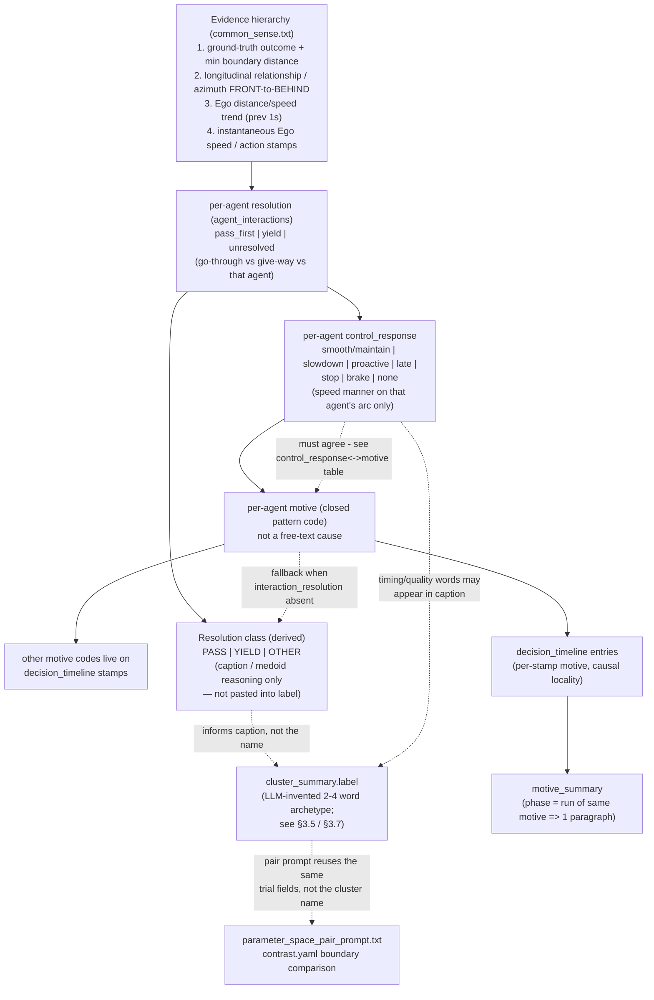

# Prompt Taxonomy Reference

**Not fed to the LLM.** This is engineering documentation for humans working on
`common_sense.txt`, `medoid_trial_prompt.txt`, `cluster_summary_prompt.txt`, and
`parameter_space_pair_prompt.txt`. Prompts are loaded by explicit filename
(`llm_pipeline/paths.py` → `PROMPT_TEMPLATES_DIR / name`), never by globbing this
folder, so adding this `.md` file here is safe and will never leak into a prompt.

Companion file: `app/llm_pipeline/docs/motive_schema_and_causal_locality.md` is the
dated **change log** (why each code was added/renamed, with the exact card that
triggered it). This file is the **current-state snapshot** — read this first to
understand the taxonomy as it stands; read the change log when you need the history
of *why* a specific value exists.

Paper referenced throughout: Chiu, Lin, Wang, Hu, Wang, *"Behavior-Centric Visual
Analytics for Scenario-Based Safety Evaluation of Autonomous Vehicles,"* IEEE T-ITS
2026 (submitted/in review) — local copy:
`gpl-odd-project/_IEEE_ITS_2026__Behavior_Centric_Visual_Analytics_for_Scenario_Based_Safety_Evaluation_of_Autonomous_Vehicles.pdf`,
plaintext extraction:
`gpl-odd-project/_IEEE_ITS_2026__Behavior_Centric_Visual_Analytics_for_Scenario_Based_Safety_Evaluation_of_Autonomous_Vehicles.txt`.
Citations below use `[Section/Fig, ~p.N]` (page numbers are approximate — the PDF's
two-column layout reorders in plain-text extraction — plus `[.txt L###-###]` pointing
at the exact, reproducible line range in the local extraction file so anyone can
jump straight to the source sentence.

---

## 1. Why a *closed* taxonomy at all

Two problems motivate a closed vocabulary instead of free-text motive descriptions:

1. **Comparability at scale.** The paper's own Design Goal G1 is "scalable and
   interpretable analysis of AV behaviors" — summaries must be comparable across
   thousands of trials, not one-off prose per trial
   `[Sec. II-D/III-A "G1", ~p.2-3, .txt L177-207]`. A free-text motive field cannot
   be aggregated, diffed across neighbors, or turned into a deterministic cluster
   `label`; a closed code can.
2. **Making unnamed behavior visible instead of hiding it in `unclear`.** This
   project's own history (see change-log §1 and §9) found that `unclear` was
   silently absorbing several *recurring, well-understood* patterns
   (`assertive_gap_acceptance`, `brake_release`, `post_clear_adjustment`,
   `post_clear_hard_brake`) simply because no code existed yet for them. Adding a
   named code each time is intentional — "the enum doing its job": an unnamed
   behavior becomes visible and auditable instead of being buried in prose.

The paper itself only defines a taxonomy at the **cluster** level (a human analyst
names a whole heatmap-confirmed cluster, e.g. "late-yield", after visual inspection —
`[Sec. III-D "Replayer"/IV, ~p.4,6-11]`). Our LLM pipeline needs a finer,
**per-timestamp** taxonomy at the single-trial level. Cluster `label` is then
invented as a short 2–4 word outcome archetype (§3.5), informed by that trial
taxonomy (and reviewed across clusters in §3.7) — not composed by concatenating
motive codes. The per-timestamp layer (`primary_motive` / `secondary_motives`) is
our own design, built so every paper cluster name remains reconstructable from
evidence. See §3.3's "Origin" column for which codes are paper-derived and which
are our extension.

---

## 2. Logic graph — one medoid trial, field by field

Decision order matters: each field is constrained by the ones before it. This
mirrors `common_sense.txt`'s *Filling `agent_interactions`* section (per-agent
resolution / control / motive on that agent's conflict arc) and the fill-order note above the YAML
fence in `medoid_trial_prompt.txt`. Pair contrast still uses per-side top-level
fields.



ASCII fallback (identical structure, for viewers without Mermaid support):

```
Evidence hierarchy (ground truth > geometry > speed trend > instantaneous speed)
        │
        ▼
per-agent resolution (pass_first | yield | unresolved) ── go-through vs give-way ──┐
        │                                                                        │
        ▼                                                                        ▼
control_response (smooth/slowdown/proactive/late/stop/brake/   Resolution class
   none) — that agent's arc only      ── speed manner ──┐      (PASS/YIELD/OTHER)
        │                                            │           caption/reasoning only
        │  (must agree — control_response<->motive   │                │
        │   table in common_sense.txt)                ▼                │
        └───────────────────────────────────►  per-agent motive           │
                                                (closed pattern) ── code ─┘
                                                    │
                                    ┌───────────────┼─────────────────┐
                                    ▼               ▼                 ▼
                          secondary_motives   decision_timeline   cluster_summary.label
                          (0-2 other codes)   entries (per-stamp,  (LLM-invented 2-4
                                               causal locality)    word archetype;
                                                    │              informed by, not
                                                    ▼              concatenated from,
                                             motive_summary        resolution/motive)
```

---

## 3. Field-by-field reference

**Rank 1 (current LLM schema).** The model writes `agent_interactions[].resolution` only (`pass_first` / `yield` / `unresolved`), plus timeline `description` and `motive_summary`. Row `control_response` and row `motive` are **retired** — do not put them back in a prompt. §§3.2–3.3 and the pairing tables below are the historical codebook, not the fence. Paper compounds (`Late Yield`) are `cluster_summary.label` only.

### 3.1 `resolution` — go-through vs give-way

| Value | Meaning | Paper anchor |
| --- | --- | --- |
| `pass_first` | Ego proceeds through: named vehicle behind, hold/accel into the gap, brake_release then continue, or FRONT→BEHIND while continuing. Covers paper's `pass-first`, `smooth-pass`, `pass-slowdown`, and post-pass `braking-rear-end`. Overlap while still braking is **not** this. | Case Study 1 C1 "pass-first" — angle shift green→pink, front-right→rear-left `[Sec. IV-A, ~p.6, .txt L611-613, Fig.6 caption ~p.7 L677-684]` |
| `yield` | Ego decelerates/stops to give way and named vehicle is not behind. Includes completed stay-ahead **and** failed yield (overlap/collision while still braking). Covers `proactive-yield`, `late-yield`, `yield`, `yield-stop-collision`. | Case Study 1 C3/C4 "proactive-yield"/"late-yield" — angle shift green→blue `[Sec. IV-A, ~p.6, .txt L615-622]`; Case Study 2 C3 "yield" `[Sec. IV-B, ~p.9, .txt L826-827, L936-940]`; Case Study 3 C3/C5 "yield"/"yield-stop-collision" `[Sec. IV-C, ~p.9-10, .txt L916-918, L1052-1054]` |
| `unresolved` | Conflict ends without a clear pass or yield state. | Our extension — not a named paper cluster; needed because some trials genuinely end ambiguous (e.g. collision mid-approach before any pass/yield state stabilizes). |

The LLM authors **only** `agent_interactions` (named vehicle first, then any
other agent Ego reacted to). Medoid YAML must not keep top-level
`interaction_resolution` / `control_response` / `primary_motive` /
`secondary_motives`; the pipeline strips them if the model still emits them.
Secondary-agent metrics in context are facts; after the named vehicle is
behind, a FRONT secondary on the same stamp/BEV is a separate row, not
furniture.

### 3.2 `control_response` — speed manner on that agent's arc

| Value | Meaning | Paper anchor |
| --- | --- | --- |
| `smooth` / `maintain` | Little/no brake through or after the pass. | "smooth-pass" (C1, Case Study 3) — high speed maintained, gap widening `[Sec. IV-C, ~p.9, .txt L1044-1046, Fig.11 caption ~p.11 L1041-1056]` |
| `slowdown` | Gradual decelerate, still passes. | "pass-slowdown" (C6, Case Study 3) `[Sec. IV-C, ~p.9-10, .txt L917-918, L1049-1050]` |
| `proactive` | Brakes while named vehicle still far/early. | "proactive-yield" (C3, Case Study 1) — earlier braking, larger gaps than C4 `[Sec. IV-A, ~p.6, .txt L618-620, Fig.9 caption ~p.9 L897-906]` |
| `late` | Brakes only near peak. | "late-yield" (C4, Case Study 1) — later braking, smaller gaps `[Sec. IV-A, ~p.6, .txt L621-622]` |
| `stop` | Decelerates to near-zero. | "yield-stop-collision" (C5, Case Study 3) `[Sec. IV-C, ~p.9-10, .txt L917-918, L1052-1054]` |
| `brake` | Severe/abrupt brake **vs this row's agent**. Paper "braking-rear-end" belongs on the agent ahead (third object / Parking), not on the vehicle already passed. | "braking-rear-end" (C4, Case Study 3) — abrupt stop after passing, triggered by a projected-boundary collision-check against a *third* object `[Sec. IV-C + Appendix D, ~p.9-10 & ~p.14-15, .txt L916-918, L1697-1731, Fig.15 ~p.15 L1753-1797]` |
| `none` | No distinctive speed control vs this agent. | Our extension. |

**Arc window.** `control_response` and row `motive` use only stamps concluded **toward that agent**, from first engagement until that agent's pass/yield/unresolved is decided. Later stamps toward another agent do not rewrite this row. Resume-driving (accel / heading change with nobody left in conflict) is timeline `motive: null`, not a `control_response` value.

**Retired (2026-09-14):** `control_response=recovery` and motive `post_clear_recovery`. Under per-agent rows, hanging "resume after pass" on the passed vehicle ignored later agents (e.g. Parking). See §9.

### 3.3 Closed motive codes — named pattern, not a causal why

This is the finer, **per-timestamp** layer the paper does not define directly (it
only labels whole clusters after the fact). Each code names a **pattern** so
that, rolled up across a medoid's timeline, it reconstructs one of the paper's
cluster labels. It is **not** a causal why (`assertive_gap_acceptance` /
`maintain_through` are pass styles, same family as `smooth`/`maintain`).

| Code | Meaning | Origin |
| --- | --- | --- |
| `yield_to_vehicle` | Ego decelerates/stops and the named vehicle keeps priority (relationship stays "named vehicle ahead"). | Paper-derived — rolls up into "yield" / "proactive-yield" / "late-yield" `[Sec. IV-A/B, ~p.6&9]` |
| `early_brake` | Sustained decelerate begins while TTC > 3.5 s or vehicle outside conflict zone, Ego stays behind. | Paper-derived — the mechanism behind "proactive-yield" `[Sec. IV-A, ~p.6, .txt L618-620]` |
| `late_reaction` | First strong decelerate/EMERGENCY_BRAKE only near peak, Ego stays behind. | Paper-derived — the mechanism behind "late-yield" `[Sec. IV-A, ~p.6, .txt L621-622]` |
| `gap_acceptance_creep` | Ego keeps a low non-zero speed into the conflict instead of stopping. | Our extension (project data pattern; distinguishes "still moving, still yielding" from a full `stop`). |
| `assertive_gap_acceptance` | Ego holds/increases speed into a closing gap before peak, no brake. | Our extension — added after batch9/cluster1 had no legal code for "accelerates into a closing gap, ttc_min=0.36s" and fell to `unclear` (change-log §1). Rolls up into "pass-first"/"smooth-pass". |
| `maintain_through` | \|Δv\| ≲ 2 m/s across **this agent's** conflict window, no brake vs that agent. | Paper-derived — "smooth-pass" mechanism `[Sec. IV-C, ~p.9, .txt L1044-1046]` |
| `post_clear_hard_brake` | Severe/abrupt decelerate toward the agent this row is about (often after someone else was already passed). Creates rear-end risk for whoever is behind Ego. | **Paper-derived.** Case Study 3 "braking-rear-end" (C4) — put this on the third object / Parking row, not on CuttingIn `[Sec. IV-C + Appendix D, ~p.9-10 & ~p.14-15, .txt L916-918, L1697-1731]`. |
| ~~`post_clear_recovery`~~ | **Retired 2026-09-14.** Resume-driving is not an interaction with the passed agent. Timeline `motive: null` when nobody is left in conflict. | Was paper-adjacent "resuming speed"; multi-agent cards showed it mis-attributing later Parking brakes or resume segments to CuttingIn. |
| `vehicle_driven_swerve` | Same-lane TURN_* inside the conflict window, moderate+ lateral effect. | Our extension (project data pattern; paper's case studies are longitudinal-dominant). |
| `brake_release` | Ego ends/eases an active decelerate **before** peak/outcome while still near/very-close. | Our extension — added after 2 of 3 medoid cards in `batch8/3_cluster_s=0.8032` showed this exact pattern falling to `unclear` (change-log §9); renamed from `unresolved_brake_release` for clarity. Direct precursor to a collision. |
| `post_clear_adjustment` | Light/moderate decelerate strictly after **this** agent's peak, that agent not re-closing, no other agent ahead. Follow-distance correction vs that agent — not resume-driving. | Our extension (change-log §9); short accelerate after clear is no longer this code (use `null`). |
| `unclear` | Metrics/BEV genuinely disagree, or evidence is missing. | Fallback of last resort — gated behind the precedence list so it is never used just because an action "doesn't feel assertive." |

### 3.4 Resolution class (derived, closed set — caption / medoid reasoning only)

Not pasted into `cluster_summary.label` (that field is an LLM-invented 2–4 word
archetype; see §3.5). This table is the fallback map when a prompt needs to talk
PASS vs YIELD vs OTHER without dumping motive codes into the name.

| Source | Resolution class | Paper anchor |
| --- | --- | --- |
| `interaction_resolution=pass_first` | PASS | See §3.1 |
| `interaction_resolution=yield` | YIELD | See §3.1 |
| `assertive_gap_acceptance` / `maintain_through` | PASS | fallback when `interaction_resolution` absent |
| `post_clear_hard_brake` | PASS (risk modifier) | "braking-rear-end" is still a *pass* that goes wrong afterward, not a yield `[Sec. IV-C, ~p.9-10]` |
| `yield_to_vehicle` (Ego remains behind) | YIELD | fallback |
| `early_brake` + still behind | YIELD | fallback |
| `gap_acceptance_creep` | YIELD (creeping) | fallback |
| `late_reaction` / `brake_release` | modifier only — combine with resolution | fallback |
| `vehicle_driven_swerve` | OTHER (lateral resolution) | our extension |
| `unclear` / `unresolved` | OTHER | fallback |

### 3.5 Cluster labels (LLM-composed — open vocabulary)

`cluster_summary.yaml` `label` is **invented by the summary LLM**, one cluster
at a time (each call sees only that cluster's medoid/pair evidence — no
sibling labels, no cross-cluster context). There is no deterministic Pass
A/Pass B name assignment and no hardcoded actor→label table.

Target: 2–4 words, one outcome archetype, paper-heatmap style — not a readout
of the motive codes above. Pasting motive codes into the name
(`assertive_gap_acceptance` → "Assertive Gap…") or chaining more than one
mechanism ("Assertive Gap Late Yield Collision") is a defect, not a feature;
motive/timing detail belongs in `caption` only.

Closed style set (prefer these; invent a new 2–4 word archetype only if none fit):

| Example label | Typical evidence (sketch) |
| --- | --- |
| `Brake Rear-end` | Following vehicle strikes Ego from behind after pass / post-pass brake |
| `Yield-Stop Collision` | Yield family + ego near-stop at contact |
| `Side Collision` | Lateral / side impact geometry |
| `Stationary Collision` | Partner ≈ stopped at contact |
| `Smooth Pass` / `Pass-Slowdown` / `Yield` / `Proactive Yield` / `Late Yield` | Safe / timing arcs |
| `Cut-in Collision` | Useful when naming the actor helps and geometry is unclear |

Paper names such as `cut-in-collision` / `parked-collision` / `opposite-collision`
are historical references only — not forced pipeline outputs.

Because each cluster is labeled independently, duplicate or near-duplicate
names across clusters, or one cluster's label drifting into a mechanism
chain, are only caught **after the fact** — see §3.7.

### 3.6 Reuse in `parameter_space_pair_prompt.txt` and `cluster_summary_prompt.txt`

`cluster_summary_prompt.txt` invents `label` plus caption / neighbor verdicts,
per cluster, independently — no sibling-label input.

`parameter_space_pair_prompt.txt` fills `interaction_resolution` /
`control_response` / `primary_motive` **per side** (`left`/`right`), one closed
motive code each (no `secondary_motives` — a boundary-comparison side is
intentionally coarser than a full medoid timeline). It follows the same fill
order and the same `control_response`↔motive consistency table as
`medoid_trial_prompt.txt` (§3.2) — see §7.2 for a gap found and fixed here.

### 3.7 Cross-cluster label review (`cluster_reviewer_prompt.txt`)

Runs **once per run**, after every requested cluster's `cluster_summary.yaml`
exists, via `cluster_label_reviewer.py` (CLI: `label-review`; product flag
`label-review`, included in `all`). Single LLM call, text-only, over every
`label` + caption excerpt + `risk_level` already on disk — never re-derives
behavior from `medoid_trial.yaml` / `contrast.yaml`. It only:

1. rewrites mechanism-chained labels to a short 2–4 word archetype, and
2. renames one of a duplicate/near-duplicate pair whose captions describe
   different behavior.

Renames patch `label` in place on `cluster_summary.yaml` and add a
`label_review: {previous_label, reason, reviewed_at}` audit block; the full
row set (changed and unchanged) is written to
`analysis/quality/cluster_label_review.json`.

---

## 4. When to adjust this taxonomy

1. If a recurring, real pattern keeps landing in `unclear` (or gets force-fit into
   a code whose gating condition doesn't quite match), that is the signal to add a
   code — do not paper over it. This has happened three times already:
   `assertive_gap_acceptance`, `brake_release`/`post_clear_adjustment`, and
   `post_clear_hard_brake` (change-log §1, §9, §10).
2. Check first whether the reference paper already names the pattern at the
   cluster level (Section IV, Figs. 6/9/10/11/14/15, or the Appendices). If yes,
   design the new trial-level code so that it rolls up into that exact paper term
   — that keeps this project's cluster labels traceable back to the paper's
   vocabulary (§3.3's "Origin" column shows this mapping for every code).
3. Add the code to `common_sense.txt`'s motive table with a **testable gating
   condition** (a metric threshold or timeline pattern, not a vibe), slot it into
   the precedence list *before* `unclear`, and wire it into both the Resolution
   class table (§3.4) and the Cluster label building blocks (§3.5) so
   `cluster_summary_prompt.txt` can still compose a label from it.
4. If the new code changes what `control_response` it pairs with, update the
   `control_response` ↔ motive consistency table in `common_sense.txt` too — a
   card must never emit a `control_response`/`primary_motive` pair that
   contradicts each other.
5. Record the change as a new dated section in
   `docs/motive_schema_and_causal_locality.md` (what pattern triggered it, which
   card/cluster, what the old behavior was) — that file is the audit trail. Then
   update the relevant table(s) in *this* file so it stays a correct snapshot.
6. No Python enum enforces this taxonomy (verified: nothing in
   `app/llm_pipeline/python` or `app/analyzer/src` validates motive codes against a
   fixed list) — the only guardrail is prompt wording, which is exactly why steps
   3-5 matter.

---

## 5. External literature (supports the axes — not adopted 1:1)

The IEEE T-ITS paper (§0) is the **primary authority** for this project's cluster
names. The sources below support *why* WHO / HOW / WHY is a valid split for AV
conflict analysis. They were **not** copied into the closed set: a game-theoretic
or standards taxonomy is too fine (or too broad) for one LLM call under causal
locality. Mapping:

| Our field | What literature supports | What we did **not** take |
| --- | --- | --- |
| `interaction_resolution` (WHO / order of access) | Markkula et al. (2020): an interaction is a space-sharing conflict resolved by who occupies the space first. Sarkar, Larson, Czarnecki (2021): first taxonomy axis = response to right-of-way (claim / relinquish / violate). Sadigh et al. (2016) and Schwarting et al. (2019): AV vs human merge/yield as competing claims of priority (assertive vs yielding). | Sarkar's full game tree (responsive vs unresponsive, aggressive variants). Schwarting's numeric Social Value Orientation. |
| `control_response` (HOW / manner) | Paper CS1 proactive-yield vs late-yield (brake timing, not a different WHO). Fu et al. (2022) / van Haperen: active vs passive yield is largely *when* the give-way happens — already recoverable from brake-onset + geometry. | A separate active/passive-yield field (would duplicate `proactive`/`late`/`stop`). |
| `primary_motive` (WHY / mechanism code) | Lefèvre, Vasquez, Laugier (2014): distinguish intended maneuver from expected maneuver and from instantaneous motion. Gap-acceptance (creep vs assert vs reject) is the classical merge/cut-in mechanism layer; we keep a small closed list gated by metrics. | Lefèvre's full probabilistic intention stack. |
| Failed yield stays `yield` | Paper CS3 "yield-stop-collision": the trial is still a yield that collides. ISO 21448 (SOTIF): outcome ≠ intended control. | Treating every overlap/collision as `pass_first`. |
| TTC / closing-rate evidence | Hayward (1972): time-to-collision as a near-miss danger scale. Our `early_brake` (TTC > 3.5 s) / `late_reaction` (TTC < 1.5 s) gates are **heuristics**, not a standard cutoff. | Adopting any one TTC threshold as certified safety. |
| Scenario / ODD envelope | Ulbrich et al. (2015) scene/situation/scenario; Menzel et al. (2018) functional/logical/concrete; ISO 34502:2022 scenario-based ADS evaluation; UN R157. | Per-trial motive codes — those standards do not define them. |
| Broader ADS behaviour catalogues | BSI Flex 1891:2025, ISO 34504:2024 | Hierarchical maneuver/competency trees; out of scope for a single-conflict timeline. |

**No prompt change required (2026-09-14):** `common_sense.txt` lines 178–279 already implement this three-axis split plus the pairing table that ties HOW to WHY. See §8.

---

## 6. References (with links)

**Primary (this project's vocabulary)**

- Chiu, S.-Y., Lin, W.-C., Wang, Y.-S., Hu, C.-H., Wang, C.-C. *"Behavior-Centric Visual Analytics for Scenario-Based Safety Evaluation of Autonomous Vehicles."* IEEE Transactions on Intelligent Transportation Systems, 2026 (submitted/in review). Local copy: repo root PDF + `.txt` extraction (see header).

**WHO / HOW interaction taxonomies (AV + human traffic)**

- Markkula, G. et al. *"Defining interactions: a conceptual framework for understanding interactive behaviour in human and automated road traffic."* Theoretical Issues in Ergonomics Science, 21(6), 728–752, 2020. [DOI](https://doi.org/10.1080/1463922X.2020.1736686) · [open PDF](https://eprints.whiterose.ac.uk/id/eprint/158075/14/1463922X.2020.pdf)
- Sarkar, A., Larson, K., Czarnecki, K. *"A taxonomy of strategic human interactions in traffic conflicts."* arXiv:2109.13367, 2021. [arXiv](https://arxiv.org/abs/2109.13367) *(previously mis-attributed in this file to Rothenbücher/Sadigh)*
- Sadigh, D., Sastry, S., Seshia, S. A., Dragan, A. D. *"Planning for Autonomous Cars that Leverage Effects on Human Actions."* Robotics: Science and Systems (RSS), 2016. [DOI](https://doi.org/10.15607/RSS.2016.XII.029) · [PDF](https://roboticsproceedings.org/rss12/p29.pdf)
- Schwarting, W., Pierson, A., Alonso-Mora, J., Karaman, S., Rus, D. *"Social behavior for autonomous vehicles."* PNAS, 116(50), 24972–24978, 2019. [DOI](https://doi.org/10.1073/pnas.1820676116)

**Yielding / intention / conflict metrics**

- Fu, T. et al. *"Analysis of Implicit Communication of Motorists and Cyclists in Intersection Using Video and Trajectory Data."* Frontiers in Psychology, 2022. [DOI](https://www.frontiersin.org/articles/10.3389/fpsyg.2022.864488)
- Lefèvre, S., Vasquez, D., Laugier, C. *"A survey on motion prediction and risk assessment for intelligent vehicles."* ROBOMECH Journal, 1(1), 2014. [DOI](https://doi.org/10.1186/s40648-014-0001-z)
- Hayward, J. C. *"Near-miss determination through use of a scale of danger."* Highway Research Record 384, 24–34, 1972. [PDF](https://onlinepubs.trb.org/Onlinepubs/hrr/1972/384/384-004.pdf)

**Scenario-based ADS evaluation (envelope, not motive codes)**

- Ulbrich, S., Menzel, T., Reschka, A., Schuldt, F., Maurer, M. *"Defining and Substantiating the Terms Scene, Situation, and Scenario for Automated Driving."* IEEE ITSC, 2015, pp. 982–988. [IEEE Xplore](https://ieeexplore.ieee.org/document/7313256)
- Menzel, T., Bagschik, G., Maurer, M. *"Scenarios for Development, Test and Validation of Automated Vehicles."* IEEE IV, 2018. [arXiv:1801.08598](https://arxiv.org/abs/1801.08598)
- ISO 34502:2022, *"Road vehicles — Test scenarios for automated driving systems — Scenario based safety evaluation framework."* [iso.org/standard/78951.html](https://www.iso.org/standard/78951.html)
- ISO 21448:2022 (SOTIF), *"Road vehicles — Safety of the intended functionality."* [iso.org/standard/77490.html](https://www.iso.org/standard/77490.html)
- ISO 34504:2024, *"Road vehicles — Test scenarios for automated driving systems — Scenario categorization."* [iso.org/standard/78953.html](https://www.iso.org/standard/78953.html)
- UN Regulation No. 157 (ALKS). [UNECE](https://unece.org/transport/documents/2021/03/standards/un-regulation-no-157-automated-lane-keeping-systems-alks)
- BSI Flex 1891:2025-01, *"Behaviour taxonomy for automated driving system (ADS) applications — Specification."* [BSI Knowledge](https://knowledge.bsigroup.com/products/behaviour-taxonomy-for-automated-driving-system-ads-applications-specification)

---

## 7. Structural review log (2026-08-29)

Cross-read all four prompt files (`common_sense.txt`, `medoid_trial_prompt.txt`,
`parameter_space_pair_prompt.txt`, `cluster_summary_prompt.txt`) end-to-end for
redundancy and cross-file contradiction. Found and fixed three real issues (plus
one bug in this doc itself); everything else checked out — same closed-value
sets, same field names, matching open/close tags, and no other unresolved
cross-file conflicts.

### 7.1 Stale precedence-check cross-references (`medoid_trial_prompt.txt`)

When `post_clear_hard_brake` was added (§3.3), the "check before defaulting to
`unclear`" reminder is repeated in **three** places in
`medoid_trial_prompt.txt` (Step 0's CoT instruction, the Lexicon's conclude-clause
note, and the Motive summary guide's rules) plus once in `common_sense.txt`.
Only two of the four were updated at the time — the CoT instruction and the
Motive summary guide rule still enumerated just `brake_release` /
`post_clear_adjustment`, silently missing the new code. **Fixed:** all four
mentions now list all three codes. This kind of drift is the risk of repeating
an enumerated list in multiple places instead of pointing at one source of
truth — worth watching for again the next time a code is added (see §4 step 3-4).

### 7.2 `parameter_space_pair_prompt.txt` never asked for `control_response`

The workflow's Step 4/5 ("Left/Right mini-motive") only instructed the model to
produce `interaction_resolution` + one motive code + evidence — but the output
YAML schema requires `control_response` per side too (it was presumably added to
the schema without a matching CoT step). Left un-fixed, the model would have to
infer on its own that it needs this field, with no guidance and no reminder that
it must agree with `primary_motive`. This prompt also never referenced the
`control_response`↔motive consistency table added to `common_sense.txt` and
`medoid_trial_prompt.txt` earlier the same day (§3.2), so it would have been the
one place left in the pipeline where a contradictory `control_response`/
`primary_motive` pair could still slip through unnoticed. **Fixed:** Step 4/5
now name `control_response` explicitly and require it to agree with the motive
per common_sense's table; the Output section now states the same
`interaction_resolution → control_response → primary_motive` fill order used by
`medoid_trial_prompt.txt`.

### 7.3 Unresolved ambiguity: `yield_to_vehicle` vs. `early_brake`/`late_reaction`

This was a **known, previously documented** gap — `docs/motive_schema_and_causal_locality.md`
§5.3 flags the exact same ambiguity found live in `batch8/6_cluster_s=0.6113`
("is braking at 7.8s a `yield_to_vehicle` or a `late_reaction`... both are
defensible under the current gating conditions, which means the gate wording is
under-specified"). Re-reading `common_sense.txt`'s motive table confirms it was
never actually resolved: `yield_to_vehicle`'s gate ("Ego decelerates/stops and
the named vehicle keeps priority") and `early_brake`/`late_reaction`'s gates (a
TTC-timed brake onset while Ego stays behind) can both legally fire on the same
yielding arc, with no tie-breaker for which is `primary_motive` — and the choice
is not cosmetic, since it changes the composed cluster `label` (bare "Yield" vs.
"Proactive Yield" vs. "Late Yield", §3.5).

The `control_response`↔motive consistency table added earlier the same day
(§3.2) turns out to already resolve this *structurally*, once the fill order is
followed: `control_response=proactive` pairs only with `early_brake`, and
`control_response=late` pairs only with `late_reaction`/`brake_release`, so
`yield_to_vehicle` is mechanically excluded as `primary_motive` whenever
`control_response` is `proactive` or `late`. This link was implicit and easy to
miss (the `yield_to_vehicle` row never mentions `control_response` at all).
**Fixed:** added an explicit note directly below the consistency table in
`common_sense.txt` spelling out that `yield_to_vehicle` should only be
`primary_motive` when `control_response=stop` or a creeping arc — not
`proactive`/`late` — closing the loop that §5.3 of the change log left open.

### 7.4 Also fixed in this document

Line 53 (§1) referenced "§4" for where paper-derived vs. our-extension codes are
distinguished; that information actually lives in §3.3's "Origin" column. Fixed
the cross-reference. §3.6 was also expanded to describe
`parameter_space_pair_prompt.txt`'s fill order now that §7.2 added it.

---

## 8. Review of `common_sense.txt` L178–279 (2026-09-14)

Re-read the WHO / HOW / WHY block plus the pairing table and resolution-class
map. **No prompt edit.** Logic is consistent; remaining items are documented
design choices, not contradictions.

### 8.1 What the three fields actually distinguish

Do **not** call these WHO / HOW / WHY. That slogan misnamed the fields.

| Field | Question | Closed set |
| --- | --- | --- |
| `resolution` | Go-through or give-way vs that agent? | `pass_first` \| `yield` \| `unresolved` |
| `control_response` | Speed manner on that agent's conflict arc only? | `smooth`/`maintain` \| `slowdown` \| `proactive` \| `late` \| `stop` \| `brake` \| `none` |
| `motive` | Which closed **pattern** names that same arc? | table in §3.3 |
| timeline other codes | Other distinct patterns on stamps | not a top-level list |

Worked example (paper CS1 C4 / our failed late yield): Ego brakes only near
peak, still behind, collides in overlap → `yield` (failed yield stays yield) +
`late` + `primary_motive=late_reaction`. Do **not** flip to `pass_first` just
because there is overlap.

Worked example (paper CS3 C4 braking-rear-end, multi-agent): CuttingIn row is
`pass_first` + `smooth`/`maintain` (or `slowdown` if Ego braked **during** that
pass). The later hard brake is the **third object's** row (`brake` +
`post_clear_hard_brake` / `late_reaction`). Do **not** set CuttingIn's
`control_response` to `brake`. Braking after that agent is already behind is
never yield vs that agent.

### 8.2 Logic checks (no error found)

1. **Failed yield ⊂ `yield`.** Overlap/collision while still braking is explicitly
   not `pass_first`. Matches paper "yield-stop-collision" and SOTIF (outcome ≠
   intended control).
2. **Braking after pass is not yield.** Stated twice (resolution bullets + the
   "Do not infer yield from braking if Ego already passed" line). Consistent
   with `post_clear_hard_brake` → PASS in the resolution-class table.
3. **`pass_first` OR-list is intentional, not contradictory.** Behind-bin, hold/
   accel into the gap, `brake_release` then continue, or FRONT→BEHIND while
   continuing can each establish go-through without requiring azimuth BEHIND.
   `brake_release` can therefore sit on a `pass_first` + `late` card — started
   yielding, released, went through.
4. **Pairing table is the tie-break, not a second taxonomy.** Fill order says
   WHO then HOW then WHY; if HOW and WHY disagree, trust motive evidence and
   **correct `control_response`**. That is a consistency repair, not a cycle:
   the timeline codes are the evidence; HOW is a manner bucket that must match
   them. This is what closed the `yield_to_vehicle` vs `early_brake` vs
   `late_reaction` hole in §7.3.
5. **Resolution class is not a fourth independent field.** It is a derived PASS/
   YIELD/OTHER view for caption/reasoning. `late_reaction` / `brake_release` are
   "modifier only" there because they do not decide WHO by themselves. They
   must not be pasted into `label` (that is now an LLM-invented 2–4 word
   archetype; §3.5 / §3.7).

### 8.3 Design choices (not bugs — do not "fix" without new data)

- `smooth` and `maintain` share the same motive partners. Harmless; paper uses
  both "smooth-pass" and a maintain-speed story.
- `post_clear_adjustment` is absent from the resolution-class table. It is a
  post-peak secondary, not a WHO decision. Leave it off unless it starts
  appearing as `primary_motive`.
- `vehicle_driven_swerve` only pairs with `control_response=none`. Acceptable
  while case studies are longitudinal-dominant; add a lateral HOW value only if
  a real card has a swerve *and* a distinctive speed manner that cannot be
  expressed with the current set.
- TTC gates 3.5 s (`early_brake`) and 1.5 s (`late_reaction`) are project
  heuristics. Hayward (1972) justifies using TTC as a danger scale, not these
  exact cutoffs. Do not treat them as a certified SOTIF threshold.
- Fill-order sentence "each constrained by the one before it" is slightly
  stronger than the pairing-table repair (WHY can revise HOW). Wording is
  good enough for the LLM; do not duplicate the whole table into
  `medoid_trial_prompt.txt`.

### 8.4 Paper support vs our extension (summary)

Supported by literature + the IEEE paper: WHO vs HOW split; failed yield;
proactive vs late timing; smooth-pass / pass-slowdown / braking-rear-end as
HOW values; TTC as evidence, not as a label.

Our extensions, kept because project cards needed them: `unresolved`,
`assertive_gap_acceptance`, `gap_acceptance_creep`, `brake_release`,
`post_clear_adjustment`, `vehicle_driven_swerve`, `control_response=none`.
Rule in §4 still applies: add a code only when a recurring pattern keeps
landing in `unclear`. Retired: `post_clear_recovery` / `control_response=recovery`
(§9).

---

## 9. Per-agent arc window; retire `post_clear_recovery` (2026-09-14)

§8.3 said not to "fix" without new data. Multi-agent `agent_interactions` **is**
that data.

**Problem 1 — `control_response` had no time window.** It was described as
"manner of speed on that same arc" without saying which stamps belong to the
arc. Models rolled a later Parking brake onto CuttingIn (`pass_first` + `brake`
+ `post_clear_hard_brake` on CuttingIn). That was the old one-agent trial
rollup.

**Rule now:** each row's `control_response` / `motive` use only stamps concluded toward **that**
agent, until that agent's conflict is decided. Smooth pass of CuttingIn then
brake for Parking → CuttingIn `smooth`/`maintain`; Parking gets the brake.

**Problem 2 — `post_clear_recovery` / `control_response=recovery`.** "Resume after clear"
was defined as pairing with the passed vehicle. After per-agent split, that
attaches resume-driving (or a later unrelated brake) to CuttingIn and ignores
Parking. Resume with nobody left in conflict is not an interaction.

**Rule now:** delete those codes. Timeline `motive: null` for resume-driving.
Keep `post_clear_hard_brake` / `post_clear_adjustment` on the agent the action
is **toward**. Pair `contrast.yaml` still has per-side top-level fields;
drop `recovery` from that fence too. Do not bulk-rewrite existing
`medoid_trial.yaml`; re-run the LLM to refresh cards.

**Problem 3 — WHO / HOW / WHY slogan.** `pass_first`/`yield` is go-through vs
give-way, not “who”. `assertive_gap_acceptance` / `maintain_through` are pass
patterns, not a why. Prompts now say resolution / speed manner / closed
pattern. Literature table in §4 still maps older names; do not copy that
slogan into new prompt text.

