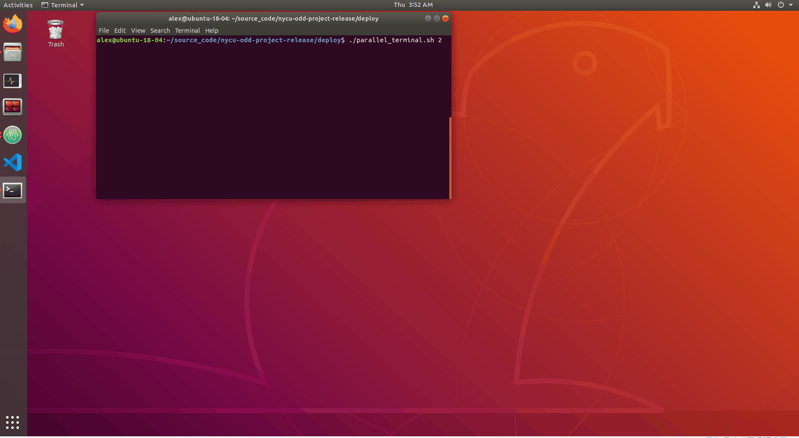
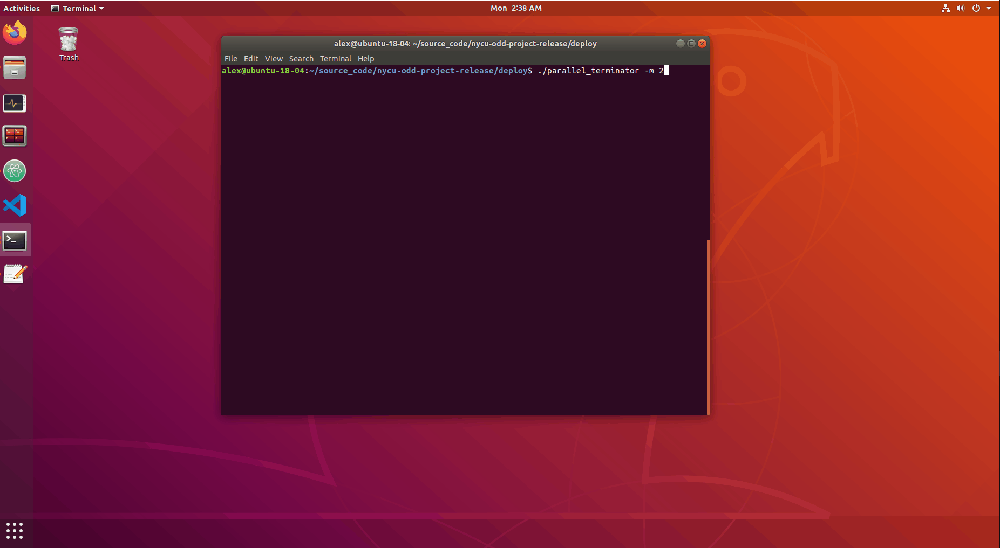

# Parallel Simulations

## Usage

Launches multiple simulations in an efficient way. There are 2 ways:

- Method 1: Terminal
- Method 2: Terminator

## Instructions

### Method 1: Launches from Terminal

Run:

```
[host | nycu-odd-project/deploy/parallel] $ ./parallel_terminal.sh <number_of_simulations>
```

#### Demo



### Method 2: Launches from Terminator

1. Install Terminator
   ```
   sudo apt-get install terminator
   ```
2. **Dependency**: configobj package is used to read the `~/.config/terminator/config` file.
   ```
   [host] $ python3.8 -m pip install -r requirements.txt
   ```
3. Open `parallel_terminator` and add the command options you would like to run in `DEFAULT = {'options':}`
4. Run:

   ```
   [host | nycu-odd-project/deploy/parallel] $ ./parallel_terminator <number_of_simulations> [-m] [--rviz]
   ```

   - `-m, --maximize` is to maximize the window. (optional argument)
   - `-v, --rviz` is to set the simulation to non-headless mode. (default set to headless)

#### Demo



For details of the tool, please refer to the [How It Works](#how-it-works) part

## How It Works

1. This tool efficiently launches multiple simulations from host.
2. Each part of this tool is used to
   - `container_script`: it is used to roslaunch different launch files with a custom port
   - `parallel_terminal.sh`: it is used to launch multiple simulations from terminals
   - `parallel_terminator`: it is used to launch multiple simulations from the terminator
3. Each part of this tool works
   - `container_script`: it uses `rmp $1` to assign a custom port and different args to determine the launch file
     - args:
       - `--sdc`: ` $ roslaunch --wait sdc run.launch`
       - `--simulation`: ` $ roslaunch simulation_adv run.launch`
       - `--scenario_updater`: ` $ roslaunch --wait scenario scenario_updater.launch`
       - `--single_parameterized`: ` $ roslaunch scenario_search single_parameterized_scenario_search.launch`
   - `parallel_terminal.sh`: it uses `gnome-terminal` to open new terminal windows/tab and `docker exec -it <container name> <command>` to execute commands in a running docker
   - `parallel_terminator`: this is a modification of the terminator-split wrapper script written by Aleksey Chudov. For more license information, please refer to `LICENSE`. it uses `docker exec -it <container name> <command>` to execute commands in a running docker and pass these commands to terminator config
