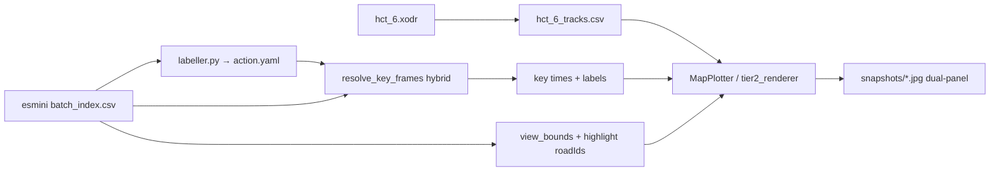

# Data Flow & Analysis Guide — GPL-ODD Project

> **Purpose:** Single reference for the pipeline from simulation CSV output → Dashboard clustering → cluster interpretation (BEV + LLM).  
> **Last verified:** 2026-06-24 (lab Payload `140.113.208.174:3020`)

---

## Executive summary

| Question | Answer |
|----------|--------|
| Where do simulation recordings live? | `simulation/ros/.cache/scenario_search/records/esmini_<batch>_<index>.csv` |
| What does Dashboard **Analysis** use? | Payload **observations** (downsampled), not local CSV |
| What does the LLM pipeline use for trajectories? | **esmini CSV only** via `csv_roadid_loader.py` |
| What is `alldatasets/dataset<N>/`? | Exported clustering bundle (embeddings, labels, `trajectories.json`) — labels + medoids, not a CSV substitute |
| How to cluster? | Dashboard → Batch → **Explore** → **Saves** → **Create New** → **Analysis** (Analyzer `:9010`) |
| How to interpret clusters? | `dataset_builder.py` → dashboard **Select and analyze** (or `run_cluster_analyze.sh --results-dir …`) |

---

## End-to-end data flow

```text
┌─────────────┐     ┌──────────────────┐     ┌─────────────────────────────┐
│  Sampling   │────▶│  Simulation      │────▶│  Layer B — local cache        │
│  :9009      │     │  esmini + ROS    │     │  records/esmini_<b>_<i>.csv   │
└─────────────┘     │  (SPSS node)     │     │  records/scenario_<i>.xosc    │
                    └────────┬─────────┘     └──────────────┬──────────────┘
                             │                               │
                             ▼                               │ ground truth
                    ┌──────────────────┐                     │ for BEV + LLM
                    │  Payload CMS     │                     │
                    │  observations    │◀────────────────────┘
                    │  trials, esminiDat                     │
                    └────────┬─────────┘
                             │
                             ▼
                    ┌──────────────────┐     ┌─────────────────────────────┐
                    │  Analyzer :9010  │────▶│  Layer A — alldatasets/     │
                    │  MFPCA + UMAP +  │     │  clustering.json            │
                    │  HDBSCAN         │     │  selectedClusteringResult_*   │
                    └────────┬─────────┘     │  trajectories.json          │
                             │               └──────────────┬──────────────┘
                    ┌────────▼─────────┐                    │
                    │  Dashboard :3000 │                    │
                    │  Explore / Saves │                    │
                    └────────┬─────────┘                    │
                             │                               │
                             ▼                               ▼
                    ┌──────────────────────────────────────────────────────┐
                    │  Layer C — results/batch<id>/<k>_cluster_s=<sil>/cluster<N>/ │
                    │  dataset_builder.py  →  trajectory, action, BEV    │
                    │  Select and analyze / run_cluster_analyze.sh  →  cluster_interpretation.yaml │
                    └──────────────────────────────────────────────────────┘
```

**Rule of thumb:** `alldatasets/` answers *which trial belongs to which cluster*; `records/esmini_*.csv` answers *what happened frame-by-frame*; Payload observations power *clustering*.

---

## Three storage layers

### Layer B — Simulation cache (authoritative trajectories)

| Path | Role |
|------|------|
| `simulation/ros/.cache/scenario_search/records/esmini_<batch>_<index>.csv` | Full esmini recording — all agents, `roadId`, `laneId`, speed |
| `simulation/ros/.cache/scenario_search/records/scenario_<index>.xosc` | Parameterized scenario for that trial |
| `simulation/ros/.cache/scenario_search/hct_6.xodr` | OpenDRIVE map |

Inside Docker the same tree is `/project/mmsl_simulation/.cache/scenario_search/`.

**Filename index** = Sampling `trial_index`, **not** Payload `trial.id`.  
Payload links trials via `esminiDat.filename` (e.g. `esmini_1_1231.dat` → trial id `1141`).

### Layer A — `alldatasets/` (clustering exports)

| File | Content |
|------|---------|
| `clustering.json` | MFPCA/UMAP embeddings + HDBSCAN grid results |
| `selectedClusteringResult_<k>Clusters.json` | `{ "<trial_id>": "<cluster_label>", ... }` |
| `trajectories.json` | Payload-derived time series (~10 Hz, dashboard format) |
| `collision.json` | Trial id → collision flag |

Used for **cluster membership** and **medoid selection**. Not used as trajectory ground truth for BEV or action labelling.

### Layer C — `results/` (interpretation output)

Generated by `app/analyzer/src/dataset_builder.py` and the analyze flow (dashboard **Select and analyze** / `scripts/run_cluster_analyze.sh`):

```text
results/<dataset>/<k>/cluster<N>/
  medoid.json
  trajectory.csv
  action.yaml
  description.txt
  meta.yaml
  stats.json
  observations.json
  map_overview.jpg
  snapshots/*.jpg          (~12 BEV key frames)
  cluster_interpretation.yaml   (after LLM step)
```

---

## Phase 1 — Sampling & simulation → CSV

### Per-trial sequence

```text
1. esmini records  →  esmini_<batch>_<trial_index>.dat
2. dat2csv.py      →  esmini_<batch>_<trial_index>.csv
3. optional        →  scenario_<trial_index>.xosc
4. sampler POST    →  Payload observations (~10 Hz)
5. upload          →  Payload esminiDat (.dat)
```

**Code:** [`single_parameterized_scenario_search.py`](../simulation/ros/src/scenario_search/src/scenario_search/single_parameterized_scenario_search.py), [`dat2csv.py`](../simulation/ros/src/scenario_search/script/dat2csv.py), [`scenario_sampler.py`](../simulation/ros/src/scenario_search/src/scenario_search/scenario_sampler.py)

### Batch ID (two places must match)

| Component | Where | Controls |
|-----------|-------|----------|
| Sampling | `POST /initialize` → `{"batch_id":"N"}` | Optimizer + `/suggest/N` |
| Simulation | `single_parameterized_scenario_search.launch` arg `batch_id=N` | Scenario config + output filenames `esmini_N_*` |

### `esmini_<batch>_<index>.csv` schema

```text
Version: 2, OpenDRIVE: ..., 3DModel:
time, id, name, x, y, z, h, p, r, roadId, laneId, offset, t, s, speed, wheel_angle, wheel_rot
```

Example agents: `Ego`, `Oncoming`. Typical duration 15–30 s, ~100 Hz dense rows (two rows per timestep when two agents).

---

## Phase 2 — Payload (metadata for clustering)

| Collection | Stores |
|------------|--------|
| `trials` | Parameters, KPIs, link to `esminiDat`, batch membership |
| `observations` | Downsampled ego + agent state per timestep (`egoRoadId`, `egoX`, `agents[]`, …) |
| `esminiDats` | Binary `.dat` per trial |
| `documents` | Analyzer exports (`analysis.zip`, heatmaps) |
| `batches` | Campaign metadata, saved analysis references |

**Clustering reads observations from Payload.** Local CSV alone is insufficient for Dashboard **Analysis**.

### Payload vs esmini CSV

| Field | esmini CSV | Payload observations | `trajectories.json` export |
|-------|------------|----------------------|----------------------------|
| x, y, yaw | ✅ | ✅ | ✅ |
| speed, laneId | ✅ | partial | ❌ |
| Ego roadId | ✅ | ✅ | often 0 |
| Agent roadId | ✅ | often 0 | often 0 |

**Always use esmini CSV** for [`dataset_builder.py`](../app/analyzer/src/dataset_builder.py), BEV, and `action.yaml`.

---

## Phase 3 — Dashboard clustering (CSV → cluster labels)

Clustering does not read CSV directly. The Analyzer reconstructs trajectories from Payload, then runs MFPCA + UMAP + HDBSCAN.

```text
Dashboard Explore  →  POST http://localhost:9010/trajectory_analysis
                         ├─ load trials + observations (Payload)
                         ├─ MFPCA on ego time series
                         ├─ UMAP → 2D embeddings
                         └─ HDBSCAN grid (one result per task)
```

### Prerequisites

1. **Analyzer** on port **9010** — `./scripts/start_dev_stack.sh` or `conda run -n analyzer litestar run --port 9010` in `app/analyzer`
2. **`app/analyzer/.env`** — same `PAYLOAD_API` / `PAYLOAD_API_KEY` as `app/dashboard/.env`
3. **Trials with observations** in Payload for the target batch
4. **Dashboard** on **3000** — `cd app/dashboard && bun run dev`

### UI workflow

| Step | Dashboard action |
|------|------------------|
| 1 | Batch → **Explore** → **Saves** → **Create New** → **Analysis** |
| 2 | Wait for MFPCA + HDBSCAN grid (15–60+ min for ~1000+ trials) |
| 3 | **Clustering Selection** — compare runs, pick k, **Use Selection** |
| 4 | **Saves** → **save** — persist analysis bundle to Payload Documents |
| 5 | Export/copy to `alldatasets/<name>/` if needed for offline `dataset_builder.py` |

### Default HDBSCAN task (paper-aligned starting point)

```json
{
  "method": "hdbscan+mfpca",
  "nClusters": 0,
  "minClusterSize": 20,
  "minSamples": 3,
  "clusterSelectionEpsilon": 1.5,
  "clusterSelectionMethod": "eom"
}
```

### API smoke test (single task)

```bash
curl -X POST http://localhost:9010/trajectory_analysis \
  -H "Content-Type: application/json" \
  -d '{"batchIds":["1"],"framePeriod":0.1,"tasks":[{"method":"hdbscan+mfpca","nClusters":0,"minClusterSize":20,"minSamples":3,"clusterSelectionEpsilon":1.5,"clusterSelectionMethod":"eom"}]}'
```

### Re-clustering when more trials finish

Each **Analysis** run loads **all** trials currently in Payload for that batch. Prior **Save** or `alldatasets/` export is a frozen snapshot. Re-run **Analysis** after new simulations, then re-save or re-export.

---

## Phase 4 — Map assets & BEV (CSV → snapshots)

### Step 0 — One-time map setup

```bash
python3 app/analyzer/src/dataset_builder.py --batch-id 1 --map-only
python3 app/analyzer/src/dataset_builder.py --batch-id 1 --map-only
```

| Asset | Role |
|-------|------|
| `hct_6_tracks.csv` | odrplot geometry for `MapPlotter` |
| `hct_6.yaml` | `JunctionRoads` for rule-based `action.yaml` |
| `hct_6.jpg` | Optional LLM map context (full network; cluster BEV is primary visual) |

### Action labelling — what becomes a key action in `action.yaml`

`labeller.label_trajectory()` reads the medoid `trajectory.csv` + `meta.yaml`
(+ map `hct_6.yaml`) and emits `action.yaml`. The **vocabulary and every numeric
threshold** live in [`taxonomy.py`](../app/analyzer/src/taxonomy.py)
(`class Thresholds`); [`labeller.py`](../app/analyzer/src/labeller.py) applies them.

**Inputs per row of `trajectory.csv`:** `time, x, y, velocity, heading, road_id,
lane_id`. Acceleration is finite-difference `a = Δvelocity / Δtime`; heading is in
degrees (esmini CCW). "Junction" = `road_id ∈ JunctionRoads` (from `hct_6.yaml`).

#### `action.yaml` shape

```yaml
dataset / location / duration / junction_aware
agents:                      # one block per agent that appears in the medoid
- track_id, name, type, role(ego|npc)
  enter_time, exit_time, initial_speed
  relation_to_ego: <NPC summary label>        # NPCs only
  actions: [ {action, start_time, end_time, duration, road_id, lane_id, attributes} ]
interactions:                # multi-agent, ego-relative (may be empty)
- {type, with_track_id, key_time, ...}
```

> **Conciseness model (faithful to xosc_gen / thesis §4.2).** The labeller emits
> only *meaningful* maneuvers, not a dense per-frame trace. The longitudinal
> extractor is a **step-for-step port** of `label_longitudinal_actions`: a
> **±`CRUISE_BAND` = 0.05 m/s²** sign band classifies each frame speed_up /
> slow_down / cruise (cruise = the implicit baseline, never emitted), an intensity
> sub-split refines each run, and a final segment is kept only if it lasts
> **> `MIN_EVENT_DURATION` = 0.5 s** *and* changes speed by **> `MIN_DELTA_V` =
> 0.2 m/s**. Each kept maneuver is parameterized by
> `{start_speed, target_speed, delta_v, acceleration}` (thesis: "start time,
> duration, target velocity"). We **add** two categories on top of the port —
> `EMERGENCY_BRAKE` (a slow_down whose mean accel ≤ −4.0 m/s²) and a sustained
> `STOPPED` — that have no xosc_gen equivalent but do not change its segmentation.

Each rule group below states **our rule**, then a **vs xosc_gen** note
(`xosc_gen/models/labeller.py`, thesis §4.2), then a **checklist** for traceability
(`[x]` done · `[ ]` open; **(OURS)** = our addition with no xosc_gen equivalent ·
**(N/A)** = xosc_gen-only concern that does not apply to our LLM pipeline).

#### Rule group 1 — Longitudinal (faithful xosc port: classify → split → filter → re-merge) · every agent

Implemented in `_longitudinal_actions()` (a direct port of
`label_longitudinal_actions`) plus `_stopped_actions()` for the additive STOPPED.

**Stage 1 — coarse sign band** (xosc_gen, thesis §4.2 stage 1). Per-frame
acceleration `a = Δv/Δt`; a maximal run of same-label frames is one coarse segment:

| Label | Condition | Threshold |
|-------|-----------|-----------|
| `ACCELERATE` (speed_up) | `a > +0.05 m/s²` | `CRUISE_BAND` |
| `DECELERATE` (slow_down) | `a < −0.05 m/s²` | `CRUISE_BAND` |
| `cruise` | otherwise (baseline — never emitted) | — |

**Stage 2 — intensity sub-split** (xosc_gen, thesis §4.2 stage 2). Inside each
speed_up/slow_down run, a `MIN_CHANGE_DURATION = 1.0 s` sliding look-back splits
the run when `|accel_A − accel_B| > ACCEL_DEV_THRESHOLD = 1.5 m/s²` (gentle decel
ramping into a hard brake → two segments). The earlier "A" segment is kept as-is;
only the **final** segment of the run is filtered (next stage) — exactly as
xosc_gen does.

**Stage 3 — conciseness filter** (xosc_gen, thesis §4.2 stage 3). The final
segment of each run survives only if `duration > 0.5 s` **and** `|Δv| > 0.2 m/s`
(`MIN_EVENT_DURATION`, `MIN_DELTA_V`); cruise is never emitted. Kept segments carry
`{start_speed, target_speed, delta_v, acceleration}`.

**Stage 4 — short-merge** (xosc_gen `merge_short_actions`). `_merge_short_same_type()`
re-merges same-type neighbours shorter than `MERGE_SHORT_S = 1.5 s`, blending
`acceleration` by duration-weighted average into the closer-accel neighbour.

**Post-passes (OURS, additive — do not alter xosc segmentation):**
- A `DECELERATE` whose mean `acceleration ≤ EMERGENCY_DECEL = −4.0 m/s²` is
  relabelled `EMERGENCY_BRAKE`.
- `_stopped_actions()` emits a `STOPPED` (`{speed}`) for every interval with
  `speed < STOPPED_SPEED = 0.3 m/s` sustained `≥ STOPPED_MIN_DURATION = 1.0 s`
  (stops are invisible to the sign pass — their accel is ~0 ⇒ cruise).

*vs xosc_gen:* stages 1–4 are a faithful port (same ±0.05 sign band, same split
look-back/threshold, same final-only filter, same 1.5 s short-merge). The only
differences are the two **additive** post-passes above.

Checklist:
- [x] **±0.05 m/s² coarse sign band** (`CRUISE_BAND`) → speed_up/slow_down/cruise.
- [x] Drop baseline (`cruise` / `MAINTAIN_SPEED`).
- [x] **1.5 m/s² intensity sub-split** (`ACCEL_DEV_THRESHOLD`, `MIN_CHANGE_DURATION`); segment A kept, final filtered.
- [x] Final-segment filter `dur > 0.5 s` **and** `|Δv| > 0.2 m/s` (xosc final-only semantics).
- [x] Parameterize by target velocity (`start_speed`, `target_speed`, `delta_v`, `acceleration`).
- [x] **Duration-weighted same-type re-merge** (`_merge_short_same_type`, `MERGE_SHORT_S`).
- [x] **(OURS)** Distinct `EMERGENCY_BRAKE` (relabel slow_down ≤ −4.0 m/s²).
- [x] **(OURS)** Sustained `STOPPED` action (≥ 1.0 s), detected separately.

#### Rule group 2 — Lateral lane change (sustained, grown to a duration window) · every agent

A lane change is a **sustained** `lane_id` change on the **same road**
(`lane[i+2]==lane[i+1]` and `lane[i-1]==lane[i]`). The maneuver is grown
backward/forward to the surrounding stable lanes; `duration = t[end] − t[start]`:

| Maneuver duration | Action emitted |
|-------------------|----------------|
| `1.0 s ≤ dur ≤ 3.0 s` | event spans `start → end` |
| `dur > 3.0 s` | capped to **3.0 s centred on the jump** |
| `dur < 1.0 s` | **discarded** (spurious flicker) |

Direction (OpenDRIVE: increasing `lane_id` ⇒ moving **left**):
`LANE_CHANGE_LEFT` if `lane[end] > lane[start]`, else `LANE_CHANGE_RIGHT`.
`attributes: {from_lane, to_lane, target_lane, direction}` — `target_lane` and the
`"left"`/`"right"` `direction` string mirror xosc_gen's attribute set for parity.

*vs xosc_gen:* same grow + `1.0–3.0 s` window logic, same attribute set. **Two
deliberate OpenDRIVE corrections:** (1) xosc_gen requires `|Δlane| == 1`, but
OpenDRIVE reserves `lane_id 0` for the reference line, so a **cross-centerline**
change is `Δ = 2`; we trigger on **any** lane change, otherwise legitimate
`-1 → 1` changes are missed. (2) xosc_gen labels *increasing* `lane_id` as
**right**; in OpenDRIVE increasing `lane_id` is to the **left**, so our sign is
the map-correct one for `hct_6` (not a port bug).

Checklist:
- [x] Same-road requirement.
- [x] Sustained-change detection (debounces flicker).
- [x] Direction + `from_lane`/`to_lane` + parity `target_lane`/`direction`.
- [x] **Maneuver `duration` estimation** (grow to stable lanes) → `start_time → end_time`.
- [x] **Duration window `1.0–3.0 s`** (cap long, discard short).
- [x] **(OpenDRIVE-corrected, not ±1)** Trigger on any lane change — required for the lane-0 reference line.
- [x] **(OpenDRIVE-corrected sign)** Increasing `lane_id` ⇒ LEFT (xosc_gen's inD axis uses the opposite).

#### Rule group 3 — Junction passage: one ENTER (with intent) + one EXIT · every agent (needs map)

Only active when `hct_6.yaml` supplies `JunctionRoads` (`junction_aware: true`).
Each contiguous run of junction frames is **one passage** emitting at most two
events. Standalone `TURN_*` / `GO_STRAIGHT` events are folded into `ENTER_JUNCTION`.

| Action | When | Attributes |
|--------|------|-----------|
| `ENTER_JUNCTION` | first frame of a junction passage | `{intent, entry_road, exit_road, heading_change_deg}` |
| `EXIT_JUNCTION` | last frame of the passage (if it ends inside the trial) | `{exit_road, exit_lane}` |

`intent` from net heading change with xosc_gen's `40°` threshold
(`TURN_HEADING_DEG = 40`): `Δθ > +40°` ⇒ `TURN_LEFT`, `< -40°` ⇒ `TURN_RIGHT`,
else `GO_STRAIGHT` — i.e. `|Δθ| ≤ 40°` is straight, matching xosc_gen exactly. A
passage whose entry→exit displacement is `< ROUTE_MIN_DISP = 0.1 m` is skipped
(xosc_gen's no-move guard; e.g. an agent parked on a connecting road).

*vs xosc_gen:* same `40°` turn math and the same no-move skip. We sample heading at
the **approach/departure** frames (road before/after the junction) rather than the
in-junction boundary frames, because `hct_6` junction connectors are very short
(in-junction Δθ ≈ 0 ⇒ everything would read as straight). We also skip the
connection-table **legality** check and the illegal/non-route **`follow`** fallback
— both exist only to *generate OpenSCENARIO files* and don't serve the LLM card.

Checklist:
- [x] Junction entry/exit detection.
- [x] Turn classification left/right/straight by net heading.
- [x] Record `entry_road` / `exit_road`.
- [x] **Turn threshold `40°`** (`TURN_HEADING_DEG`) — aligned to xosc_gen.
- [x] **No-move skip** (`ROUTE_MIN_DISP = 0.1 m`) — ported from xosc_gen.
- [x] **(deliberate)** Heading sampled at approach/departure frames (short connectors give ~0 in-junction Δθ).
- [ ] **(N/A)** Connection-table legality check — xosc generation concern, not LLM interpretation.
- [ ] **(N/A)** Illegal/non-route `follow` fallback with representative points — xosc generation concern.
- [ ] **(N/A)** Suppress `lane_change` inside a route interval — our route events are instantaneous, so no interval to conflict with.

#### Rule group 4 — NPC relation to ego (one summary label per NPC)

`relation_to_ego` (`_classify_npc_relation`), evaluated in order:

| Label | Condition |
|-------|-----------|
| `PARKED` | NPC speed `< 0.3 m/s` for the entire trial |
| `IRRELEVANT` | min ego–NPC gap `> 30 m` (`NEAR_GAP`) |
| `ONCOMING` | `|Δheading| > 2.2 rad` for `> 50 %` of shared frames (`ONCOMING_HEADING`) |
| `YIELD_TO_EGO` | min gap `< 18 m` (`FOLLOW_GAP`) and NPC nearly stops (`< 0.3 m/s`) |
| `FOLLOWING_EGO` | min gap `< 18 m` and NPC keeps moving |
| `CROSSING` | within 30 m but none of the above |

*vs xosc_gen:* xosc_gen is binary (purely-parked → `Unrelated`, dropped from the
scenario; else `Agent`). Our 6-way summary is an addition.

Checklist:
- [x] PARKED / stationary detection.
- [x] **(OURS)** 6-way `relation_to_ego` summary label.
- [ ] **(decided — keep)** We do **not** drop parked NPCs; they are useful BEV proximity context.

#### Rule group 5 — Interactive (multi-agent) → top-level `interactions:`

`detect_interactions()` reads **all** agents together. Distance `d(t)` to ego,
`closing = -d(d)/dt`, `TTC = d / closing`.

| Action | Trigger | Recorded |
|--------|---------|----------|
| `NEAR_MISS` | partner is **moving** (max speed `> 0.3`) **and** any frame has `TTC < 2.5 s` while closing (`TTC_NEAR_MISS`) | `key_time` = absolute-min-distance moment, `min_distance_m`, `min_ttc_s`, `with_name` |
| `DANGEROUS_CUT_IN` | NPC changes lane into the ego's exact `(road_id, lane_id)` within 30 m, **and** ego then brakes `≤ -1.5 m/s²` within 2 s (`CUT_IN_DECEL`, `CUT_IN_REACTION_S`) | `key_time`, `cut_in_time`, `ego_reaction_accel`, `min_distance_m` |
| `COLLISION` | medoid `collided` KPI **or** Payload `events[].name = collisionWith{Name}` **or** polygon clearance `≤ CONTACT_CLEARANCE_M` (0.5 m) when KPI true | `key_time`, `with_name`, `min_clearance_m`, `source`, `ego_at_collision` / `partner_at_collision` (speed, road/lane, x/y) |
| `CLOSEST_APPROACH` | moving NPC with polygon gap `< CONFLICT_RELEVANCE_M` (5 m), cap 2, excluding tier-A partners | `key_time`, `min_clearance_m`, `with_name` |

`collision_partner.py` resolves the partner (GT first, polygon fallback). Spurious
`NEAR_MISS` rows with `min_distance_m > 5 m` are dropped. These `key_time`s are
force-fed into BEV keyframe selection so the conflict moment is always rendered.

*vs xosc_gen:* xosc_gen has **no** composite multi-agent detector — this whole
group is our addition.

Checklist:
- [x] **(OURS)** `NEAR_MISS` detector.
- [x] **(OURS)** `DANGEROUS_CUT_IN` detector.
- [x] **(OURS)** Interaction `key_time`s force-injected into BEV keyframe selection.
- [ ] **(OURS, optional future)** `YIELD` / `AGGRESSIVE_PASS` at merges (designed, not yet built).

> **Scope:** rule groups 1–3 run for **every agent** (ego *and* NPCs), so each NPC
> block also carries its own `actions:` list; NPCs additionally get the rule-4
> `relation_to_ego` summary. Group 5 is ego-relative and lives at the top level.

#### What is *not* stored

- **`cruise`** (the `|a| ≤ 0.05 m/s²` baseline) — never written (biggest conciseness win).
- Speed changes shorter than `0.5 s` **or** smaller than `0.2 m/s` (`MIN_EVENT_DURATION` / `MIN_DELTA_V`).
- Stops shorter than `1.0 s` (`STOPPED_MIN_DURATION`).
- Lane changes whose grown maneuver lasts `< 1.0 s` (`LANE_CHANGE_MIN_S`) — spurious flicker.
- Standalone `TURN_*` / `GO_STRAIGHT` events — folded into `ENTER_JUNCTION.intent`.
- Junction events when the map has no `JunctionRoads` (`junction_aware: false`).
- Interactions whose triggers never fire (e.g. no moving conflict vehicle).

#### Status vs xosc_gen — what remains

As of the 2026-06 rewrite the three extraction methods are **faithful ports** of
`xosc_gen/models/labeller.py`:
- **Longitudinal** now uses xosc_gen's **±0.05 m/s² sign band** (no more ±1.0
  category pre-pass, no `merge_consecutive` pre-grouping), the same intensity
  sub-split, the same **final-segment-only** keep filter, and the same 1.5 s
  short-merge.
- **Lateral** matches the grow + `1.0–3.0 s` window and now carries the same
  `{target_lane, direction}` attributes.
- **Route** uses xosc_gen's **40° turn threshold** and **no-move skip**.

Everything still open is either an **OpenDRIVE correction** (any-Δlane trigger and
increasing-`lane_id`-⇒-left, both required by the lane-0 reference-line convention),
a **deliberate LLM-card choice** (approach/departure heading sampling for short
connectors; folded `ENTER`/`EXIT` representation), an **(OURS)** additive feature
(`EMERGENCY_BRAKE`, `STOPPED`, the interaction detectors), or **(N/A)** xosc-
generation-only machinery (legality check, `follow` fallback). No existing rule was
abandoned — the additive layers sit on top of the faithful port.

#### xosc_gen fidelity report (line-by-line, 2026-06 — post-alignment)

Step-by-step verification of our [`labeller.py`](../app/analyzer/src/labeller.py)
against [`xosc_gen/models/labeller.py`](../../xosc_gen/models/labeller.py). `=` exact
port · `≈` same algorithm, different value · `≠` deliberately different · `＋` ours-only.
After the 2026-06 rewrite the three methods are direct ports; the only `≠` rows are
OpenDRIVE corrections, deliberate LLM-card choices, or xosc-generation-only N/A.

**① `label_longitudinal_actions` ↔ `_longitudinal_actions` (+ `_merge_short_same_type`) and `_stopped_actions`**

| Step | xosc_gen | ours | |
|------|----------|------|---|
| Acceleration | `acc = Δv/Δt` (`np.divide`) | `acc = Δv/Δt` (`np.divide`, `where dt≠0`) | `=` |
| Coarse classifier | sign band: `acc>+0.05`→speed_up, `<−0.05`→slow_down, else cruise | sign band: `acc>+0.05`→ACCELERATE, `<−0.05`→DECELERATE, else cruise (`CRUISE_BAND`) | `=` |
| Pre-grouping | none (segments by label run) | none — maximal same-label run | `=` |
| Intensity split params | `accel_change_threshold=1.5`, `min_change_duration=1.0` | `ACCEL_DEV_THRESHOLD=1.5`, `MIN_CHANGE_DURATION=1.0` | `=` |
| Intensity split algo | sliding look-back; `dur_A>0.5 & dur_B>0`; split if `|accel_A−accel_B|>1.5`; emit A as-is | identical inline look-back, `searchsorted`, same guards/threshold; emit A as-is | `=` |
| Keep filter | **final segment only**: `dur>0.5 & |Δv|>0.2` | **final segment only**: `dur>0.5 & |Δv|>0.2` | `=` |
| Baseline | `cruise` not emitted | `cruise` not emitted | `=` |
| Short-merge | `merge_short_actions(1.5 s)`, closer-accel neighbour, duration-weighted accel | `_merge_short_same_type(MERGE_SHORT_S=1.5)`, same logic (+ skips STOPPED) | `=` |
| Attributes | `{start_time, acceleration, target_speed, duration}` | `{start_speed, target_speed, delta_v, acceleration}` + top-level `duration` | `≈` (we add `start_speed`/`delta_v`) |
| Extra categories | — | `EMERGENCY_BRAKE` (relabel slow_down ≤ −4.0), sustained `STOPPED` (≥1.0 s, separate pass) | `＋` |

**② `label_lateral_actions` ↔ lane-change loop**

| Step | xosc_gen | ours | |
|------|----------|------|---|
| Jump trigger | `|Δlane| == 1` | `Δlane ≠ 0` (any) | `≠` (OpenDRIVE reserves lane 0; cross-centerline = Δ2) |
| Sustained check | `lane[i+2]==lane[i+1]` and (`i==0` or `lane[i−1]==lane[i]`) | identical | `=` |
| Same road | `road[jump]==road[jump+1]` | `road[i]==road[i+1]` | `=` |
| Grow bounds | back/forward while lane stable & same road | identical | `=` |
| Duration | `t[end]−t[start]` | `t[end_index]−t[start_index]` | `=` |
| Window | keep `1.0–3.0 s`; `>3.0`→cap 3.0 centred on jump; `<1.0`→discard | `LANE_CHANGE_MIN_S=1.0` / `LANE_CHANGE_MAX_S=3.0`, identical cap/discard | `=` |
| **Direction** | `>0 ⇒ "right"`, else `"left"` | `lane[end]>lane[start] ⇒ LEFT`, else RIGHT | `≠` **OPPOSITE — OpenDRIVE-correct, see note** |
| Attributes | `{start_time, target_lane, direction, duration}` | `{from_lane, to_lane, target_lane, direction}` + top-level `start/end_time`, `duration` | `=` (parity attrs added) |

> ⚠ **Direction convention (needs awareness).** xosc_gen labels *increasing*
> `lane_id` as **right**; we label it **left**. In OpenDRIVE, lane IDs increase to
> the **left** of the reference line (positive = left, negative = right) in the +s
> direction, so a `−1 → 1` change *is* a move to the left — **our convention is the
> OpenDRIVE-correct one** for `hct_6`. xosc_gen's opposite sign reflects its inD
> dataset/axis convention. This is a deliberate divergence, not a port bug.

**③ `label_route_decisions` ↔ junction-pass loop**

| Step | xosc_gen | ours | |
|------|----------|------|---|
| Junction source | per-junction connection-road sets (`Junctions` dict) | flat `JunctionRoads` set | `≠` (ours map-agnostic) |
| Entry/exit detect | `isin` + `shift` per junction | contiguous junction-frame run | `≈` (same result) |
| Heading sampled at | in-junction boundary frames (`ent`, `ext`) | **outside** frames: approach `i−1`, departure `j+1` | `≠` (deliberate — short connectors give ~0 in-junction Δθ) |
| Turn formula | `Δθ = ((h_out−h_in+180)%360)−180`; `|Δθ|≤40`→straight, `<−40`→right, else left | same `Δθ`; `>40`→left, `<−40`→right, else straight | `=` (threshold now **40°**, same sign) |
| No-move skip | skip passage if `dist(entry,exit)<0.1 m` | skip passage if `dist(approach,departure)<ROUTE_MIN_DISP=0.1 m` | `=` (ported) |
| Legality check | `_is_link_legal` vs connection table | none | `≠` **(N/A** — xosc generation only) |
| `follow` fallback | representative points for illegal/non-route | none | `≠` **(N/A)** |
| Lane-change-in-route filter | `label()` drops `lane_change` inside a route interval | none (our route events are instantaneous) | `≠` (N/A) |
| Representation | standalone `go_straight/turn_*` + `entry_point/exit_point` | `ENTER_JUNCTION{intent,…}` + `EXIT_JUNCTION{…}` | `≠` (same info, folded) |

**Verdict (post-alignment).** All three methods now match `xosc_gen` step-for-step:
- **①** ±0.05 sign band, inline intensity split (segment-A as-is), final-segment-only
  `dur>0.5 & |Δv|>0.2` filter, 1.5 s short-merge — every algorithm row is `=`. The
  only non-`=` rows are the two **additive** categories (`EMERGENCY_BRAKE`, `STOPPED`)
  and the richer attribute set (`start_speed`/`delta_v`).
- **②** grow + `1.0–3.0 s` window and the full `{target_lane, direction}` attribute
  set are `=`. The two `≠` rows (any-Δlane trigger, increasing-`lane_id`-⇒-left) are
  **OpenDRIVE corrections** required by the lane-0 reference-line convention.
- **③** `40°` turn threshold and the `0.1 m` no-move skip are now `=`. The remaining
  `≠` rows are a **deliberate LLM-card choice** (approach/departure heading sampling
  for short connectors; folded `ENTER`/`EXIT` representation) or **N/A**
  xosc-generation-only machinery (legality check, `follow` fallback,
  lane-change-in-route filter).

The three former "action items to confirm" are resolved: (a) the lane-change
direction sign is kept OpenDRIVE-correct (documented); (b) the turn threshold is
aligned to **40°**; (c) `target_lane`/`direction` are now surfaced in lane-change
attributes.

### Step 4 — BEV pipeline (Tier 2)



| Component | File |
|-----------|------|
| CSV loader | `app/analyzer/src/csv_roadid_loader.py` |
| Action labelling + taxonomy | `app/analyzer/src/labeller.py`, `app/analyzer/src/taxonomy.py` |
| BEV renderer | `app/analyzer/src/tier2_renderer.py`, `map_plotter.py` |
| Orchestration | `app/analyzer/src/dataset_builder.py` |

**BEV renderer status:** Agent boxes, velocity arrows, lane boundaries, key-frame
selection, and the dual-panel (whole-scene + ego-zoom) composite are implemented.
Full-network map JPG is reference only; per-cluster `snapshots/` are the main LLM visual evidence.

#### How BEV frames are chosen (`resolve_key_frames`, hybrid mode — default)

Frames come from **`action.yaml` only** by default (`--key-frame-mode action`):
per-agent action boundaries + `interactions:` key-times (`NEAR_MISS`, `COLLISION`, …).
Legacy proximity heuristics (`ego closest to BackgroundParking*`) are **off** unless
`--key-frame-mode hybrid` with the old `pick_critical_timestamps` proximity gate.

**BEV titles (2026-06).** Each snapshot title/filename names the **agent** and the
**phase**: interval actions render both boundaries (`ego start DECELERATE`,
`ego end DECELERATE`; `Opposite end STOPPED`), instantaneous ones a single label
(`ego ENTER_JUNCTION`), interactions name the partner (`NEAR_MISS with Opposite`,
`COLLISION with Parking`), using the **display id drawn on the car** when relevant.
When many agents act on the same frame, `COLLISION` / `NEAR_MISS` labels are
prioritised; filenames are length-capped for the filesystem.

#### Plan — focus BEV density on conflict / close-to-moving-agent windows

**Problem.** On the dense `hct_6` network a medoid passes through ~7 junctions, so
the hybrid selector emits many routine `ENTER/EXIT_JUNCTION` frames (ego *and*
every NPC) while the genuinely critical window — a near miss or a close pass with
a *moving* vehicle — gets only 1–2 frames. The model sees lots of "driving through
a connector" and little of the actual conflict. We want the opposite: **sparse on
routine route events, dense around conflict.**

**Goal.** Concentrate the frame budget where ego is *near a moving agent* or where
TTC is low, while keeping a thin backbone of routine context.

**Design (criticality-weighted sampling), staged:**

1. **Per-frame criticality score `c(t)`** (computed from the esmini CSV, ego vs
   every *moving* agent):
   - proximity term: `max(0, 1 − d_min(t)/D_FOCUS)` with `D_FOCUS = 20 m`;
   - urgency term: `max(0, 1 − TTC(t)/TTC_FOCUS)` with `TTC_FOCUS = 3 s`, only while closing;
   - dynamics term: ego `|deceleration|` and `|heading-rate|` normalised;
   - take the max over moving agents; parked/background cars contribute 0.
2. **Conflict windows.** Threshold `c(t)` (e.g. `c > 0.5`) into contiguous
   intervals `[t0, t1]`; pad each by ±1 s. These are the "focus windows".
3. **Tiered budget.** Split the snapshot budget (or min-gap):
   - **Tier 1 — always kept:** every `interactions:` `key_time`; the min-distance
     frame to each moving agent within `D_FOCUS`; `ego_max_deceleration`;
     `EMERGENCY_BRAKE`. Inside focus windows, sample **densely** (`min_gap ≈ 0.3 s`).
   - **Tier 2 — sparse backbone:** outside focus windows, sample routine events
     with a **large** `min_gap` (e.g. 2–3 s) and keep **only ego** route events
     (drop NPC `ENTER/EXIT_JUNCTION` unless that NPC is in a focus window).
4. **Down-weight routine route events.** A `GO_STRAIGHT` junction pass with no
   nearby moving agent is Tier 2; an `ENTER_JUNCTION` whose passage overlaps a
   focus window is promoted to Tier 1.
5. **Approach triplet per moving agent.** For each moving agent that enters
   `D_FOCUS`, force three frames: approach onset (first `< D_FOCUS`), **minimum
   distance**, and departure (last `< D_FOCUS`) — so the conflict has a clear
   before/at/after sequence.

**New thresholds (proposed, `taxonomy.py` or a `BevFocus` config):**
`D_FOCUS = 20 m`, `TTC_FOCUS = 3 s`, `FOCUS_SCORE = 0.5`, `FOCUS_PAD_S = 1.0`,
`FOCUS_MIN_GAP_S = 0.3`, `ROUTINE_MIN_GAP_S = 2.5`.

**Implementation steps:**
1. Add `compute_criticality(df)` → `c(t)` array in `tier2_renderer.py`.
2. Add `conflict_windows(time_steps, c)` → list of `(t0, t1)`.
3. In `merge_key_frame_times`, tag each candidate Tier 1/2 by window membership
   and label; apply per-tier `min_gap`; demote NPC route events outside windows.
4. Keep Tier-1 picks exempt from the cap; trim Tier-2 first when over budget.
5. Verify on `batch2/4_cluster_s=0.6945/cluster0` (the trial-1188 near-miss): the
   33.2 s `NEAR_MISS` window should gain several frames; routine NPC junction
   frames at 34–40 s should thin out.

**Status:** planned (not yet implemented). It layers on the existing hybrid
selector — Tier 1 reuses today's "always kept" interaction/closest logic; Tier 2
is the current routine path with a larger gap and ego-only route filtering.

---

## Phase 5 — Build LLM dataset ([`dataset_builder.py`](../app/analyzer/src/dataset_builder.py))

### Inputs

| Input | Path | Used for |
|-------|------|----------|
| Cluster labels | `alldatasets/<ds>/selectedClusteringResult_<k>Clusters.json` | Trial → cluster |
| Embeddings | `alldatasets/<ds>/clustering.json` | Medoid = nearest to centroid |
| **Ground truth** | `records/esmini_<batch>_<index>.csv` | trajectory, BEV, actions |
| Map | `alldatasets/map/` + `alldatasets/resources/xodr/` | Labelling + rendering |

### Trial ID mapping

From [`dataset_config.py`](../app/analyzer/src/dataset_config.py):

```text
trial_id = trial_id_base + esmini_csv_index
```

| Dataset | batch_id | trial_id_base | Paper case |
|---------|----------|---------------|------------|
| dataset1 | 1 | 2600 | Case 1 — junction / oncoming |
| dataset2 | 2 | 8135 | Case 2 — straight + parked |
| dataset3 | 3 | 6122 | Case 3 — full HCT network |

### Commands

```bash
cd gpl-odd-project
conda activate analyzer

# Map assets (once per map, batch-centric → results/map/)
python3 app/analyzer/src/dataset_builder.py --batch-id 1 --map-only
python3 app/analyzer/src/dataset_builder.py --batch-id 1 --map-only

# Build per-cluster artifacts directly from Payload saved analysis
python3 app/analyzer/src/dataset_builder.py --batch-id 1 --k 4

# Same k can have several clustering results with different silhouettes.
#   --k <k>                     → picks the HIGHEST-silhouette result for that k
#   --k <k> --silhouette 0.7037 → picks the k-result nearest that silhouette
#   --clustering-index <i>      → picks an exact row (see --list-clusterings)
#   --list-clusterings          → print all candidates (index, k, silhouette)
python3 app/analyzer/src/dataset_builder.py --batch-id 1 --k 4 --silhouette 0.7037

# Optional: explicit trials when local CSV coverage is partial
python3 app/analyzer/src/dataset_builder.py dataset3 4 --trials '3:0,3:1,3:2,3:3'
```

List local CSV coverage:

```bash
ls simulation/ros/.cache/scenario_search/records/esmini_1_*.csv | wc -l
```

---

## Artifact data flow (producers → consumers)

Every file the pipeline reads or writes, in order. "Producer" = what writes it,
"Consumers" = what reads it next.

### Upstream inputs (not produced here)

| Artifact | Producer | Consumers | Content |
|----------|----------|-----------|---------|
| `records/esmini_<batch>_<index>.csv` | Simulation (esmini/ROS) | `csv_roadid_loader`, `dataset_builder`, `tier2_renderer`, `labeller` | Per-frame, all-agent ground truth: `x,y,speed,h,roadId,laneId,s` |
| `hct_6.xodr` | Sim cache | `map_assets` / `dataset_builder --map-only` | OpenDRIVE map |
| Payload saved analysis zip (`savedTrajectoryAnalysis`) | Dashboard **Save** | `dataset_builder.load_clustering_from_payload_save` | `trajectories.json` (MFPCA/HDBSCAN clustering grid), `selected.json` |

### Shared map assets — `results/map/` (one-time per map)

| Artifact | Producer | Consumers | Content |
|----------|----------|-----------|---------|
| `hct_6_tracks.csv` | `map_assets / dataset_builder --map-only` | `tier2_renderer` / `MapPlotter` | odrplot lane geometry for BEV |
| `hct_6.xodr` (copy) | `map_assets / dataset_builder --map-only` | `labeller`, parser | local copy of the map |
| `hct_6.yaml` | `map_assets / dataset_builder --map-only` | `labeller` (`JunctionRoads`) | junction-road list for turn/junction detection |
| `hct_6.jpg`, `hct_6_description.txt` | `map_assets / dataset_builder --map-only` | optional LLM map context | full-network reference render |

### Per-cluster build — `results/batch<id>/<k>_cluster_s=<sil>/cluster<N>/`

Orchestrated by `dataset_builder.process_medoid()` for each medoid trial:

| Artifact | Producer (function) | Inputs it consumes | Consumers | Content |
|----------|--------------------|--------------------|-----------|---------|
| `trajectory.csv` | `esmini_df_to_trajectory_csv` | esmini CSV (medoid) | `labeller`, `MapPlotter` trails | medoid timeline: `trackId,time,x,y,velocity,heading,road_id,lane_id,...` |
| `meta.yaml` *(temp, deleted)* | `write_meta_yaml` | esmini CSV | `labeller` only | agent registry + duration (intermediate) |
| `action.yaml` | `labeller.label_trajectory` + `collision_partner.augment_interactions` | esmini CSV + `trajectory.csv` + `meta.yaml` + map YAML + optional Payload `trial.events` | `tier2_renderer`, `description`, `context.md` | per-agent actions + `interactions:` (`NEAR_MISS`, `COLLISION`, `CLOSEST_APPROACH`, …) |
| `description.txt` | `description.py` | `action.yaml` | `context.md`, LLM | narration + structured **`Collision:`** block (when/where/speeds) + Critical moments |
| `snapshots/*.jpg` | `tier2_renderer.render_trial_from_esmini_csv` | esmini CSV + `action.yaml` + map tracks | `context.md`, LLM (vision) | dual-panel BEV at each key frame (whole scene + ego ±R zoom) |
| `map_overview.jpg` | `tier2_renderer.render_map_overview` | map tracks + view bounds | LLM (vision) | whole-map view with medoid roads highlighted |
| `cluster.json` | `dataset_builder.process_medoid` | clustering result + Payload KPI + medoid + registry + collision partner | `cluster_interpretation_pipeline`, `context.md` | cluster stats (`collision_count`/`rate`, TTC, params) + `medoid.collided` + `medoid.collision{…}` |
| `context.md` | `dataset_builder.write_context_md` | `cluster.json` + `description.txt` + `action.yaml` + snapshot list | **LLM (primary text)** | single consolidated card: header + description + action table + interactions table + snapshot index |

### Run-level + interpretation

| Artifact | Producer | Consumers | Content |
|----------|----------|-----------|---------|
| `manifest.json` | `dataset_builder` (end of run) | `cluster_interpretation_pipeline`, operators | run summary: dataset/batch, k, silhouette, per-cluster medoid `trial_id`/`trial_index`, paths |
| `cluster_interpretation.yaml` | dashboard **Select and analyze** / `run_cluster_analyze.sh --results-dir …` → `cluster_interpreter` | engineers / downstream | LLM verdict: label, behavior_description, safety_assessment, ego_perspective_summary |

### One-line summary

```text
esmini CSV ──▶ trajectory.csv ──▶ action.yaml ──┬─▶ description.txt ─┐
                                  (labeller +    │                    ├─▶ context.md ─▶ LLM ─▶ cluster_interpretation.yaml
clustering zip ─▶ cluster.json ───┘  taxonomy)   └─▶ snapshots/*.jpg ─┘            ▲
                                                    (tier2_renderer)     map_overview.jpg, manifest.json
```

> **`taxonomy.py`** defines the action vocabulary + thresholds (no I/O); **`labeller.py`**
> applies it to `trajectory.csv` to write `action.yaml` (single-agent actions + the
> multi-agent `interactions:` block). Both are pure logic consumed by `dataset_builder`.

---

## Phase 6 — LLM cluster interpretation

LLM interpretation reads one **clustering result** (a `results/batch<id>/<k>_cluster_s=<sil>/`
folder produced by `dataset_builder.py`) and, for every `cluster<N>/`, asks a multimodal
LLM to characterise the shared driving behaviour and its safety implications. The output is a
`cluster_interpretation.yaml` written next to each cluster's `cluster.json`, `action.yaml`,
and `snapshots/`.

### Two-pass flow (analysis + review) — mirrors `xosc_gen`

The pipeline implements the same two-pass design as `xosc_gen/models/scenario_interpretation.py`
(`run_baseline_analysis` + `review_interaction_analysis`), implemented in
[`cluster_interpreter.py`](../app/llm_pipeline/python/llm_pipeline/cluster_interpreter.py):

| Pass | Method | Inputs | Role |
|------|--------|--------|------|
| **1 — Baseline analysis** | `_run_initial_analysis` | system prompt + common-sense + map description + MFPCA heatmap + selected BEV snapshots + interaction prompt (cluster stats & medoid action log) | Multimodal "first read": produce a YAML report (label, behavior_description, safety_assessment, parameter_conditions, ego_perspective_summary). |
| **2 — Reviewer audit** | `_run_reviewer_pass` | reviewer prompt + cluster stats + medoid action log + Pass-1 YAML | Skeptical **text-only** verification that corrects over-claims and tightens the YAML. Optional — disabled with the **Reviewer pass** toggle / `--no-review`. |

Token usage from both passes is summed. If Pass 2 fails, Pass 1's YAML is kept.

> Difference vs `xosc_gen`: that project interprets a **single trajectory** from raw observations;
> here the unit is a **behavioral cluster**, so the text signal is the rule-based
> Labeller/Describer output (`description.txt` / `action.yaml`) of the cluster's **medoid** trial,
> the images are the medoid's BEV snapshots, plus the cluster-level MFPCA heatmap and aggregate
> stats (collision rate, TTC, parameter ranges).

### Inputs & data flow (per cluster)

For each `cluster<N>/`, `interpret_cluster_dir()` assembles **one multimodal request** from:

| Slot | Source (builder `results/` layout) | Notes |
|------|------------------------------------|-------|
| Cluster stats (text) | `cluster<N>/cluster.json` → `cluster` block | `n_trials`, `collision_rate`/`collision_count`, `mean_ttc` / `min_ttc` / `mean_spret` / `parameter_ranges` (populated at build time in payload-save mode from the per-trial `criticalityMetrics`; backfill existing folders with `--backfill-stats`). |
| **Medoid (single-trajectory) outcome (text)** | `cluster.json` → `medoid.collided` + `medoid.collision` + `description.txt` **`Collision:`** block | Whether the medoid collided, **who** (`partner_name`), **when** (`time_s`), **where** (road/lane, x/y), and **speeds** at contact. Distinct from cluster-wide `collision_rate`. |
| Medoid action log (text) | `cluster<N>/description.txt` (else `context.md`, else `action.yaml`) | Rule-based timeline of the medoid trial. Ends with structured collision info (if any), **Critical moments**, and **Interactions**. |
| BEV snapshots (images) | `cluster<N>/snapshots/*.jpg` | The user's selection from the analyze page (or evenly-spaced default). Each frame is the medoid trial at a key `action.yaml` timestamp. **Each image is now labelled in the prompt with its timestamp + event** (parsed from the filename, e.g. `Snapshot 8 — t=27.71s — ... STOPPED`) so the LLM can anchor images temporally and describe the latest frames. |
| Variation heatmap (image, optional) | `cluster<N>/trajectory_overlay.png` (else `mfpca_heatmap.png`, else `alldatasets/<dataset>/mfpca_heatmap_cluster<N>.png`) | A real per-cluster **ego-trajectory overlay** (all members faint, medoid highlighted) generated at build time / by `--backfill-stats`. If none exists the slot is **omitted** — we no longer reuse BEV[0] as a fake heatmap. |
| Map description (text) | static placeholder in `_get_map_description()` | Not yet parsed from the per-run OpenDRIVE. |

**Pass 1 assembly** (`_run_initial_analysis`):
`SystemMessage(cluster_system_prompt)` +
`HumanMessage([common_sense, map_description, heatmap-image, BEV-images…, interaction_prompt])`,
where `interaction_prompt` interpolates `{cluster_stats}`, `{agent_actions_log}`, `{map_description}`.

**Pass 2 assembly** (`_run_reviewer_pass`): **text-only** —
`SystemMessage(reviewer header)` + `HumanMessage(reviewer_prompt)` with `{cluster_stats}`,
`{agent_actions_log}`, `{preliminary_yaml}`. No images are re-sent.

**Output parsing & resilience:** the YAML report is extracted from the **last** ```yaml fence
(or the **first** top-level `cluster_*:` key when unfenced). If the reviewer returns only
Chain-of-Thought prose — common with `gemini-2.5-flash`, whose thinking budget can truncate the
final block — the pipeline **falls back to the Pass-1 baseline** instead of writing a stub.
Disable the reviewer (UI **Reviewer pass** toggle / `--no-review`) to save ~40% tokens when the
audit isn't needed.

> **Intermittent failures don't destroy good results.** `gemini-2.5-flash` at higher temperature
> occasionally emits prose in **both** passes (no parseable YAML at all) → the cluster would get a
> failure stub. `write_stub_interpretation` now **refuses to overwrite a previously successful
> (non-stub) `interpretation_meta.json`**: a re-run that fails keeps the last good result on disk
> and logs `keeping previous successful interpretation`. This is why a "Run all" that fails on
> cluster 0 no longer clobbers a result you already produced with a per-cluster run. Re-running
> a single cluster until it succeeds is the reliable recovery path. (A lower temperature, e.g. 0.1,
> also markedly reduces the no-YAML rate.)

**Full-timeline coverage:** the interaction prompt's *Ego-Perspective Summary* step now requires
**4-8 events spanning the whole scenario**, with the **last event being the final outcome**
(collision / near-miss / safe resolution). It explicitly instructs the model to use the labelled
**latest** snapshots, the `Interactions:` line of the action log, and the `medoid_critical_time`
stat — fixing the previous behaviour where the summary stopped at the emergency-braking apex
(e.g. 20.95 s) and never reached the 27.7 s collision.

```text
cluster.json ─┐
description.txt┤→ interaction_prompt ─┐
snapshots/*.jpg┤(selected) ───────────┤
heatmap/BEV[0] ┘                      ├→ Pass 1 (multimodal) → baseline YAML ─┐
                                      │                                       ├→ cluster_interpretation.yaml
cluster.json + description + baseline ┴→ Pass 2 (text-only) → reviewed YAML ──┘  (+ interpretation_meta.json)
                                              └─ unparseable? fall back to baseline ─┘
```

### What collision & safety context actually reaches the LLM

Answering "do we send collision info?" — yes, at **three** levels, all inside the Pass-1
multimodal request (and Pass-2 text). The medoid is a **single trajectory**, so it is kept
distinct from the cluster aggregate:

| Signal | Sent? | Where it comes from | How it appears in the prompt |
|--------|-------|---------------------|------------------------------|
| Cluster-wide **collision rate** | ✅ | `cluster.json` → `cluster.collision_rate` | `Collision rate (whole cluster): 99.8%` |
| **This trajectory** collided (true/false) | ✅ (new) | `cluster.json` → `medoid.collided` | `Medoid trial outcome (shown in snapshots): COLLISION / no collision (near-miss/safe)` |
| **Critical / closest-approach time** | ✅ (new) | `description.txt` `Interactions:` (`collision`/`near miss`/`min TTC`) | `Medoid critical/closest-approach time: t=27.70s` |
| Mean / min **TTC**, mean **SPrET** | ✅ | `cluster.json` `cluster` block | listed in the stats text |
| Full per-agent **action timeline + interactions** | ✅ | `description.txt` (rule-based Describer) | the `agent_actions_log` block, incl. the final `t=…s: near miss / collision …` line |
| Per-snapshot **timestamp + event** | ✅ (new) | parsed from snapshot filenames | `Snapshot N — t=20.95s — ego max deceleration:` |
| Parameter ranges | ✅ | `cluster.json` `parameter_ranges` | listed in the stats text |

So both the **single-trajectory collision flag** and the **cluster collision rate** are organised
and sent. The action/`description.txt` timeline (including the near-miss/collision interaction) is
sent verbatim as the textual signal; the snapshots are the medoid's BEV frames, now timestamp-
labelled. The prompt instructs the model to reason about *this* trajectory's outcome and to cover
the timeline through the critical moment rather than the cluster average alone.

### Prompt templates

`app/llm_pipeline/prompt_templates/` (all four are editable from the dashboard analyze page):

| File | Override key | Used in | Purpose |
|------|--------------|---------|---------|
| `cluster_system_prompt.txt` | `system` | Pass 1 | Persona + output contract (CoT then YAML). |
| `cluster_common_sense.txt` | `common_sense` | Pass 1 | Traffic-safety reference (right-of-way, TTC thresholds, behavior taxonomy). |
| `cluster_interaction_prompt.txt` | `interaction` | Pass 1 | Main task. Placeholders: `{cluster_stats}` `{agent_actions_log}` `{map_description}`. |
| `cluster_reviewer_prompt.txt` | `reviewer` | Pass 2 | Skeptical audit. Placeholders: `{cluster_stats}` `{agent_actions_log}` `{preliminary_yaml}`. |

UI-edited prompt text is substituted with a brace-tolerant formatter, so example YAML/JSON inside
a prompt no longer breaks `str.format`.

### Dashboard "Select and analyze" page (recommended)

The dashboard is the primary entry point (the old `LlmAnalysis` dock panel has been removed):

1. **Clustering Selection** panel → pick a clustering result → click **Select and analyze**.
   This routes to `/batch/<id>/analyze?ego=<ego>&k=<k>&s=<silhouette>`.
2. The page mirrors `xosc_gen/app.py`: model selectbox (Gemini / OpenAI), **ephemeral** API-key
   field, temperature slider, reviewer-pass + dry-run toggles, four editable prompt text-areas,
   and a per-cluster BEV grid with checkboxes (auto evenly-spaced default, manual override).
3. **Run analysis** posts the selection; each cluster renders a **summary card**:
   label + confidence + risk/collision chips, behavior description, failure-mode callout,
   parameter conditions, an **ego-perspective timeline scrubber** (drag the slider — the
   active timestamped caption is highlighted, mimicking a replay), and the raw YAML in a
   collapsible block with a download button.
4. **Results are persisted** to `cluster<N>/cluster_interpretation.yaml` +
   `interpretation_meta.json` (both real runs and offline stubs write the meta sidecar).
   On revisiting the page, the `GET /api/cluster-analyze` config call returns any saved
   interpretations, which load automatically into the cards (clusters with a stored result
   show an **analyzed** chip) — no re-run needed unless you want to refresh.
5. **Per-cluster runs:** each cluster has its own **Analyze** button (run one medoid at a
   time to save API quota) in addition to **Run all selected**. Clusters are always sent to
   the LLM **one at a time, sequentially** — each cluster is an independent request (Pass 1
   + optional Pass 2), never one giant multi-cluster payload.
6. **Live progress + logs:** `POST /api/cluster-analyze/run` streams NDJSON
   (`{type:"log"|"done"}`) with `PYTHONUNBUFFERED=1`, so the page shows a progress bar
   (completed/total clusters) and the child's stdout/stderr live. The full run log is saved
   to `results/batch<id>/<folder>/logs/analysis_<timestamp>_<clusters>.log` (API key is never
   logged) for later inspection. **Timestamps are in Taiwan time (UTC+8)** — both the log
   filename (`analysis_2026-06-30_13-36-03_c0.log`) and the `# time:` header (`... (UTC+8)`).
7. **Models:** only currently-served models are offered. `gemini-2.0-flash` was retired by
   Google (`404 ... no longer available`) and has been removed — use `gemini-2.5-flash` /
   `gemini-2.5-pro` / `gemini-2.5-flash-lite` or the OpenAI `gpt-4o*` models.

API routes ([`app/dashboard/src/app/api/cluster-analyze/`](../app/dashboard/src/app/api/cluster-analyze/)):

- `GET /api/cluster-analyze?batchId&k&s` — resolves `results/batch<id>/<k>_cluster_s=<s>/`
  (closest-silhouette fallback) and returns per-cluster stats + snapshot filenames + default
  prompt texts + model list.
- `GET /api/cluster-analyze?batchId&folder&cluster&file` — streams a BEV snapshot (path-traversal guarded).
- `POST /api/cluster-analyze/run` — writes prompt/image overrides to a temp dir and spawns
  `scripts/run_cluster_analyze.sh`. The API key is injected into `GOOGLE_API_KEY`/`OPENAI_API_KEY`
  for that process only — never persisted or logged.

### CLI (offline / scripting)

`scripts/run_cluster_analyze.sh` forwards to the `cluster-interpret` subcommand with the
**builder batch layout** via `--results-dir`:

```bash
# Whole clustering result (all clusters):
bash scripts/run_cluster_analyze.sh \
  --results-dir results/batch2/4_cluster_s=0.6945 \
  --model gemini-2.5-flash --temperature 0.1

# Subset + overrides + skip reviewer pass:
bash scripts/run_cluster_analyze.sh \
  --results-dir results/batch1/4_cluster_s=0.7341 \
  --clusters 0,2 --no-review \
  --prompts-json /tmp/prompts.json --images-json /tmp/images.json

# Dry-run (stub YAML, no API key needed) to validate wiring:
bash scripts/run_cluster_analyze.sh \
  --results-dir results/batch2/2_cluster_s=0.5972 --dry-run
```

```bash
# Full build from Payload save (preferred — fills collision KPI + trial.events):
python3 app/analyzer/src/dataset_builder.py --batch-id 2 --k 4 --silhouette 0.6945

# Rebuild BEV/action/description into an existing results folder (keeps _s=<sil> dirname):
python3 app/analyzer/src/dataset_builder.py --source alldatasets --dataset dataset2 \
  --n-clusters 4 --from-run results/batch2/4_cluster_s=0.6945 --batch-id 2 \
  --key-frame-mode action
```

Output path is always `results/batch<id>/<k>_cluster_s=<silhouette>/` when the
clustering result carries a `silhouetteScore` (or `--silhouette` is passed).
Manual `--trials` mode is for quick CSV checks only — it sets `n_trials=1` and
**omits** cluster collision stats unless you also pass `--from-run` / payload-save.

**Backfilling stats only** (no BEV rebuild):

```bash
python3 -m dataset_builder --source payload-save --batch-id 2 --k 4 \
  --silhouette 0.6945 \
  --backfill-stats results/batch2/4_cluster_s=0.6945
```

Gemini (default): `export GOOGLE_API_KEY=…`  ·  OpenAI `gpt-*`: `export OPENAI_API_KEY=…`.
Dataset is resolved automatically from the `batch<id>` component of the path (or pass `--batch-id`).

> The analyzer controller can still interpret its own capture runs automatically
> (`run_post_analyzer_cluster_interpretation()` on the `llm_artifacts/<run_id>/` layout it builds
> internally), but the batch-centric `--results-dir` flow above is the single source of truth for
> interpreting builder output. The old standalone `run_cluster_interpretation.sh` / `--run-id` CLI
> adapter has been removed.

---

## Analyzer `app/analyzer/src/` layout (2026-07)

| Module | Role |
|--------|------|
| `controller.py` + `app.py` | Dashboard Analyze API (MFPCA → UMAP → HDBSCAN; metric heatmaps via KD-tree; collision fault typing via `TwoDimTTC.py`) |
| `dataset_builder.py` | LLM dataset orchestration (`--source payload-save` or `--from-run`) |
| `labeller.py` / `description.py` / `taxonomy.py` | Rule-based actions + narration |
| `collision_partner.py` | Collision partner GT + polygon clearance + kinematics at impact |
| `tier2_renderer.py` / `map_plotter.py` / `renderer.py` | BEV + XODR parsing |
| `sim_labeller.py` / `csv_roadid_loader.py` | esmini CSV → `trajectory.csv` |
| `predict.py` | GP surrogate helper (legacy heatmap path; grid uses KD-tree) |

Removed unused deep-learning experiments (`train.py`, `blocks.py`, `utils.py`,
`gradient.py`, vendored `third_party/`). Clustering does **not** use a neural
encoder — MFPCA scores feed HDBSCAN.

---

## Paper cases & scenario parameters

| Case | dataset | Batch | Map | Launch notes |
|------|---------|-------|-----|--------------|
| 1 — oncoming at junction | dataset1 | 1 | `hct_6.xodr` | `ego_position_seq=21` (batches 1, 4) |
| 2 — straight + cut-in | dataset2 | 2 | `hct_6_no_930.xodr` | `ego_position_seq=4` |
| 3 — full network | dataset3 | 3 | `hct_6.xodr` | `ego_position_seq=29` |

Parameter bounds: Payload Admin → **Scenarios** → **Parameters**, or Dashboard Explore scatter axes.  
OpenSCENARIO template: `scenarios.openScenarioField.openScenario` (e.g. batch 1 → `drive_out_straight_from_right-5.xosc`).

---

## Current project state (2026-06-24)

| Item | Count / status |
|------|----------------|
| Local `esmini_1_*.csv` | **1,144** |
| Local `esmini_3_*.csv` | **1,106** |
| Payload batch 1 trials | **1,135** |
| Payload batch 1 scenario | Drive out Hct Exit with Oncoming Straight from Right |
| Sample CSV validation | `esmini_1_1231.csv` — 25.5 s, Ego+Oncoming, linked to Payload trial **1141** |
| Dashboard | `:3000` (dev) |
| Analyzer | start on `:9010` before **Analysis** |
| LLM pipeline | `app/llm_pipeline/python/llm_pipeline/` |

---

## Recommended workflow

### Path A — Use existing lab data (dataset1, no new simulation)

```text
1. Start Analyzer + Dashboard (Payload env aligned)
2. Dashboard → Batch 1 → Analysis → Clustering Selection → Save
3. Export clustering JSON to alldatasets/dataset1/ (or use senior bundle)
4. dataset_builder.py --source payload-save --batch-id 1 --k <k>
5. run_cluster_analyze.sh --results-dir results/batch1/<k>_cluster_s=<sil>
```

### Path B — New simulation campaign

```text
1. POST /initialize {"batch_id":"N"} + launch batch_id=N
2. Run simulation → verify esmini_N_*.csv count grows
3. Dashboard Analysis on batch N
4. Export alldatasets bundle + run dataset_builder + interpretation
```

### Path C — Sync CSVs from lab only

```bash
# On lab
cd /project/mmsl_simulation/.cache/scenario_search/records
tar czf esmini_batch3.tar.gz esmini_3_*.csv

# Local
tar xzf esmini_batch3.tar.gz -C simulation/ros/.cache/scenario_search/records/
```

---

## Next steps

| Priority | Task | Command / location |
|----------|------|-------------------|
| **1** | Run Dashboard **Analysis** on batch 1 | Analyzer `:9010` + Explore → Analysis |
| **2** | Pick clustering k in **Clustering Selection** | Match paper / silhouette (~k=4 for dataset1) |
| **3** | Build cluster artifacts | `python3 app/analyzer/src/dataset_builder.py --batch-id 1 --k 4` |
| **4** | Verify per-cluster outputs | `results/batch1/4_cluster_s=*/cluster*/snapshots/*.jpg` |
| **5** | Run LLM interpretation | Dashboard **Select and analyze**, or `bash scripts/run_cluster_analyze.sh --results-dir results/batch1/4_cluster_s=<sil>` |
| **6** | Integrate interpreter into Analyzer API (Phase 6) | `cluster_interpreter_integration_plan.md` |
| **7** | Scale simulation for dataset2/3 | Mission Control + `readMD/MISSION_CONTROL.md` |
| **8** | Action-aligned BEV frames | `tier2_renderer.py` — render at `action.yaml` timestamps |

---

## Key file index

| What | Path |
|------|------|
| Esmini CSV cache | [`simulation/ros/.cache/scenario_search/records/`](../simulation/ros/.cache/scenario_search/records/) |
| Analyzer clustering | [`app/analyzer/src/controller.py`](../app/analyzer/src/controller.py) |
| Dataset / trial ID map | [`app/analyzer/src/dataset_config.py`](../app/analyzer/src/dataset_config.py) |
| Build script | [`app/analyzer/src/dataset_builder.py`](../app/analyzer/src/dataset_builder.py) |
| Dev stack | [`scripts/start_dev_stack.sh`](../scripts/start_dev_stack.sh) |
| LLM interpreter | [`app/llm_pipeline/python/llm_pipeline/cluster_interpreter.py`](../app/llm_pipeline/python/llm_pipeline/cluster_interpreter.py) |
| Integration roadmap | [`../cluster_interpreter_integration_plan.md`](../cluster_interpreter_integration_plan.md) |
| Simulation runbook | [`readMD/MISSION_CONTROL.md`](MISSION_CONTROL.md) |

---

## Related docs

- [`MISSION_CONTROL.md`](MISSION_CONTROL.md) — simulation orchestration, batch/worker setup
- [`cluster_interpreter_integration_plan.md`](../cluster_interpreter_integration_plan.md) — Phase 6 analyzer + dashboard integration
- [`/results/README.md`](../results/README.md) — output layout after `dataset_builder.py`
