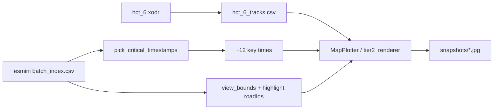

# Data Flow & Analysis Guide — GPL-ODD Project

> **Purpose:** Single reference for the pipeline from simulation CSV output → Dashboard clustering → cluster interpretation (BEV + LLM).  
> **Last verified:** 2026-06-24 (lab Payload `140.113.208.174:3020`)

---

## Executive summary

| Question | Answer |
|----------|--------|
| Where do simulation recordings live? | `simulation/ros/.cache/scenario_search/records/esmini_<batch>_<index>.csv` |
| What does Dashboard **Analysis** use? | Payload **observations** (downsampled), not local CSV |
| What does the LLM pipeline use for trajectories? | **esmini CSV only** via `csv_roadid_loader.py` |
| What is `alldatasets/dataset<N>/`? | Exported clustering bundle (embeddings, labels, `trajectories.json`) — labels + medoids, not a CSV substitute |
| How to cluster? | Dashboard → Batch → **Explore** → **Saves** → **Create New** → **Analysis** (Analyzer `:9010`) |
| How to interpret clusters? | `build_llm_dataset.sh` → `run_cluster_interpretation.sh` |

---

## End-to-end data flow

```text
┌─────────────┐     ┌──────────────────┐     ┌─────────────────────────────┐
│  Sampling   │────▶│  Simulation      │────▶│  Layer B — local cache        │
│  :9009      │     │  esmini + ROS    │     │  records/esmini_<b>_<i>.csv   │
└─────────────┘     │  (SPSS node)     │     │  records/scenario_<i>.xosc    │
                    └────────┬─────────┘     └──────────────┬──────────────┘
                             │                               │
                             ▼                               │ ground truth
                    ┌──────────────────┐                     │ for BEV + LLM
                    │  Payload CMS     │                     │
                    │  observations    │◀────────────────────┘
                    │  trials, esminiDat                     │
                    └────────┬─────────┘
                             │
                             ▼
                    ┌──────────────────┐     ┌─────────────────────────────┐
                    │  Analyzer :9010  │────▶│  Layer A — alldatasets/     │
                    │  MFPCA + UMAP +  │     │  clustering.json            │
                    │  HDBSCAN         │     │  selectedClusteringResult_*   │
                    └────────┬─────────┘     │  trajectories.json          │
                             │               └──────────────┬──────────────┘
                    ┌────────▼─────────┐                    │
                    │  Dashboard :3000 │                    │
                    │  Explore / Saves │                    │
                    └────────┬─────────┘                    │
                             │                               │
                             ▼                               ▼
                    ┌──────────────────────────────────────────────────────┐
                    │  Layer C — results/<dataset>/<k>/cluster<N>/           │
                    │  build_llm_dataset.sh  →  trajectory, action, BEV    │
                    │  run_cluster_interpretation.sh  →  cluster_interpretation.yaml │
                    └──────────────────────────────────────────────────────┘
```

**Rule of thumb:** `alldatasets/` answers *which trial belongs to which cluster*; `records/esmini_*.csv` answers *what happened frame-by-frame*; Payload observations power *clustering*.

---

## Three storage layers

### Layer B — Simulation cache (authoritative trajectories)

| Path | Role |
|------|------|
| `simulation/ros/.cache/scenario_search/records/esmini_<batch>_<index>.csv` | Full esmini recording — all agents, `roadId`, `laneId`, speed |
| `simulation/ros/.cache/scenario_search/records/scenario_<index>.xosc` | Parameterized scenario for that trial |
| `simulation/ros/.cache/scenario_search/hct_6.xodr` | OpenDRIVE map |

Inside Docker the same tree is `/project/mmsl_simulation/.cache/scenario_search/`.

**Filename index** = Sampling `trial_index`, **not** Payload `trial.id`.  
Payload links trials via `esminiDat.filename` (e.g. `esmini_1_1231.dat` → trial id `1141`).

### Layer A — `alldatasets/` (clustering exports)

| File | Content |
|------|---------|
| `clustering.json` | MFPCA/UMAP embeddings + HDBSCAN grid results |
| `selectedClusteringResult_<k>Clusters.json` | `{ "<trial_id>": "<cluster_label>", ... }` |
| `trajectories.json` | Payload-derived time series (~10 Hz, dashboard format) |
| `collision.json` | Trial id → collision flag |

Used for **cluster membership** and **medoid selection**. Not used as trajectory ground truth for BEV or action labelling.

### Layer C — `results/` (interpretation output)

Generated by `scripts/build_llm_dataset.sh` and `scripts/run_cluster_interpretation.sh`:

```text
results/<dataset>/<k>/cluster<N>/
  medoid.json
  trajectory.csv
  action.yaml
  description.txt
  meta.yaml
  stats.json
  observations.json
  map_overview.jpg
  snapshots/*.jpg          (~12 BEV key frames)
  cluster_interpretation.yaml   (after LLM step)
```

---

## Phase 1 — Sampling & simulation → CSV

### Per-trial sequence

```text
1. esmini records  →  esmini_<batch>_<trial_index>.dat
2. dat2csv.py      →  esmini_<batch>_<trial_index>.csv
3. optional        →  scenario_<trial_index>.xosc
4. sampler POST    →  Payload observations (~10 Hz)
5. upload          →  Payload esminiDat (.dat)
```

**Code:** [`single_parameterized_scenario_search.py`](../simulation/ros/src/scenario_search/src/scenario_search/single_parameterized_scenario_search.py), [`dat2csv.py`](../simulation/ros/src/scenario_search/script/dat2csv.py), [`scenario_sampler.py`](../simulation/ros/src/scenario_search/src/scenario_search/scenario_sampler.py)

### Batch ID (two places must match)

| Component | Where | Controls |
|-----------|-------|----------|
| Sampling | `POST /initialize` → `{"batch_id":"N"}` | Optimizer + `/suggest/N` |
| Simulation | `single_parameterized_scenario_search.launch` arg `batch_id=N` | Scenario config + output filenames `esmini_N_*` |

### `esmini_<batch>_<index>.csv` schema

```text
Version: 2, OpenDRIVE: ..., 3DModel:
time, id, name, x, y, z, h, p, r, roadId, laneId, offset, t, s, speed, wheel_angle, wheel_rot
```

Example agents: `Ego`, `Oncoming`. Typical duration 15–30 s, ~100 Hz dense rows (two rows per timestep when two agents).

---

## Phase 2 — Payload (metadata for clustering)

| Collection | Stores |
|------------|--------|
| `trials` | Parameters, KPIs, link to `esminiDat`, batch membership |
| `observations` | Downsampled ego + agent state per timestep (`egoRoadId`, `egoX`, `agents[]`, …) |
| `esminiDats` | Binary `.dat` per trial |
| `documents` | Analyzer exports (`analysis.zip`, heatmaps) |
| `batches` | Campaign metadata, saved analysis references |

**Clustering reads observations from Payload.** Local CSV alone is insufficient for Dashboard **Analysis**.

### Payload vs esmini CSV

| Field | esmini CSV | Payload observations | `trajectories.json` export |
|-------|------------|----------------------|----------------------------|
| x, y, yaw | ✅ | ✅ | ✅ |
| speed, laneId | ✅ | partial | ❌ |
| Ego roadId | ✅ | ✅ | often 0 |
| Agent roadId | ✅ | often 0 | often 0 |

**Always use esmini CSV** for [`build_llm_dataset.sh`](../scripts/build_llm_dataset.sh), BEV, and `action.yaml`.

---

## Phase 3 — Dashboard clustering (CSV → cluster labels)

Clustering does not read CSV directly. The Analyzer reconstructs trajectories from Payload, then runs MFPCA + UMAP + HDBSCAN.

```text
Dashboard Explore  →  POST http://localhost:9010/trajectory_analysis
                         ├─ load trials + observations (Payload)
                         ├─ MFPCA on ego time series
                         ├─ UMAP → 2D embeddings
                         └─ HDBSCAN grid (one result per task)
```

### Prerequisites

1. **Analyzer** on port **9010** — `./scripts/start_dev_stack.sh` or `conda run -n analyzer litestar run --port 9010` in `app/analyzer`
2. **`app/analyzer/.env`** — same `PAYLOAD_API` / `PAYLOAD_API_KEY` as `app/dashboard/.env`
3. **Trials with observations** in Payload for the target batch
4. **Dashboard** on **3000** — `cd app/dashboard && bun run dev`

### UI workflow

| Step | Dashboard action |
|------|------------------|
| 1 | Batch → **Explore** → **Saves** → **Create New** → **Analysis** |
| 2 | Wait for MFPCA + HDBSCAN grid (15–60+ min for ~1000+ trials) |
| 3 | **Clustering Selection** — compare runs, pick k, **Use Selection** |
| 4 | **Saves** → **save** — persist analysis bundle to Payload Documents |
| 5 | Export/copy to `alldatasets/<name>/` if needed for offline `build_llm_dataset.sh` |

### Default HDBSCAN task (paper-aligned starting point)

```json
{
  "method": "hdbscan+mfpca",
  "nClusters": 0,
  "minClusterSize": 20,
  "minSamples": 3,
  "clusterSelectionEpsilon": 1.5,
  "clusterSelectionMethod": "eom"
}
```

### API smoke test (single task)

```bash
curl -X POST http://localhost:9010/trajectory_analysis \
  -H "Content-Type: application/json" \
  -d '{"batchIds":["1"],"framePeriod":0.1,"tasks":[{"method":"hdbscan+mfpca","nClusters":0,"minClusterSize":20,"minSamples":3,"clusterSelectionEpsilon":1.5,"clusterSelectionMethod":"eom"}]}'
```

### Re-clustering when more trials finish

Each **Analysis** run loads **all** trials currently in Payload for that batch. Prior **Save** or `alldatasets/` export is a frozen snapshot. Re-run **Analysis** after new simulations, then re-save or re-export.

---

## Phase 4 — Map assets & BEV (CSV → snapshots)

### Step 0 — One-time map setup

```bash
python3 scripts/generate_map_tracks.py --dataset dataset1   # → alldatasets/resources/xodr/hct_6_tracks.csv
python3 scripts/map_preprocess.py --dataset dataset1        # → alldatasets/map/hct_6.{yaml,jpg,_description.txt}
```

| Asset | Role |
|-------|------|
| `hct_6_tracks.csv` | odrplot geometry for `MapPlotter` |
| `hct_6.yaml` | `JunctionRoads` for rule-based `action.yaml` |
| `hct_6.jpg` | Optional LLM map context (full network; cluster BEV is primary visual) |

### Step 4 — BEV pipeline (Tier 2)



| Component | File |
|-----------|------|
| CSV loader | `app/analyzer/src/csv_roadid_loader.py` |
| Action labelling | `app/analyzer/src/sim_labeller.py` |
| BEV renderer | `app/analyzer/src/tier2_renderer.py`, `map_plotter.py` |
| Orchestration | `app/analyzer/src/dataset_builder.py` |

**BEV renderer status:** Agent boxes, velocity arrows, lane boundaries, and key-frame selection are implemented. Full-network map JPG is reference only; per-cluster `snapshots/` are the main LLM visual evidence.

**Key frames:** `pick_critical_timestamps()` — start/end, closest approach, road changes, uniform mid fills (~12 frames). Future improvement: align frames to `action.yaml` event times.

---

## Phase 5 — Build LLM dataset ([`build_llm_dataset.sh`](../scripts/build_llm_dataset.sh))

### Inputs

| Input | Path | Used for |
|-------|------|----------|
| Cluster labels | `alldatasets/<ds>/selectedClusteringResult_<k>Clusters.json` | Trial → cluster |
| Embeddings | `alldatasets/<ds>/clustering.json` | Medoid = nearest to centroid |
| **Ground truth** | `records/esmini_<batch>_<index>.csv` | trajectory, BEV, actions |
| Map | `alldatasets/map/` + `alldatasets/resources/xodr/` | Labelling + rendering |

### Trial ID mapping

From [`dataset_config.py`](../app/analyzer/src/dataset_config.py):

```text
trial_id = trial_id_base + esmini_csv_index
```

| Dataset | batch_id | trial_id_base | Paper case |
|---------|----------|---------------|------------|
| dataset1 | 1 | 2600 | Case 1 — junction / oncoming |
| dataset2 | 2 | 8135 | Case 2 — straight + parked |
| dataset3 | 3 | 6122 | Case 3 — full HCT network |

### Commands

```bash
cd gpl-odd-project
conda activate analyzer

# Map assets (once per dataset)
python3 scripts/generate_map_tracks.py --dataset dataset1
python3 scripts/map_preprocess.py --dataset dataset1

# Build per-cluster artifacts (pick k matching selectedClusteringResult filename)
bash scripts/build_llm_dataset.sh dataset1 4

# Optional: explicit trials when local CSV coverage is partial
bash scripts/build_llm_dataset.sh dataset3 4 --trials '3:0,3:1,3:2,3:3'
```

List local CSV coverage:

```bash
ls simulation/ros/.cache/scenario_search/records/esmini_1_*.csv | wc -l
```

---

## Phase 6 — LLM cluster interpretation

### Prompt templates

`app/llm_pipeline/prompt_templates/`:

- `cluster_system_prompt.txt`
- `cluster_common_sense.txt`
- `cluster_interaction_prompt.txt`
- `cluster_reviewer_prompt.txt`

### Orchestration

`app/llm_pipeline/python/llm_pipeline/cluster_interpreter.py` — `ClusterInterpreter.analyze_cluster()`  
Inputs: cluster stats, medoid action log, BEV snapshots, MFPCA heatmap, map description.  
Output: `cluster_interpretation.yaml` (label, safety assessment, parameter conditions, ego-perspective summary).

```bash
bash scripts/run_cluster_interpretation.sh dataset1 4
# dry-run without API key:
bash scripts/run_cluster_interpretation.sh dataset1 4 --dry-run
```

---

## Paper cases & scenario parameters

| Case | dataset | Batch | Map | Launch notes |
|------|---------|-------|-----|--------------|
| 1 — oncoming at junction | dataset1 | 1 | `hct_6.xodr` | `ego_position_seq=21` (batches 1, 4) |
| 2 — straight + cut-in | dataset2 | 2 | `hct_6_no_930.xodr` | `ego_position_seq=4` |
| 3 — full network | dataset3 | 3 | `hct_6.xodr` | `ego_position_seq=29` |

Parameter bounds: Payload Admin → **Scenarios** → **Parameters**, or Dashboard Explore scatter axes.  
OpenSCENARIO template: `scenarios.openScenarioField.openScenario` (e.g. batch 1 → `drive_out_straight_from_right-5.xosc`).

---

## Current project state (2026-06-24)

| Item | Count / status |
|------|----------------|
| Local `esmini_1_*.csv` | **1,144** |
| Local `esmini_3_*.csv` | **1,106** |
| Payload batch 1 trials | **1,135** |
| Payload batch 1 scenario | Drive out Hct Exit with Oncoming Straight from Right |
| Sample CSV validation | `esmini_1_1231.csv` — 25.5 s, Ego+Oncoming, linked to Payload trial **1141** |
| Dashboard | `:3000` (dev) |
| Analyzer | start on `:9010` before **Analysis** |
| LLM pipeline | `app/llm_pipeline/python/llm_pipeline/` |

---

## Recommended workflow

### Path A — Use existing lab data (dataset1, no new simulation)

```text
1. Start Analyzer + Dashboard (Payload env aligned)
2. Dashboard → Batch 1 → Analysis → Clustering Selection → Save
3. Export clustering JSON to alldatasets/dataset1/ (or use senior bundle)
4. build_llm_dataset.sh dataset1 <k>
5. run_cluster_interpretation.sh dataset1 <k>
```

### Path B — New simulation campaign

```text
1. POST /initialize {"batch_id":"N"} + launch batch_id=N
2. Run simulation → verify esmini_N_*.csv count grows
3. Dashboard Analysis on batch N
4. Export alldatasets bundle + run build_llm_dataset + interpretation
```

### Path C — Sync CSVs from lab only

```bash
# On lab
cd /project/mmsl_simulation/.cache/scenario_search/records
tar czf esmini_batch3.tar.gz esmini_3_*.csv

# Local
tar xzf esmini_batch3.tar.gz -C simulation/ros/.cache/scenario_search/records/
```

---

## Next steps

| Priority | Task | Command / location |
|----------|------|-------------------|
| **1** | Run Dashboard **Analysis** on batch 1 | Analyzer `:9010` + Explore → Analysis |
| **2** | Pick clustering k in **Clustering Selection** | Match paper / silhouette (~k=4 for dataset1) |
| **3** | Build cluster artifacts | `bash scripts/build_llm_dataset.sh dataset1 4` |
| **4** | Verify per-cluster outputs | `results/dataset1/4/cluster*/snapshots/*.jpg` |
| **5** | Run LLM interpretation | `bash scripts/run_cluster_interpretation.sh dataset1 4` |
| **6** | Integrate interpreter into Analyzer API (Phase 6) | `cluster_interpreter_integration_plan.md` |
| **7** | Scale simulation for dataset2/3 | Mission Control + `readMD/MISSION_CONTROL.md` |
| **8** | Action-aligned BEV frames | `tier2_renderer.py` — render at `action.yaml` timestamps |

---

## Key file index

| What | Path |
|------|------|
| Esmini CSV cache | [`simulation/ros/.cache/scenario_search/records/`](../simulation/ros/.cache/scenario_search/records/) |
| Analyzer clustering | [`app/analyzer/src/controller.py`](../app/analyzer/src/controller.py) |
| Dataset / trial ID map | [`app/analyzer/src/dataset_config.py`](../app/analyzer/src/dataset_config.py) |
| Build script | [`scripts/build_llm_dataset.sh`](../scripts/build_llm_dataset.sh) |
| Dev stack | [`scripts/start_dev_stack.sh`](../scripts/start_dev_stack.sh) |
| LLM interpreter | [`app/llm_pipeline/python/llm_pipeline/cluster_interpreter.py`](../app/llm_pipeline/python/llm_pipeline/cluster_interpreter.py) |
| Integration roadmap | [`../cluster_interpreter_integration_plan.md`](../cluster_interpreter_integration_plan.md) |
| Simulation runbook | [`readMD/MISSION_CONTROL.md`](MISSION_CONTROL.md) |

---

## Related docs

- [`MISSION_CONTROL.md`](MISSION_CONTROL.md) — simulation orchestration, batch/worker setup
- [`cluster_interpreter_integration_plan.md`](../cluster_interpreter_integration_plan.md) — Phase 6 analyzer + dashboard integration
- [`/results/README.md`](../results/README.md) — output layout after `build_llm_dataset.sh`
