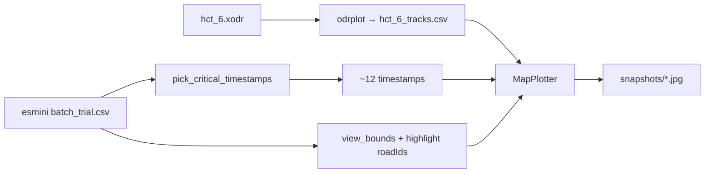

# Map & BEV Visualization — Discussion & Checklist

> **Purpose:** Follow-up guide for map preprocessing (Step 0) and BEV snapshots (Step 4).
> Use this when auditing outputs, comparing with `xosc_gen`, and deciding what to improve next.
>
> **Related docs:** `cluster_interpreter_integration_plan.md` (V1 roadmap), `readMD/BEV_COMPARISON_REPORT.md` (renderer comparison), `readMD/DATA_INVENTORY.md` (CSV availability).

---

## 1. Core insight: whole map ≠ what downstream analysis uses

`hct_6.xodr` is a **full road network** (554 roads, 66 junctions). `xosc_gen` works on **one small intersection** (4 arterial roads). You cannot expect gpl-odd Step 0 outputs to look or behave like `xosc_gen` at full-map scale.

| Artifact | Role in pipeline | Needed at full-map scale? |
|----------|------------------|---------------------------|
| `alldatasets/map/hct_6.yaml` | Labeller `ENTER/EXIT_JUNCTION` via `JunctionRoads` | **Yes** — lookup table, not a picture |
| `alldatasets/resources/xodr/hct_6_tracks.csv` | odrplot geometry for `MapPlotter` | **Yes** — source data; renderer crops locally |
| `alldatasets/map/hct_6.jpg` | LLM “map context” (Step 5) | **Mostly no** — 117 arterial roads ≠ one readable intersection |
| `alldatasets/map/hct_6_description.txt` | LLM map semantics | **Weak today** — generic rules, not scenario-local maneuvers |
| `results/.../cluster<i>/snapshots/*.jpg` | Main visual evidence for LLM | **Yes** — this is the xosc_gen equivalent |

**Bottom line:** Step 0 ✅ means “map database ready.” Thesis-quality gap is **Step 4 = localized, action-aligned BEV**, not a legible full-network JPG.

---

## 2. Pipeline comparison (xosc_gen vs gpl-odd)

| # | xosc_gen | gpl-odd | Status |
|---|----------|---------|--------|
| **0** | `map_preprocess.py` → YAML + JPG + description + tracks (one intersection) | `scripts/map_preprocess.py` (**map-agnostic**) + `scripts/generate_map_tracks.py` | ✅ YAML, tracks, JPG, description exist |
| **1** | `trajectory.csv` + `meta.yaml` | `dataset_builder.py` + `sim_labeller.py` | ✅ per cluster |
| **2** | `action.yaml` | `labeller.py` + `taxonomy.py` | ✅ per cluster |
| **3** | `description.txt` | `description.py` | ✅ per cluster |
| **4** | BEV at **action timestamps** (`xodr_plot.py`) | `tier2_renderer.py` — **heuristic** `pick_critical_timestamps()` | ⚠️ works; not action-aligned (V1-6) |
| **5** | LLM + snapshots | `cluster_interpretation_pipeline.py` | ⚠️ separate track |

### xosc_gen Step 0 vs gpl-odd Step 0 (important differences)

| Aspect | xosc_gen | gpl-odd now |
|--------|----------|-------------|
| Map YAML scope | 1 intersection, 4 roads + maneuver connections | Whole network (`Roads`, `JunctionRoads`, `Junctions`) |
| Description | Per-lane turn permissions for that intersection | 10-line generic rules (`hct_6_description.txt`) |
| Map JPG | Small intersection, readable highlights | All 117 arterial roads highlighted — dense / low LLM value |
| Why | inD cases are single-intersection recordings | `hct_6` is a real network; 4-way `collect_arterial_roads()` logic does not apply (GAP-1) |

---

## 3. How BEV snapshots work (Tier 2)



| Component | Implementation | Notes |
|-----------|----------------|-------|
| Map geometry | `scripts/generate_map_tracks.py` → `hct_6_tracks.csv` | Full network sampled (default step 2 m) |
| Agent motion | `csv_roadid_loader.get_csv_road_data()` | **Not** Payload observations |
| Key frames | `pick_critical_timestamps()` in `tier2_renderer.py` | Default 12: start/end, closest approach, within 20 m, min speed, max decel, road changes, uniform `mid_*` fill |
| View crop | `view_bounds_from_df()` | Agent bbox over **whole trial** + **10% pad per axis** (was fixed 45 m) |
| Road highlight | `highlight_road_ids_from_df()` | Only `roadId > 0` seen in esmini CSV; non-highlight roads show thin borders only |
| Output | `results/<dataset>/<k>/cluster<i>/snapshots/` | Via `dataset_builder.py` Step 7 |

### Why roads look “missing” in snapshots

1. **Highlight filter** — filled lanes and labels only for roads in the highlight set (visited `roadId` in CSV).
2. **View crop** — matplotlib `xlim`/`ylim` clip geometry outside the trial bounding box.
3. **NPC `roadId`** — if zero in esmini CSV, those roads never enter the highlight set (see §6).

### Known gap (GAP-5 / V1-6)

`xosc_gen` renders at **`action.yaml` event times** (enter junction, lane change, etc.).
gpl-odd still uses **kinematic heuristics**. Example: cluster0 has `LANE_CHANGE_RIGHT` at 6.86 s and `ENTER_JUNCTION` at 13.13 s in `action.yaml` — BEV may not frame those moments unless a heuristic coincides.

---

## 4. Dashboard replayer (visual reference — do not merge stacks)

Use the dashboard replayer as a **quality reference** for agent positions, not as the BEV implementation.

| Layer | Replayer | BEV (Tier 2) |
|-------|----------|--------------|
| Map | Static `app/dashboard/public/map.svg` (PixiJS `SVGScene`) | Dynamic `MapPlotter` + odrplot CSV |
| Trajectory | Payload API `/trials/trajectories` or saved `trajectories.json` ZIP | esmini `esmini_{batch}_{trial}.csv` |
| Replay | Linear interpolation on `time[]` → sprite position/rotation | Single-frame matplotlib render per key time |
| Camera | Ego-centric pivot + zoom | Fixed crop for whole trial |

**Takeaway for BEV improvements:** ego-centered per-frame zoom and smooth framing (replayer-style) are good *ideas*; implementation stays in `tier2_renderer.py` + `map_plotter.py`.

---

## 5. Scripts folder vs `app/analyzer`

| File | Why under `scripts/` |
|------|----------------------|
| `scripts/generate_map_tracks.py` | One-shot CLI; shells out to esmini `odrplot` binary |
| `scripts/map_preprocess.py` | One-shot CLI; writes into `alldatasets/map/` |

Both import `app/analyzer/src` (`dataset_config`, `MapPlotter`) but are **operator entry points**, not analyzer runtime. Same pattern as `build_llm_dataset.sh`, `run_bev_tier2.sh`.

---

## 6. NPC `roadId=0` — break or missing store?

**Not data corruption.** Positions and speeds are fine.

| Layer | Ego `roadId` | NPC `roadId` |
|-------|--------------|--------------|
| esmini CSV (source) | ✓ present | ✓ usually present |
| Payload Observations | ✓ stored | ✗ **always 0** — not copied in sampler |
| BEV highlight set | from esmini CSV | depends on CSV values |

**Root cause (Payload path):** `scenario_sampler.py` copies ego fields from `egoRow` but hardcodes agent map fields to zero:

```python
# ego: copied
"egoRoadId": int(egoRow["roadId"].values[0]),

# agents: NOT copied — bug at ~line 1405
"roadId": 0,
"laneId": 0,
```

**Impact:**

- `observations.json` / Payload trajectories: NPC `roadId` useless.
- `sim_labeller.py`: spatial fallback via XODR nearest lane.
- `tier2_renderer.py`: reads esmini CSV directly — highlight quality depends on CSV, not Payload.

**Fix location:** `simulation/ros/.../scenario_sampler.py` — copy `agentRow["roadId"]`, `laneId`, `s`, etc. like ego.

---

## 7. Priority order (map + BEV focus)

### P0 — Verify outputs exist (audit first)

`results/dataset1/3/cluster0/` was observed **without** `snapshots/` — Step 4 may have failed silently (`dataset_builder` catches exceptions and prints `⚠️`).

**Per cluster, confirm:**

```text
results/<dataset>/<k>/cluster<i>/
  medoid.json
  action.yaml
  description.txt
  trajectory.csv
  meta.yaml
  snapshots/*.jpg    ← must exist (~12 files)
```

**Prerequisites:**

```bash
# Map tracks (once per map variant)
python3 scripts/generate_map_tracks.py --dataset dataset1

# Esmini CSV for medoid (from medoid.json batch_id + trial_index)
ls simulation/ros/.cache/scenario_search/records/esmini_<batch>_<trial_index>.csv

# Rebuild cluster artifacts
./scripts/build_llm_dataset.sh dataset1 3
```

Watch console for: `⚠️ BEV skipped`, `⚠️ BEV generation failed`, `No esmini CSV`.

---

### P1 — Action-aligned BEV timestamps (GAP-5 / V1-6) — highest value

| Check | Pass criteria |
|-------|---------------|
| Each `ENTER_JUNCTION` / `EXIT_JUNCTION` / `LANE_CHANGE_*` in `action.yaml` has a snapshot | Time appears in filename or figure title |
| Start / end always present | `*_start*`, `*_end*` labels |
| Heuristic `mid_*` frames | OK as filler, not primary story |

**Target change:** `tier2_renderer.py` — optional `action_yaml_path`; render at `action.start_time` first, then fill with heuristics.

---

### P2 — Local map in the image (not whole network)

| Mechanism | Current behavior | What to check visually |
|-----------|------------------|------------------------|
| View crop | Trial agent min/max + 10% pad, **same for all 12 frames** | Interaction centered? Too tight/wide? |
| Highlight | `roadId > 0` from esmini CSV only | Junction connectors missing? |
| Full tracks CSV | Drawn then clipped by matplotlib | Expected |

**Improvement ideas (in order):**

1. Expand highlight: visited `roadId` ∪ junction neighbors from `hct_6.yaml`
2. Per-frame ego-centered crop (replayer-style)
3. Per-cluster **local overview** JPG (cropped empty map) instead of full `hct_6.jpg` in LLM prompt

---

### P3 — Step 0 artifacts: keep YAML, downgrade full-map image/description for LLM

| File | Improve for LLM? |
|------|------------------|
| `hct_6.yaml` | Low — sufficient for labeller |
| `hct_6_description.txt` | Medium — add **cluster-local** road/junction excerpt |
| `hct_6.jpg` (full network) | Low — prefer scenario-cropped map per cluster |

Do **not** port xosc_gen 4-way `map_preprocess` to full hct_6. Extract **local context** from medoid trajectory + `Junctions` in YAML.

---

### P4 — Data quality for highlight (`roadId`)

For each medoid, inspect esmini CSV:

```bash
# Example: medoid batch_id=1, trial_index=467
# Inspect roadId per agent name column
```

- Ego: `roadId` populated along route?
- Oncoming: mostly non-zero or mostly 0?

If NPC `roadId` is 0 in CSV → fix sampler; consider topological highlight expansion in BEV.

---

### P5 — Acceptance test vs xosc_gen

Side-by-side for one medoid:

| Dimension | xosc_gen | gpl-odd target |
|-----------|----------|----------------|
| Map style | Filled lanes, labels | Same (`MapPlotter` + odrplot) ✅ |
| Map extent | One intersection | **Local crop only** |
| Frame times | `action.yaml` events | **After V1-6** |
| Agent boxes + trails | Yes | Yes ✅ |
| Map text for LLM | Rich lane rules | **Per-scenario snippet** |

---

## 8. Step-by-step checklist (copy-paste audit)

### Step 0 — Map setup (infrastructure)

- [ ] `python3 scripts/generate_map_tracks.py --dataset dataset1` → `alldatasets/resources/xodr/hct_6_tracks.csv` exists
- [ ] `python3 scripts/map_preprocess.py --dataset dataset1` → `alldatasets/map/hct_6.yaml`, `.jpg`, `_description.txt`
- [ ] `hct_6.yaml` contains `JunctionRoads` used in your cases (e.g. road 206 in cluster0 `action.yaml`)
- [ ] Open `hct_6.jpg` — treat as **reference only**, not primary LLM visual
- [ ] Confirm `hct_6_description.txt` is generic; per-cluster `description.txt` carries scenario narrative

### Step 1–3 — Inputs to BEV

- [ ] `trajectory.csv` + `meta.yaml` per cluster
- [ ] `action.yaml` has junction/lane events with plausible `road_id`
- [ ] `description.txt` mentions same roads/times as `action.yaml`
- [ ] `medoid.json` → local `esmini_{batch}_{trial_index}.csv` exists

### Step 4 — BEV (main focus)

- [ ] `snapshots/` exists with ~12 JPGs per cluster
- [ ] `ENTER_JUNCTION` (and other key actions) times appear in snapshot set
- [ ] Both agents visible on **filled** lanes (not only thin borders)
- [ ] Note heuristic labels: `start`, `end`, `closest_approach`, `mid_*`, `ego_road_change_*`
- [ ] Optional: compare one frame with dashboard replayer at same trial/time

### Step 5 — LLM wiring (informs what Step 4 must deliver)

- [ ] Interpreter uses `snapshots/*.jpg` + `description.txt`
- [ ] Question whether full `hct_6.jpg` helps or adds noise

---

## 9. Recommended improvement sequence

| Order | Task | File(s) |
|-------|------|---------|
| 1 | Audit all clusters — fix missing CSV/tracks/snapshots | `dataset_builder.py`, local cache |
| 2 | V1-6: BEV frames from `action.yaml` timestamps | `tier2_renderer.py` |
| 3 | Expand road highlight (topology / junction neighbors) | `tier2_renderer.py`, `map_plotter.py` |
| 4 | Per-cluster local map snippet for LLM (cropped empty map + junction text) | new helper or `map_preprocess` extension |
| 5 | Visual QA vs dashboard replayer | manual |
| 6 | Optional: per-frame ego-centric zoom | `tier2_renderer.py` |
| 7 | Fix NPC `roadId` at source | `scenario_sampler.py` |

---

## 10. Safe to deprioritize

- Porting xosc_gen 4-way maneuver extraction to full hct_6
- Making full-network `hct_6.jpg` legible for LLM
- Phase 3a `renderer.py` / `XodrParser` path (superseded by Tier 2)
- Merging dashboard `map.svg` into BEV (different stack; use as reference only)

---

## 11. Key file paths

| What | Path |
|------|------|
| Map preprocess CLI | `scripts/map_preprocess.py` |
| odrplot tracks CLI | `scripts/generate_map_tracks.py` |
| BEV renderer | `app/analyzer/src/tier2_renderer.py` |
| Map drawing | `app/analyzer/src/map_plotter.py` |
| Esmini CSV loader | `app/analyzer/src/csv_roadid_loader.py` |
| Dataset orchestration | `app/analyzer/src/dataset_builder.py` |
| Build script | `scripts/build_llm_dataset.sh` |
| Map assets | `alldatasets/map/`, `alldatasets/resources/xodr/` |
| Cluster outputs | `results/<dataset>/<n_clusters>/cluster<i>/` |
| Esmini CSV cache | `simulation/ros/.cache/scenario_search/records/` |
| Sampler bug | `simulation/ros/src/scenario_search/src/scenario_search/scenario_sampler.py` |
| Dashboard replayer | `app/dashboard/src/app/batch/[id]/_tabs/explore/components/dock/panels/Replayer/index.tsx` |
| Integration plan | `../cluster_interpreter_integration_plan.md` (repo parent) |

---

## 12. xosc_gen vs gpl-odd — why `01_bendplatz.jpg` looks smooth

### Code trace (same algorithm)

| Step | xosc_gen | gpl-odd |
|------|----------|---------|
| Map geometry | `odrplot` → `*_tracks.csv` | Same (`generate_map_tracks.py` → `hct_6_tracks.csv`) |
| Parser | `xodr_plot.MapPlotter._parse_and_process_map_data` | Vendored copy in `map_plotter.py` (same lane tags) |
| Empty JPG | `map_preprocess.py` → `plot_empty_map(tracks, jpg, road_ids)` | `scripts/map_preprocess.py` → same call |
| Draw order | ① all `#AAAAAA` borders ② red ref (highlight) ③ gray fill (highlight) ④ labels | **Restored to match xosc_gen (June 2026)** |

xosc_gen `_plot_base_map` (lines 113–137) **always** plots every `border` polyline with no highlight filter. Ref, fill, and labels are filtered by `highlight_road_ids`.

### Source data — NOT lost

Verified on `hct_6_tracks.csv`:

| Lane tag in CSV | Parsed type | Count (approx.) |
|-----------------|-------------|-----------------|
| `lane … 0` (no `no-driving`) | `ref` | 592 |
| `lane … N, no-driving` | `border` | **329** (194 roads) |
| `lane … N, driving` | `driving` | 774 |

OpenDRIVE / odrplot still exports borders. If borders are missing in JPG, cause is **rendering or view**, not missing XODR tags.

### Why xosc_gen *looks* connected and gpl-odd often does not

| Factor | xosc_gen `01_bendplatz` | gpl-odd `hct_6` / cluster BEV |
|--------|-------------------------|-------------------------------|
| Map scope | **One intersection**, ~4 arterial roads in highlight | **554 roads**, 66 junctions; cluster view shows ~5–10 roads in crop |
| Camera | Full intersection fits in frame (no `view_bounds`) | **Cropped** to trial agent bbox + 10% pad |
| Highlight set | 4 single-digit road IDs | Multi-digit IDs from esmini CSV (`51`, `152`, …) |
| Junction geometry | Short connector roads in one odrplot file | Junction = separate `junction-road` polylines; **gaps at road–junction joins** are normal in odrplot sampling |
| Border drawing | All 329-equivalent borders for **small** map | All borders from **whole network** drawn, then matplotlib **clips** — segments from off-scene roads still appear as stray gray lines in crop |

**Conclusion:** xosc_gen smoothness = **small map + full frame + few highlighted roads**. gpl-odd fragmentation = **network scale + crop + junction sampling gaps**, not a broken parser or missing `no-driving` tags.

### Bugs found in gpl-odd (fixed)

1. **Border skip (regression):** We had disabled `#AAAAAA` borders when `highlight_road_ids_list` was set. xosc_gen never does this. **Fixed:** always draw all borders like xosc_gen.
2. **Highlight string bug:** `map_preprocess.py` passed `"51,152,…"` as a string; iterating it character-by-character broke multi-digit road IDs. **Fixed:** `_coerce_highlight_road_ids()` + pass `map_data["Roads"]` as a list.
3. **Junction connector roads have no border lanes (root cause of "missing corners")** — see Section 14.

---

## 14. Root cause: disconnected gray borders at junctions (June 2026)

### Investigation method
Pipeline audit from raw XODR → odrplot CSV → MapPlotter:

```
hct_6.xodr  ──odrplot──►  hct_6_tracks.csv  ──MapPlotter──►  map_overview.jpg
```

### Finding 1 — Lane types in XODR for junction connector roads

Junction connector roads (those with `junction != -1`) **only define driving lanes**. They do NOT have `shoulder`, `curb`, `parking`, or `border`-typed lanes. Examples:

| Road | junction= | Lanes in XODR | Border lanes in CSV |
|------|-----------|---------------|---------------------|
| 51   | -1 (arterial) | driving, shoulder(-2), parking(-3) | ✅ -2, -3 → `no-driving` |
| 152  | -1 (arterial) | driving, shoulder(±2) | ✅ ±2 → `no-driving` |
| 89   | -1 (arterial) | driving(±1) only | ❌ NONE |
| 206  | 187 (junction connector) | driving(+1) only | ❌ NONE |
| 396  | 391 (junction connector) | driving(-1) only | ❌ NONE |
| 199,200,203,205,208 | 187 (junction connector) | driving(+1) only | ❌ NONE |

`odrplot` correctly outputs `no-driving` only for lanes that are non-drivable types in the XODR. Junction connectors do not have those lanes — **by design in the OpenDRIVE standard**. A turning lane inside a junction has no shoulder.

### Finding 2 — odrplot polyline semantics

For each `lane` row, odrplot writes the **outer boundary** polyline of that lane. So for a junction road with only lane `+1`:
- The polyline for lane `+1` = outer-left edge of the road → **this IS the road border**
- The polyline for lane `0` (ref) = road center line

These outer polylines for junction connectors are tagged as `driving` in our parsed CSV, and `_plot_base_map` only draws `#AAAAAA` for lanes tagged `border`. The road outer edge was **silently ignored**.

### Fix — `map_plotter.py` `_plot_base_map` Pass 2

For each road section: if a side (positive or negative lane IDs) has **zero explicit border lanes**, draw the outermost driving lane's polyline as `#AAAAAA`. This is sound because that polyline = the road's physical outer edge.

```python
# Pass 2 (new): junction connectors have no shoulder → draw outermost driving lane as border
for r_id, sections_data in processed_roads_data.items():
    for ls_idx, lanes_in_section in sections_data.items():
        pos_ids = [lid for lid in lanes_in_section if lid is not None and lid > 0]
        neg_ids = [lid for lid in lanes_in_section if lid is not None and lid < 0]
        pos_has_border = any(lanes_in_section[lid]["type"] == "border" for lid in pos_ids)
        neg_has_border = any(lanes_in_section[lid]["type"] == "border" for lid in neg_ids)
        if not pos_has_border and pos_ids:
            outer = lanes_in_section[max(pos_ids)]
            if outer["type"] == "driving" and len(outer["x"]) > 0:
                plt.plot(outer["x"], outer["y"], linewidth=1.0, color="#AAAAAA")
        if not neg_has_border and neg_ids:
            outer = lanes_in_section[min(neg_ids)]
            if outer["type"] == "driving" and len(outer["x"]) > 0:
                plt.plot(outer["x"], outer["y"], linewidth=1.0, color="#AAAAAA")
```

Roads with explicit border lanes (51, 152, 72) are **not affected** — `pos_has_border`/`neg_has_border` is `True` for them so no extra line is drawn.

### Result
Before: junction corners had **no gray lines** — borders ended abruptly where arterial roads met connector roads.  
After: all outer edges drawn consistently. `map_overview.jpg` shows connected junction geometry.

### What still differs from xosc_gen visually

- Cropped cluster views show border segments that **do not connect across junction-road IDs** (odrplot limitation — each road is its own independent set of polylines, junctions are just co-located endpoints, not stitched).
- Gray **outer curb** is the border polyline; **inner** lane edge is often the red ref line (fill goes ref ↔ outer border per half-road).
- Full-network `hct_6.jpg` (554 roads, 66 junctions) will never look as clean as `01_bendplatz.jpg` (4 roads, 1 junction).

### Red “dots” in BEV

Road-direction arrows at ref-line starts (`plt.arrow` in `_plot_base_map`). Short segments at junctions look like dots when zoomed. xosc_gen uses the same arrow code (width 0.1, head 1.0 / 1.5).

### Per-cluster map without cars

`results/<dataset>/<k>/cluster<i>/map_overview.jpg` — same `render_scene()` as snapshots (borders + fill + labels), no agents.

---

## 13. Status log (update as you go)

| Date | Dataset / clusters | Snapshots OK? | Notes |
|------|-------------------|---------------|-------|
| 2026-06-05 | dataset1 / 2 | ✅ 2/2 | cluster0 trial_467, cluster1 trial_651 |
| 2026-06-05 | borders restored | — | `_plot_base_map` aligned with xosc_gen; highlight id coerce fix |
| 2026-06-05 | **junction border fix** | ✅ 2/2 | Pass-2 in `_plot_base_map`: outermost driving lane drawn gray when no explicit border; corners connect |

---

*Last updated: June 2026 — junction border fix (Pass 2 in `_plot_base_map`); full root cause traced in Section 14.*
