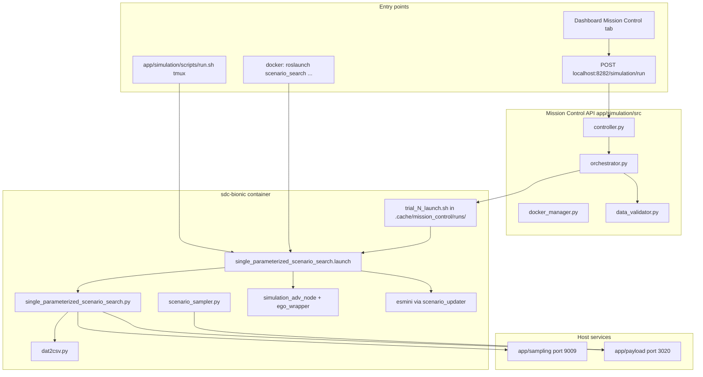
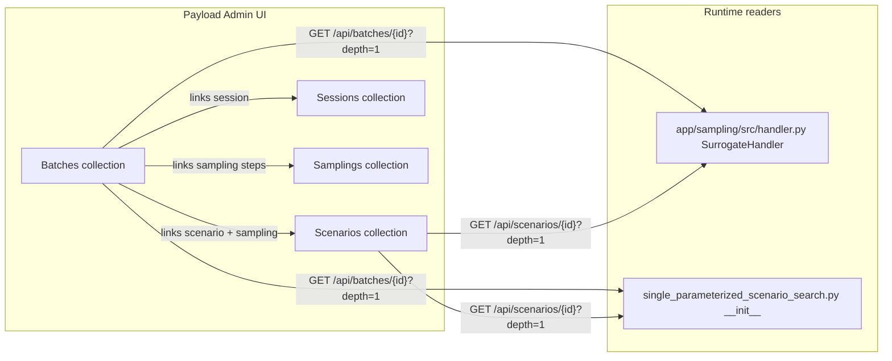
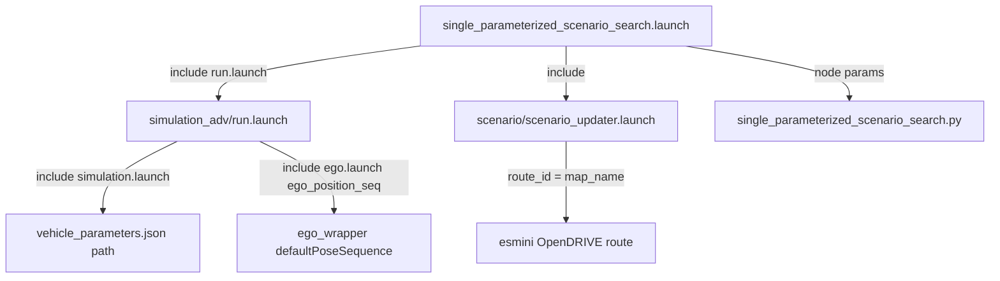
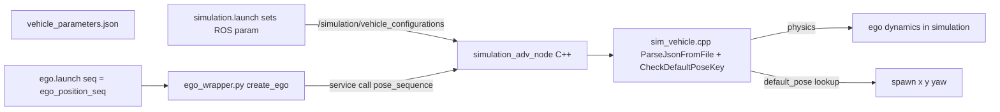

# Mission Control — Simulation Pipeline Reference

**Status:** Mission Control API (port 8282) and Dashboard **Mission Control** tab are **implemented**. The underlying ROS/esmini stack is unchanged from upstream [ian-chiu/gpl-odd-project](https://github.com/ian-chiu/gpl-odd-project); this fork adds programmatic orchestration and a one-click UI.

**Goal:** Unify Payload, Sampling, Simulation, Analyzer, and Dashboard into a single workflow with visibility and fewer manual terminals.

### Documentation map

| Need | Read |
|------|------|
| **Step-by-step run commands** (ports, SSH tunnel, container) | [MISSION_CONTROL_USER_GUIDE.md](MISSION_CONTROL_USER_GUIDE.md) |
| **Per-trial CSV paths, data flow & analysis** | [DATA_INVENTORY_AND_ANALYSIS.md](DATA_INVENTORY_AND_ANALYSIS.md) |
| **Legacy tmux workflow** (upstream / senior style) | [README.md](../README.md) §4 Goal B; [Legacy upstream workflow](#legacy-upstream-workflow--can-you-still-follow-it) below |
| **Payload Admin → code parameter flow** | [Payload CMS configuration → code](#payload-cms-configuration--code-parameter-flow) below |
| **Architecture, call graph, launch file, vehicle_parameters** | **This file** |

---

## Problem Statement (original motivation)

The **legacy** workflow required **4 manual terminals (SSH/Xterm)**:

| Terminal | Command | Issue |
|----------|---------|-------|
| 1 | `sdc-docker-enter-container-shell` → `roslaunch simulation_adv run.launch` | Needs Xterm GUI |
| 2 | `litestar run --port 9009` (Sampling) | Must activate conda env manually |
| 3 | `docker compose up -d` (Payload) | Must be started before anything else |
| 4 | `rosrun scenario_search single_parameterized_scenario_search.py --batch_id X` | Easy to mis-configure |

Mission Control addresses **visibility** (progress bar, logs) and **orchestration** (one API / Dashboard button). Payload and the ROS trial loop are the same; see [How to run simulation](#how-to-run-simulation) below.

---

## How simulation runs

Three **entry points** all converge on the same ROS launch file inside the `sdc-bionic` container.



### File call graph

| Step | File | Role |
|------|------|------|
| Launch file | `simulation/ros/src/scenario_search/launch/single_parameterized_scenario_search.launch` | Includes `simulation_adv/run.launch`, `scenario/scenario_updater.launch`; starts node `single_parameterized_scenario_search.py` |
| ROS sim core | `simulation/ros/src/simulation_adv/launch/simulation.launch` | Sets `/simulation/vehicle_configurations` → `vehicle_parameters.json`; starts `simulation_adv_node` |
| Ego spawn | `simulation/ros/src/simulation_adv/launch/ego.launch` | `ego_position_seq` → spawn pose lookup in `vehicle_parameters.json` |
| Trial loop | `simulation/ros/src/scenario_search/src/scenario_search/single_parameterized_scenario_search.py` | Bootstrap from Payload; `/suggest`; run esmini; `dat2csv`; `/register`; `POST /trials`, `/esminiDats` |
| Observations | `simulation/ros/src/scenario_search/src/scenario_search/scenario_sampler.py` | ROS topic subscribers → `POST /observations/bulk` |
| Mission Control | `app/simulation/src/orchestrator.py` | Per trial: write launch script → `docker exec` → poll `records/esmini_<batch>_*.csv` (**does not** call `/suggest` — ROS does) |
| HTTP API | `app/simulation/src/controller.py` | `POST /simulation/run`, WebSocket `/simulation/stream/{id}`, health |
| Legacy workers | `app/simulation/scripts/run.sh` | tmux + container `~/.bash_script --scenario_search_headless` |

### Launch parameters (batch 1 example — HCT exit)

| Parameter | Default in launch file | Set by Mission Control? |
|-----------|------------------------|-------------------------|
| `batch_id` | `3` in file; override on CLI | Yes — `batch_id:=N` in generated `trial_N_launch.sh` |
| `sampling_suggestion_api` | `http://localhost:9009` | Yes |
| `headless` | `false` in file | Yes — `headless:=true` |
| `map_name` | `hct_logistic` | No (launch default) |
| `route_name` | `operation` | No |
| `ego_position_seq` | `26` | No — see [vehicle_parameters.json](#vehicle_parametersjson--injection-and-influence) |

---

## Per-trial data flow

Full data flow: [DATA_INVENTORY_AND_ANALYSIS.md](DATA_INVENTORY_AND_ANALYSIS.md).

```text
1. SPSS __init__       GET Payload /batches/{id}, /scenarios/{id}
                       Download .xosc / .xodr → simulation/ros/.cache/scenario_search/
2. New trial           GET Sampling /suggest/{batch_id} → OncomingSpeed, OncomingStartDelay, ...
3. esmini run          records/esmini_{batch}_{trial_index}.dat
4. dat2csv.py          records/esmini_{batch}_{trial_index}.csv
5. End of trial        POST Sampling /register (outcome, KPIs)
                       POST Payload /esminiDats (upload .dat)
                       POST Payload /trials (parameters, link batch)
6. During run          scenario_sampler → POST Payload /observations/bulk
7. Mission Control     polls CSV mtime under records/; optional validate_trial()
```

**Disk paths (bind-mounted repo):**

| Artifact | Path |
|----------|------|
| esmini CSV | `simulation/ros/.cache/scenario_search/records/esmini_<batch>_<trial_index>.csv` |
| MC run logs | `simulation/ros/.cache/mission_control/runs/<run_id>/trial_*_roslaunch.log` |
| Analysis export | `alldatasets/datasetN/` (Analyzer + Dashboard — **not** written by esmini directly) |

**Trial ID warning:** The numeric index in the CSV filename is Sampling's `trial_index`, **not** Payload `trial.id`. Mapping `trial_id ≈ trial_id_base + trial_index` only holds when clustering and CSVs come from the **same** simulation campaign. Do not pair senior `alldatasets/` exports with new local `records/` without re-running clustering. See [DATA_INVENTORY_AND_ANALYSIS.md](DATA_INVENTORY_AND_ANALYSIS.md).

---

## Legacy upstream workflow — can you still follow it?

**Yes.** The senior / [ian-chiu/gpl-odd-project](https://github.com/ian-chiu/gpl-odd-project) steps still work on this fork. Mission Control is an **optional** wrapper around the same ROS stack; it does not replace Payload setup or the scenario_search launch file.

| Senior doc step | Still valid? | Notes for this repo |
|-----------------|--------------|---------------------|
| Payload Admin → Scenario, Session, Batch, Sampling | Yes | Same collections; `http://140.113.208.174:3020/admin` = `http://localhost:3020/admin` on the lab PC |
| Edit launch file `batch_id`, `sampling_suggestion_api` | Yes | Correct path: `simulation/ros/src/scenario_search/launch/single_parameterized_scenario_search.launch` (not `simulation/ros/scenario_search/...`) |
| `ego_position_seq` + `vehicle_parameters.json` | Yes | See [Launch file flow](#launch-file--who-reads-each-parameter) below |
| Headless via `deploy/parallel/container_script` | Yes | Last line: `headless:=true` for `run.sh` workers; Mission Control also passes `headless:=true` |
| `conda activate sampling` + `litestar run --port 9009` + `POST /initialize` | Yes | Or use `./scripts/start_dev_stack.sh` |
| `cd app/simulation/scripts` → `tmux` → `./run.sh N` | Yes | Legacy parallel workers — [Path B](#path-b--legacy-tmux-upstream--senior) |
| `bun run start` for Dashboard | Yes | Skip if port 3000 already in use (`start_dev_stack.sh` may have started it) |
| Analyzer on 9010 + Dashboard Save → Analyze | Yes | Unchanged |

**What Mission Control adds:** you can skip tmux and pass `batch_id` / sampling URL from the Dashboard or API instead of editing the launch file for those two args — but **Scenario / Batch / Sampling documents in Payload are still required** for the first-time setup.

---

## Payload CMS configuration → code (parameter flow)

Payload Admin is step 1: you define **what** to search (parameters, KPIs, maps, sampling plan). At runtime, **two services** read the same batch/scenario documents independently.



### What you configure in Admin vs what code reads

| Payload collection / field | Used for | Read by | Becomes in code |
|--------------------------|----------|---------|-----------------|
| **Batch** `id` | Which search run | Launch `batch_id`, `POST /initialize`, MC `batch_id` | `rospy.get_param(".../batch_id")` → `GET /batches/{id}` |
| **Batch** → **Scenario** link | Logical scenario definition | SPSS + Sampling `__init__` | `GET /scenarios/{scenario.id}` |
| **Scenario** `parameters` (min/max per name) | Search space | Both | `sampling_plan.search_space.parameters` in `scenario_search_config.json` |
| **Scenario** `parameterConstraints` | Valid combinations | Both | Same config JSON |
| **Scenario** `testObjectives.criticalityMetrics` | KPI thresholds (TTC, etc.) | Both | `safety_requirement.metrics` |
| **Scenario** `validConditions`, `startObservationSamplingConditions` | When trial is valid / when to sample | SPSS only | `scenario_valid_conditions`, `start_sampling_conditions` |
| **Scenario** `observationRecordingAgents` | Which agents to record | SPSS only | `state_recording_agents` |
| **Scenario** `openScenarioField`, `openDrive` | `.xosc` / `.xodr` files | SPSS only | Downloaded to `.cache/scenario_search/`; xosc LogicFile patched to local xodr path |
| **Batch** → **Sampling** link `steps` | Bayesian / generation steps | Both | `sampling_plan.generation_steps` |
| **Session** | Organizes batches in Admin/Dashboard | Dashboard UI only | Not read by ROS at runtime |

### Key code locations (Payload → disk → ROS)

| Step | File | What happens |
|------|------|----------------|
| Sampling init | `app/sampling/src/handler.py` — `SurrogateHandler.__init__` | `GET /batches/{batch_id}`, `GET /scenarios/{id}`; builds Ax search space from scenario parameters + sampling steps |
| Sampling suggest | `app/sampling/src/controller.py` — `GET /suggest/{batch_id}` | Returns next `trial_index` + parameter values (e.g. `OncomingSpeed`, `OncomingStartDelay`) |
| SPSS bootstrap | `single_parameterized_scenario_search.py` lines ~133–282 | Same Payload GETs; writes `scenario_search_config.json`, `scenario_default_config.json`; sets ROS param `scenario/config/file` |
| Per trial | `single_parameterized_scenario_search.py` — `generate_new_config()` | `GET {sampling_api}/suggest/{batch_id}` → applies parameters to esmini config |
| After trial | same file ~653–761 | `POST /register` to Sampling; `POST /trials`, `/esminiDats` to Payload |
| Observations | `scenario_sampler.py` ~1162 | `POST /observations/bulk` during simulation |

**Important:** `batch_id` in the **launch file** (or Mission Control) must match the **Batch** document ID in Payload. The launch file does **not** embed scenario parameters — those always come from Payload via HTTP at node startup.

**Env vars in container:** `PAYLOAD_API` (e.g. `http://host.docker.internal:3020/api` or lab IP) and `USER_API_KEY` must be set so SPSS and scenario_sampler can authenticate.

---

## Launch file — who reads each parameter

**File:** `simulation/ros/src/scenario_search/launch/single_parameterized_scenario_search.launch`

Launch `<arg>` values become ROS params on nodes started by that file. This is **separate** from Payload (except `batch_id` must match your Batch document).



| Launch `<arg>` | ROS param namespace | Read by | Effect |
|----------------|---------------------|---------|--------|
| `batch_id` | `/single_parameterized_scenario_search/batch_id` | `single_parameterized_scenario_search.py` | Selects Payload Batch; used in CSV names `esmini_{batch}_{idx}.csv` |
| `sampling_suggestion_api` | `/single_parameterized_scenario_search/sampling_suggestion_api` | SPSS | Base URL for `/suggest` and `/register` |
| `map_name` | `/single_parameterized_scenario_search/map_name` | SPSS | Writes `route_mission_handler/route` in vehicle yaml; scenario_updater `route_id` |
| `route_name` | `/single_parameterized_scenario_search/route_name` | SPSS | Mission / route file name (e.g. `operation`) |
| `ego_id` | `/single_parameterized_scenario_search/ego_id` | SPSS | Payload `trials` ego link |
| `headless` | passed to `simulation_adv` | `simulation_adv_node` | esmini with or without display |
| `ego_position_seq` | `ego.launch` → `spawn_information/defaultPoseSequence` | `ego_wrapper.py` → `simulation_adv` service | Index into `vehicle_parameters.json` poses — see below |
| `enable_reference_preventable_judgement` | SPSS param | SPSS | Reference-model preventable flow |

**Map / route files (ITRI AV):** Senior docs refer to `semantic-maps/data` and `semantic-maps/route` inside the Docker image. For `hct_logistic` / `operation`, route content may be adjusted under the container's semantic-maps tree; OpenDRIVE for esmini also comes from Payload scenario `openDrive` download into `.cache/scenario_search/`.

**Headless (legacy tmux):** `deploy/parallel/container_script` line 18 runs `roslaunch ... headless:=true`. Equivalent to Mission Control's generated launch script.

---

## `vehicle_parameters.json` — readers and data flow

**File:** `simulation/ros/src/simulation_utils/data/vehicle_parameters.json`

Controls **ego vehicle physics** (mass, stiffness, dimensions) and **discrete spawn poses**. Does **not** set sampled parameters (`OncomingSpeed`, etc. — those come from Payload + Sampling).



| Reader | File | How it uses the JSON |
|--------|------|----------------------|
| ROS param injection | `simulation_adv/launch/simulation.launch` | Sets `/simulation/vehicle_configurations` to absolute path of JSON |
| Physics + pose lookup | `simulation_utils/src/sim/sim_vehicle.cpp` | `ParseJsonFromFile()` loads JSON; `CheckDefaultPoseKey(model, route, fileName, seq)` reads `default_pose.<route>.<fileName>[seq]` |
| Ego spawn orchestration | `simulation_adv/scripts/ego_wrapper.py` | Reads `~spawn_information/defaultPoseSequence` from launch; calls create-ego service with `pose_sequence` |
| Service handler | `simulation_adv/src/simulation.cpp` | Passes `request.defaultPoseSequence` into vehicle creation |
| Launch wiring | `simulation_adv/launch/run.launch` → `ego.launch` | `ego_position_seq` launch arg → `seq` → `defaultPoseSequence` param |

**Index rule:** `ego_position_seq` is the **0-based index** into the array `pacifica.default_pose.<map_name>.<route_name>` (e.g. `hct_logistic` → `operation` → `[26]`).

### JSON path for default batch-1 spawn

```text
vehicle_parameters.json
  └── pacifica
        └── default_pose
              └── hct_logistic          ← map_name launch arg
                    └── operation       ← route_name launch arg
                          └── [26]        ← ego_position_seq
                                alias: "turn_right_at_bridge"
                                x: 505.16, y: 199.78, orientation: 0.6018
```

| Change you want | Edit |
|-----------------|------|
| Ego start position on map | `ego_position_seq` in launch file **or** add entry under `default_pose.<map>.<route>` |
| Vehicle dynamics (mass, tire stiffness) | `pacifica` top-level fields in JSON |
| Oncoming vehicle speed / delay | Payload scenario `parameters` + Sampling `/suggest` — **not** this file |
| Visualize poses on map | esmini `odrplot` (senior doc) — offline; not wired in this repo |

---

## Payload's role in the simulation pipeline (summary)

Payload is the **system of record**. Simulation nodes use REST + API key (`PAYLOAD_API`, `USER_API_KEY` in the container). See [Payload CMS configuration → code](#payload-cms-configuration--code-parameter-flow) for the full field mapping.

| When | Payload endpoint | Consumer |
|------|------------------|----------|
| Node startup | `GET /batches/{id}`, `GET /scenarios/{id}` | `single_parameterized_scenario_search.py`, `app/sampling/src/handler.py` |
| Asset fetch | OpenSCENARIO / OpenDRIVE URLs from scenario document | SPSS → `.cache/scenario_search/` |
| Each trial | `GET /suggest/{batch_id}` (via Sampling, not Payload) | SPSS |
| After trial | `POST /esminiDats`, `POST /trials` | SPSS |
| Per frame | `POST /observations/bulk` | `scenario_sampler.py` |
| Analysis later | `GET` trials / observations | Analyzer (9010) → Dashboard → `alldatasets/` export |

**Admin UI** (`http://<host>:3020/admin`) is optional for operators — browse batches, trials, observations. Services do not use browser login; they use `Authorization: users API-Key <key>`.

Payload often runs in Docker with `restart: unless-stopped`, so `http://140.113.208.174:3020/admin` and `http://localhost:3020/admin` are the **same website** when you are on the lab PC.

---

## How to run simulation

Detailed port, SSH tunnel, and container steps: **[MISSION_CONTROL_USER_GUIDE.md](MISSION_CONTROL_USER_GUIDE.md)**.

### Prerequisites

| Service | Port | Legacy tmux | Mission Control |
|---------|------|-------------|-----------------|
| Payload | 3020 | `docker compose up -d` in `app/payload` | Same (often already running) |
| Sampling | 9009 | `litestar run` + `POST /initialize` | `./scripts/start_dev_stack.sh` |
| Analyzer | 9010 | Optional for sim; needed to view clusters | Started by dev stack |
| Mission Control | 8282 | N/A | Started by dev stack |
| Dashboard | 3000 | Optional | Started by dev stack |
| `sdc-bionic` | — | `sdc-docker-start-container` | Same |

### Path A — Mission Control (recommended on lab PC)

1. Start stack: `./scripts/start_dev_stack.sh` (from repo root).
2. Ensure `sdc-bionic` is running: `docker ps | grep sdc-bionic`.
3. **Before a run:** if the container has stale ROS processes from earlier sessions, clean up:
   ```bash
   docker exec sdc-bionic bash -lc 'pkill -9 -f roslaunch; pkill -9 -f rosmaster; sleep 3'
   ```
   Do **not** run standalone `roslaunch simulation_adv run.launch` in parallel — Mission Control launches the **full** `single_parameterized_scenario_search.launch` per trial.
4. **Dashboard:** open a batch → Explore dock → **Mission Control** tab → set trial count → **Run Simulation**.
5. **Or API:**
   ```bash
   curl -X POST http://localhost:8282/simulation/run \
     -H "Content-Type: application/json" \
     -d '{"batch_id":1,"scenario_id":1,"n_trials":1,"max_trial_duration_seconds":600}'
   curl http://localhost:8282/simulation/status/<run_id>
   ```
6. **Logs:** `simulation/ros/.cache/mission_control/runs/<run_id>/trial_*_roslaunch.log`
7. **Output CSV:** `simulation/ros/.cache/scenario_search/records/esmini_<batch>_<idx>.csv`

### Path B — Legacy tmux (upstream / senior)

Documented in [README.md](../README.md) §4 Goal B and [simulation/README.md](../simulation/README.md):

```bash
cd app/simulation/scripts
tmux
./run.sh 4    # parallel workers
```

Workers call `roslaunch scenario_search single_parameterized_scenario_search.launch headless:=true` inside the container via `~/.bash_script`.

### Path C — Manual debug (single worker)

Inside `sdc-bionic`:

```bash
source /opt/ros/melodic/setup.bash
source /project/mmsl_simulation/devel/setup.bash
roslaunch scenario_search single_parameterized_scenario_search.launch \
  batch_id:=1 \
  sampling_suggestion_api:=http://localhost:9009 \
  headless:=true
```

### Troubleshooting (lab-tested)

| Symptom | Likely cause | Fix |
|---------|--------------|-----|
| `ROS_DISTRO: unbound variable` in `trial_*_roslaunch.log` | Launch script used `set -u` before sourcing ROS | Fixed in `orchestrator.py` (`export ROS_DISTRO=melodic`) |
| `SyntaxError` / `exist_ok` in SPSS log | Python 2.7 in container vs Py3-only helper | Fixed in `single_parameterized_scenario_search.py` (`_safe_dump_json`) |
| Duplicate node names / processes die | Stale `roslaunch` from prior runs | Kill old ROS in container before MC run (see step 3 above) |
| Trial runs but no new CSV | esmini still running, or SPSS crashed | Inspect roslaunch log; trials can take several minutes |
| `fake_lane_detection` missing | Optional package | Warning only; usually non-fatal |
| ROS log disk > 1 GB | Long-running container | `rosclean purge` inside container |

---

## Dashboard integration

### Already implemented (no extra UI work for basic runs)

| Piece | Location |
|-------|----------|
| Mission Control tab | `app/dashboard/src/app/batch/[id]/_tabs/explore/components/dock/panels/MissionControl/` |
| Dock registration | `app/dashboard/.../dock/layout.tsx` |
| API client | `app/dashboard/src/app/_shared/api/missionControl.ts` |
| Env | `NEXT_PUBLIC_MISSION_CONTROL_API` in `app/dashboard/.env` |

**Features:** health chips (Payload, Sampling, Docker), trial count input, start/stop, WebSocket progress, data-quality summary.

**You do not need a second integration project** to run simulations from the Dashboard — configure the env URL and start the dev stack on the lab PC.

### Roadmap (optional)

- Reverse proxy (single hostname for Payload + Dashboard + MC)
- Auto `ego_position_seq` per batch from Payload scenario metadata
- Trajectory-match guard before BEV/medoid CSV lookup
- Pause/resume, auto `rosclean` when log disk > 1 GB
- Post-simulation auto-cluster / BEV (Track A research pipeline)

---

## Architecture (current unified state)

```
┌──────────────────────────────────────────────────────────────────┐
│                    Dashboard (Port 3000)                          │
│  Mission Control tab → Run Simulation, progress, logs             │
└──────────────────┬───────────────────────────────────────────────┘
                   │ HTTP + WebSocket
                   ▼
┌──────────────────────────────────────────────────────────────────┐
│          Mission Control API (Port 8282)                          │
│  app/simulation/src/                                              │
│  • controller.py      — HTTP + WebSocket endpoints                │
│  • orchestrator.py    — Docker + per-trial roslaunch loop         │
│  • docker_manager.py  — Python Docker SDK wrapper                 │
│  • ros_monitor.py     — ROS master health checks                  │
│  • data_validator.py  — CSV + Payload integrity checks            │
└───┬─────────┬─────────┬─────────┬────────────────────────────────┘
    │         │         │         │
    ▼         ▼         ▼         ▼
┌────────┐ ┌────────┐ ┌────────┐ ┌──────────────────────┐
│Payload │ │Sampling│ │Analyzer│ │ Docker (sdc-bionic)   │
│(3020)  │ │(9009)  │ │(9010)  │ │ roslaunch, esmini,   │
│        │ │        │ │        │ │ dat2csv, sampler      │
└────────┘ └────────┘ └────────┘ └──────────────────────┘
```

### Key files

| Component | File | Purpose |
|-----------|------|---------|
| Payload | `app/payload/docker-compose.yml` | CMS + PostgreSQL |
| Sampling | `app/sampling/src/handler.py` | Bayesian parameter suggestions |
| Analyzer | `app/analyzer/src/controller.py` | Clustering + BEV rendering |
| Dashboard | `app/dashboard/src/` | Visualization + Mission Control UI |
| Simulation ROS | `simulation/ros/src/scenario_search/.../single_parameterized_scenario_search.py` | Trial loop inside container |
| Simulation ROS | `simulation/ros/src/scenario_search/.../scenario_sampler.py` | Posts observations to Payload |
| Mission Control | `app/simulation/src/controller.py` | Litestar HTTP API |
| Mission Control | `app/simulation/src/orchestrator.py` | Trial orchestration |

### Fork vs upstream

| | [ian-chiu/gpl-odd-project](https://github.com/ian-chiu/gpl-odd-project) | This fork |
|---|--------------------------------------------------------------------------|-----------|
| Run simulation | README Goal B: Sampling + tmux `run.sh` + manual ROS | Same ROS stack **plus** Mission Control API (8282) + Dashboard tab |
| Dashboard | View/analyze existing data | View **and** trigger new simulation runs |
| Dev stack | Manual terminals | `./scripts/start_dev_stack.sh` |

---

## Payload CMS (`app/payload`) — role, structure, and login

Payload here is **not** just a database UI: it is the **system of record** for scenarios, sampling plans, batches, trials, per-frame observations, saved analyses (`documents`), and uploaded maps/scenarios. Everything else (Sampling, Analyzer, Simulation ROS nodes) reads or writes Payload through **REST** (`/api/...`) or **GraphQL** (`/api/graphql`).

### Tech stack

| Piece | Location / detail |
|-------|-------------------|
| Framework | **Next.js 15** App Router + **Payload 3** (`payload`, `@payloadcms/next`, `@payloadcms/db-postgres`) |
| Database | **PostgreSQL** (`DATABASE_URI` in `.env`; Docker `docker-compose.yml` maps host `3020` → container `3000`) |
| Config | `app/payload/src/payload.config.ts` — collections, CORS (includes dashboard URLs), `serverURL`, GraphQL |
| Types | `app/payload/src/payload-types.ts` (generated) |

### Collections (data model)

Registered in `payload.config.ts` — main simulation/analysis entities:

| Collection | Purpose |
|------------|---------|
| `sessions` | Groups related **batches** (e.g. “dataset 1 / 2 / 3” style organization). |
| `scenarios` | Logical scenario: parameters, objectives, links to OpenSCENARIO / OpenDRIVE assets. |
| `batches` | One **parameter search run** for a scenario: links `scenario`, `session`, `sampling`, optional saved `documents` (analysis zip, images). |
| `trials` | One simulation run: parameter values, KPIs, link to observations. Custom endpoints (e.g. trajectories) live in `Trials.ts`. |
| `observations` | Per-frame trajectory + agent state (`egoRoadId`, `egoLaneId`, agents’ `roadId` / `laneId`, etc.). |
| `samplings` | Sampling strategy/steps for a batch (used by `app/sampling`). |
| `openScenarios` / `openDrives` | Stored `.xosc` / `.xodr` (and metadata). |
| `documents` | Uploaded analysis artifacts (`analyze.zip`, plots). |
| `users` | Admin login + **API keys** (`auth: { useAPIKey: true }` in `Users.ts`). |
| Others | `egos`, `keyPerformanceIndicators`, `esminiDats`, `media`. |

**Typical selection path for analysis:** choose **Session** → **Batch** → **Trials** / export; the **research dashboard** mirrors this by querying the same IDs via Payload API using `PAYLOAD_API` + API key.

### Routes you actually use

| URL | Who uses it |
|-----|-------------|
| **`/admin`** | **Human operators** — Payload’s built-in admin UI: browse/edit collections, upload files, inspect trials/observations. **This is where you log in with a `users` account** (email/password created on first setup; see `app/payload/README.md`). |
| **`/api/*`** | Sampling service, Analyzer, Dashboard, simulation nodes — REST CRUD + uploads. |
| **`/api/graphql`** | Dashboard GraphQL client (`graphql-codegen`). |
| **`/`** (`app/(frontend)/page.tsx`) | Minimal welcome page; optional **SSR auth check** (`payload.auth({ headers })`) — mostly a stub; real “product” UI is **`app/dashboard`**, not this page. |
| Custom REST | e.g. `heatmapOrdering` endpoint registered in `payload.config.ts`. |

### Access control

- **Browser:** Use **`http://<host>:3020/admin`**. Only authenticated **Users** get write access on many collections; **read** on batches is often public so APIs can list data.
- **Programs:** Use **`Authorization: users API-Key <key>`**. The Analyzer/Dashboard `.env` uses this — no interactive login for services.

### Single entry point (optional future)

1. **Reverse proxy** — one hostname with `/admin` → Payload, `/` → Dashboard, `/api/analyzer` → Analyzer (9010).
2. **Mission Control as BFF** — Dashboard tab calls port 8282; orchestrator checks Payload health with the same API key pattern.
3. **Deep merge** — embed Dashboard in Payload Next app (higher effort; proxy + MC usually suffices).

---

## API reference (Mission Control)

```
POST  /simulation/run            — Start simulation run
POST  /simulation/stop/{id}      — Stop running simulation
GET   /simulation/status/{id}    — Get progress snapshot
GET   /simulation/health         — Service health check
GET   /simulation/logs/{id}      — Buffered logs
WS    /simulation/stream/{id}    — Real-time status updates
```

**Request `POST /simulation/run`:**
```json
{
  "batch_id": 1,
  "scenario_id": 1,
  "n_trials": 100,
  "max_trial_duration_seconds": 600
}
```

**Response:**
```json
{
  "run_id": "mc_a1b2c3d4",
  "status": "starting",
  "websocket_url": "/simulation/stream/mc_a1b2c3d4"
}
```

Per-run artifacts: `simulation/ros/.cache/mission_control/runs/<run_id>/` — see `app/simulation/docs/mission_control_artifacts.md`.

---

## Developer notes

### Setup

```bash
# Mission Control runs in the sampling conda env via start_dev_stack.sh
conda activate sampling
cd app/simulation/src
litestar run --port 8282 --host 0.0.0.0
```

### Testing

```bash
curl -X POST http://localhost:8282/simulation/run \
  -H "Content-Type: application/json" \
  -d '{"batch_id":1,"scenario_id":1,"n_trials":1}'

curl http://localhost:8282/simulation/status/<run_id>
curl http://localhost:8282/simulation/health
```

### Common pitfalls

- **Do not call `/suggest` from Mission Control** — `single_parameterized_scenario_search.py` calls it inside the container; a duplicate call desynchronises CSV filenames.
- **Do not use `docker exec_run(..., detach=True)` alone for roslaunch** — use bind-mounted script + `nohup` (implemented in `orchestrator.py`).
- **Orchestrator must export `ROS_DISTRO=melodic`** before sourcing ROS in generated launch scripts.

---

## Risks and mitigations

| Risk | Mitigation |
|------|------------|
| Docker SDK permission denied | Add user to `docker` group; test `docker ps` without `sudo` |
| ROS node crashes / duplicate names | Kill stale `roslaunch` before MC run; inspect `trial_*_roslaunch.log` |
| Runaway esmini (large `.dat`) | Poll file size; kill process if > 1 GB (roadmap) |
| Payload/Sampling network timeout | Exponential backoff; increase `max_trial_duration_seconds` |
| WebSocket drops | HTTP status polling fallback in Dashboard client |
| Mixed campaign data | Never pair `alldatasets/` trial IDs with unrelated local CSVs |

---

## Historical — original implementation phases

The sections below were the **original design plan**. Phase B1 (API) and B2 (Dashboard tab) are **done**; B3 (advanced features) is partially done (retry, data quality panel).

<details>
<summary>Phase B1–B3 design notes (collapsed)</summary>

### Phase B1 — Core API

Implemented in `app/simulation/src/`: `orchestrator.py`, `docker_manager.py`, `ros_monitor.py`, `data_validator.py`, `controller.py`.

### Phase B2 — Dashboard UI

Implemented: `MissionControl/index.tsx`, `missionControl.ts`, Explore dock tab.

### Phase B3 — Advanced (partial)

- Auto-retry per trial: implemented in orchestrator
- Data quality panel: implemented in Dashboard MC tab
- Multi-batch queue, live log tail in UI, runaway `.dat` guard: roadmap

</details>

---

## Related documents

| Document | Purpose |
|----------|---------|
| [MISSION_CONTROL_USER_GUIDE.md](MISSION_CONTROL_USER_GUIDE.md) | Operator runbook |
| [DATA_INVENTORY_AND_ANALYSIS.md](DATA_INVENTORY_AND_ANALYSIS.md) | Data flow, clustering, interpretation |
| [README.md](../README.md) | Project overview, Goal A / Goal B |
| [simulation/README.md](../simulation/README.md) | ITRI Docker / catkin setup |
| `app/simulation/docs/mission_control_artifacts.md` | Per-run artifact layout |
