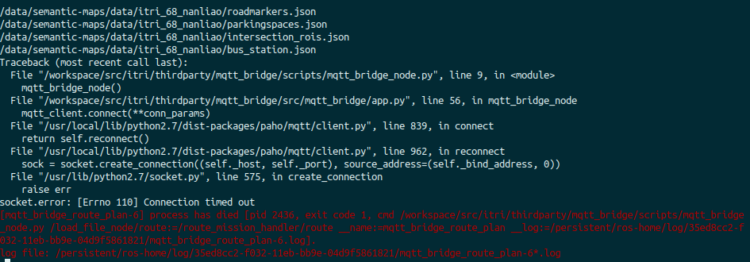

# Simulation Package - Trouble Shooting

## Module issue
### Error when running simulation in releas/highway branch
* Error message

* Solution: 因為模擬沒有lane detection 的結果，現在寫成一定要用lane detection，模擬時需要build fake_lane_detection package 並且在vehicle configuration 將parameters.yaml的use_openpilot設成false，最後在開啟sdc run.launch之前先開啟roslaunch fake_lane_detection run.launch
    * For launching simulation_adv/simulation.launch or simulation_adv/run.launch with argument velocity_in_ego_coord:=true, fake_lane_detection will be ran automatically.

## Remote Server Connection Issue

### Recommended work flow
* if all works fine, the connection should be fine. ( Otherwise please log here. )

#### Procedure

1. ping remote host from local host
2. ping local host from remote host
3. launch roscore on remote
    * ROS_MASTER_URI of remote docker must be in format `http://[machine_name]:[port #]`
4. publish a random topic from local and echo at remote
5. publish a random topic from remote and echo at local

#### Test failure during checking procedure

##### Step 4. failure: remote machine cannot echo topic that is published from local machine
* Can happen when trying to run ViL testing.
* There are many internet interface on each machine, find their common broadcast's ip and use the ip under that broadcast.
##### Step 5. failure
* It is possible that local machine does not recognize remote ip.
    * Add IP information to /etc/hosts in local docker
        * i.e. `140.96.39.235   d400-ProLiant-DL380-Gen10`
    * Or through command line:
        * `sudo -- sh -c "echo '192.168.5.2      black-panther-p1' >> /etc/hosts"`

##### Other failure
* Check if `127.0.0.1   [Machine Name]` is in /etc/hosts of remote docker.
* Not encountered yet.

## catkin_make failed

##### Imgui / vehicle_gateway not found
* Possible Causes:
    1. OVERLAID_WORKSPACE were set incorrectly
        * Solution: Check if [sdc]/ros/ is correctly mounted to /repository/ros in docker
    2. sdc package was only partly built
        * Solution: Build the missing package from /repository/ros accordingly.
            * e.g. [/repository/ros] $ catkin_make --only-pkg-with-deps autoware_msgs

##### scenario::Simulator::RunCarlaUpdate error
* Error message
> /project/mmsl_simulation/src/scenario/src/scenario/scenario_simulator.cpp: In member function 'virtual void scenario::Simulator::RunCarlaUpdate(std::vector<carla::ActorUpdateData>\*)': /project/mmsl_simulation/src/scenario/src/scenario/scenario_simulator.cpp:112:40: error: 'accumulate' is not a member of 'std' const std::size_t actorSize = std::accumulate(

* Solution: Add `#include<numeric>` to scenario/src/scenario/scenario_simulator.cpp

##### Simulation package make fail
* Error message

> /repository/ros/devel/lib/liballegro_monolith-static.a(xfullscreen.c.o): In function 'xinerama_init':
> /repository/ros/src/itri/thirdparty/Imgui/allegro5/src/x/xfullscreen.c:186: undefined reference to 'XineramaQueryExtension'
> /repository/ros/src/itri/thirdparty/Imgui/allegro5/src/x/xfullscreen.c:188: undefined reference to 'XineramaQueryVersion'
> /repository/ros/src/itri/thirdparty/Imgui/allegro5/src/x/xfullscreen.c:191: undefined reference to 'XineramaIsActive'
> /repository/ros/src/itri/thirdparty/Imgui/allegro5/src/x/xfullscreen.c:195: undefined reference to 'XineramaQueryScreens'
> /repository/ros/devel/lib/liballegro_monolith-static.a(xrandr.c.o): In function 'xrandr_set_mode':
> /repository/ros/src/itri/thirdparty/Imgui/allegro5/src/x/xrandr.c:537: undefined reference to 'XRRSetCrtcConfig'
> /repository/ros/src/itri/thirdparty/Imgui/allegro5/src/x/xrandr.c:572: undefined reference to 'XRRSetScreenSize'
> /repository/ros/devel/lib/liballegro_monolith-static.a(xrandr.c.o): In function 'xrandr_handle_xevent':
> /repository/ros/src/itri/thirdparty/Imgui/allegro5/src/x/xrandr.c:772: undefined reference to 'XRRUpdateConfiguration'
> /repository/ros/devel/lib/liballegro_monolith-static.a(xrandr.c.o): In function 'xrandr_restore_mode':
> /repository/ros/src/itri/thirdparty/Imgui/allegro5/src/x/xrandr.c:601: undefined reference to 'XRRSetCrtcConfig'
> /repository/ros/devel/lib/liballegro_monolith-static.a(xrandr.c.o): In function '\_al_xsys_xrandr_init':
> /repository/ros/src/itri/thirdparty/Imgui/allegro5/src/x/xrandr.c:796: undefined reference to 'XRRQueryExtension'
> /repository/ros/src/itri/thirdparty/Imgui/allegro5/src/x/xrandr.c:798: undefined reference to 'XRRQueryVersion'
> /repository/ros/devel/lib/liballegro_monolith-static.a(xrandr.c.o): In function 'xrandr_query':

> /repository/ros/src/itri/thirdparty/Imgui/allegro5/src/x/xrandr.c:326: undefined reference to 'XRRGetScreenResources'
> /repository/ros/src/itri/thirdparty/Imgui/allegro5/src/x/xrandr.c:382: undefined reference to 'XRRSelectInput'
> /repository/ros/src/itri/thirdparty/Imgui/allegro5/src/x/xrandr.c:383: undefined reference to 'XRRSelectInput'
> /repository/ros/devel/lib/liballegro_monolith-static.a(xrandr.c.o): In function 'xrandr_copy_screen':
> /repository/ros/src/itri/thirdparty/Imgui/allegro5/src/x/xrandr.c:229: undefined reference to 'XRRGetOutputInfo'
> /repository/ros/src/itri/thirdparty/Imgui/allegro5/src/x/xrandr.c:233: undefined reference to 'XRRFreeOutputInfo'
> /repository/ros/src/itri/thirdparty/Imgui/allegro5/src/x/xrandr.c:219: undefined reference to 'XRRFreeCrtcInfo'
> /repository/ros/src/itri/thirdparty/Imgui/allegro5/src/x/xrandr.c:215: undefined reference to 'XRRGetCrtcInfo'
> /repository/ros/devel/lib/liballegro_monolith-static.a(xrandr.c.o): In function '\_al_xsys_xrandr_exit':

> /repository/ros/src/itri/thirdparty/Imgui/allegro5/src/x/xrandr.c:895: undefined reference to 'XRRFreeScreenResources'
> collect2: error: ld returned 1 exit status
> simulation/CMakeFiles/simulation_node.dir/build.make:446: recipe for target '/project/mmsl_simulation/devel/lib/simulation/simulation_node' failed
> make[2]: \*\*\* [/project/mmsl_simulation/devel/lib/simulation/simulation_node] Error 1
> CMakeFiles/Makefile2:11711: recipe for target 'simulation/CMakeFiles/simulation_node.dir/all' failed
> make[1]: \*\*\* [simulation/CMakeFiles/simulation_node.dir/all] Error 2
> make[1]: \*\*\* Waiting for unfinished jobs....

* Cause:
    * OpenGL link issue ?

* Solution:
    * Make sure all below are added to target_link_libraries of simulation/CMakeLists.txt
        * X11
        * Xi
        * Xcursor
        * Xrandr
        * Xxf86vm
        * Xcursor
        * Xinerama
    * https://stackoverflow.com/questions/21685903/glfw3-undefined-reference-to-xrr

##### carla-ros-bridge/pcl_recorder related  error
* Error message

> CMakeFiles/Makefile2:10174: recipe for target 'carla_ros_bridge/pcl_recorder/CMakeFiles/pcl_recorder_node.dir/all' failed

> make[1]: *** [carla_ros_bridge/pcl_recorder/CMakeFiles/pcl_recorder_node.dir/all] Error 2

>make[1]: *** Waiting for unfinished jobs....

* Cause:
    * submodule carla-ros-bridge is not initialized.
* Solution:
    * Initialize carla-ros-bridge by ` $ git submodule update --init --recursive `
        * This will clone the whole ros-bridge to the submodule.

##### libvtkRenderingPythonTkWidgets.so
* Error message

> -- The imported target "vtkRenderingPythonTkWidgets" references the file

> "/usr/lib/x86_64-linux-gnu/libvtkRenderingPythonTkWidgets.so"

> but this file does not exist.  Possible reasons include:

> ...

* Solution:
    * Check if python-vtk6 was installed by ` $ ls -l /usr/lib/python2.7/dist-packages/vtk/libvtkRendering*`
    * If not, install it by ` $ sudo apt-get install python-vtk6 `
    * Otherwise, make a soft link by ` $ sudo ln -s /usr/lib/python2.7/dist-packages/vtk/libvtkRenderingPythonTkWidgets.x86_64-linux-gnu.so /usr/lib/x86_64-linux-gnu/libvtkRenderingPythonTkWidgets.so `
    * [ref](https://www.twblogs.net/a/5cbf9717bd9eee397113c830)

* Note: Caused by PCL library. The error message does not show in red color.

##### Unknown CMake command "roslaunch_add_file_check"
* Error messages not recorded but it came with ackermann_msgs not found error.
* Solution: I realize that switching between branches sometimes delete and re-add the ros-bridge submodule, which made the submodule uninitialized. After re-initialize the submodule, the build error gone.

##### carla_ros_bridge/rviz_carla_plugin/CMakeFiles/rviz_carla_plugin.dir/build.make:165: recipe for target 'carla_ros_bridge/rviz_carla_plugin/CMakeFiles/rviz_carla_plugin.dir/rviz_carla_plugin_automoc.cpp.o' failed

* Error messages:
> /project/mmsl_simulation/build/carla_ros_bridge/rviz_carla_plugin/moc_carla_control_panel.cpp:92:27: error: 'ros::message_traits::rviz_carla_plugin' has not been declared
>
> /project/mmsl_simulation/build/carla_ros_bridge/rviz_carla_plugin/moc_carla_control_panel.cpp:95:9: error: 'CarlaControlPanel' was not declared in this scope
>
> In file included from /project/mmsl_simulation/build/carla_ros_bridge/rviz_carla_plugin/rviz_carla_plugin_automoc.cpp:2:0: /project/mmsl_simulation/build/carla_ros_bridge/rviz_carla_plugin/moc_carla_control_panel.cpp:95:28: error: '\_t' was not declared in this scope
>
> /project/mmsl_simulation/build/carla_ros_bridge/rviz_carla_plugin/moc_carla_control_panel.cpp:95:45: error: 'CarlaControlPanel' does not name a type
>
> ...
>
> /project/mmsl_simulation/build/carla_ros_bridge/rviz_carla_plugin/moc_carla_control_panel.cpp:132:26: error: 'ros::message_traits::rviz_carla_plugin' has not been declared
>
> /project/mmsl_simulation/build/carla_ros_bridge/rviz_carla_plugin/moc_carla_control_panel.cpp:134:47: error: cannot call member function 'virtual int rviz::Panel::qt_metacall(QMetaObject::Call, int, void\*\*)' without object
>
> /project/mmsl_simulation/build/carla_ros_bridge/rviz_carla_plugin/moc_carla_control_panel.cpp:139:32: error: invalid use of 'this' in non-member function
* Solution: Just remove build/ and /devel, run ` $ catkin_make` again.
>

##### /usr/bin/ld: cannot find -lXrandr

* Solution: **Comment** Xrandr and Xinerama in target_link_libraries section in simulation/CMakeLists.txt

* Full Error Message:

> /usr/bin/ld: cannot find -lXrandr  
> /usr/bin/ld: cannot find -lXinerama  
> collect2: error: ld returned 1 exit status  
> simulation/CMakeFiles/simulation_node.dir/build.make:446: recipe for target '/project/mmsl_simulation/devel/lib/simulation/simulation_node' failed  
> make[2]: *** [/project/mmsl_simulation/devel/lib/simulation/simulation_node] Error 1  
> CMakeFiles/Makefile2:3453: recipe for target 'simulation/CMakeFiles/simulation_node.dir/all' failed  
> make[1]: *** [simulation/CMakeFiles/simulation_node.dir/all] Error 2  
> make[1]: *** Waiting for unfinished jobs....  
> Makefile:138: recipe for target 'all' failed  
> make: *** [all] Error 2  