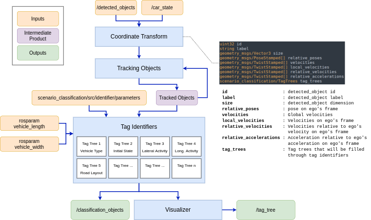
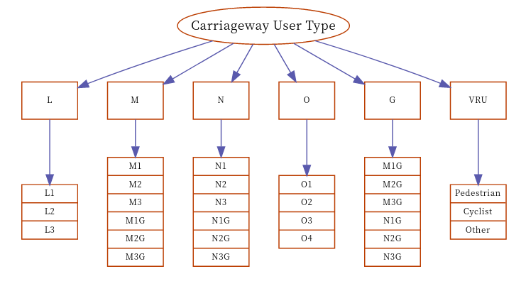
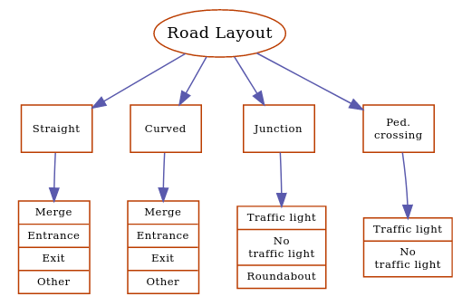
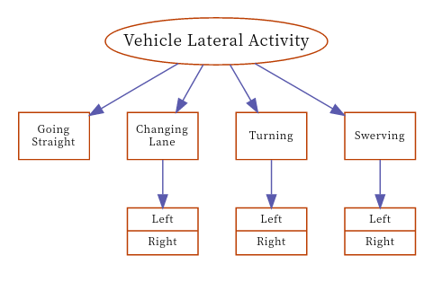
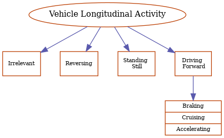
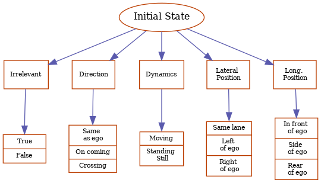
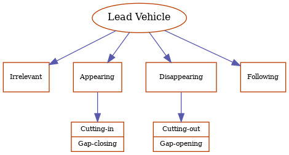
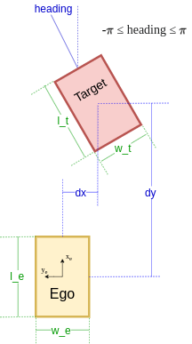
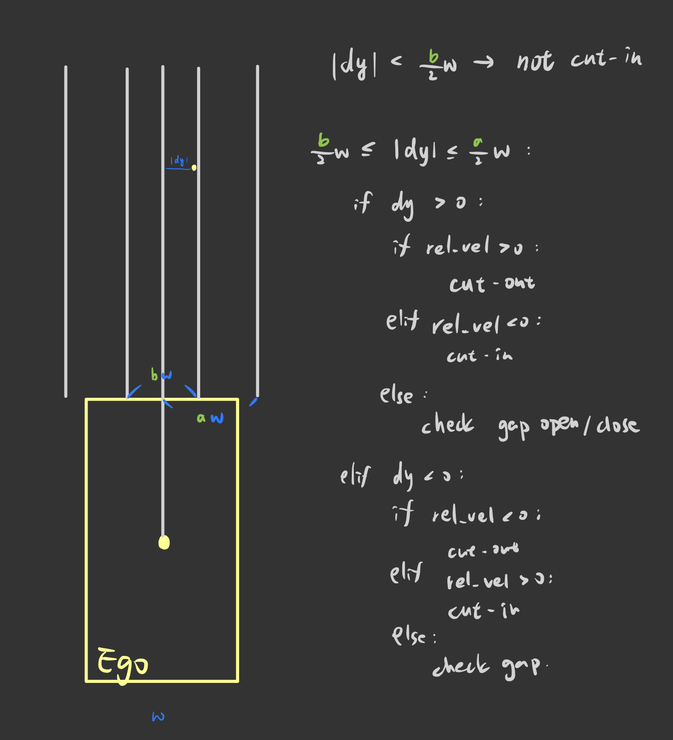

# scenario_classification


## Tree of Tags

### Overview


### Tag Trees Definitions
- Note: For Initial State Tag Tree, a secondary category have to picked under ALL primary categories, as for other trees, only 1 secondary category under only 1 primary category will be chosen at once.
- Note: 除了Initial State需要同時判斷四個主要類別下該選取哪個次要類別外，其他Tag Tree在同個情境下都只會有某一個主要類別下的某一個次要類別符合條件。

<p float="left">
	
	
	
	
	
	
</p>

### How to
#### (A) Implement a tree of tag that is already exists
##### In C++
1. Adding the implementation
	1. In scenario_classification/src/identifier/, copy identifier_carriageway_user_type.cpp and rename file name and class name accordingly.
	2. Choosing the input and output message type and add those headers.
	3. Modify data type in `IdentifyTag`
	4. Implement the code in `_Identifying`.
	5. Modify names in BOOST_PYTHON_MODULE.
2. Modifying CMakeLists.txt
	1. Add library by: `add_library(_identifier_[TAG_NAME]_cpp src/identifier/identifier_[TAG_NAME]_type.cpp)`.
	2. Add target_link_libraries by: `target_link_libraries(_identifier_[TAG_NAME]_cpp utils ${catkin_LIBRARIES} ${Boost_LIBRARIES})`.
	3. Add `_identifier_[TAG_NAME]_cpp` as a new line under `set_target_properties`.
3. Connecting to python script run_tree_of_tags.py
	1. Import the module by `from scenario_classification._identifier_[TAG_NAME]_cpp import Identifier[TAG_DEFINED_IN_1._5.]Type`
	2. Add a new member variable just like `self.identify_carriageway_user_type` did.
	3. Add the function in `update_tags` just like self.identify_carriageway_user_type did.
	4. update c_obj.tag_trees.[TagType]
##### In Python
1. Adding the implementation
2. Connecting to run_tree_of_tags.py

#### (B) Add a new tree of tag
1. Add an msg file in scenario_classification/msg
2. Add the newly added msg into `add_message_files` in CMakeLists.txt
3. Follow the instruction in (A).

### Develop Note
#### Not Yet Implemented in ClassificationObject
1. Angular velocity related fields is not filled.
2. Acceleration related fields should be double-checked
3. Lane related fields should be added into ClassificationObject since the lateral activity requires the information.

#### Implementation Details

##### ClassificationObject
```
uint32 id
string label
geometry_msgs/Vector3 size
geometry_msgs/PoseStamped[] relative_poses
geometry_msgs/TwistStamped[] velocities
geometry_msgs/TwistStamped[] local_velocities
geometry_msgs/TwistStamped[] relative_velocities
geometry_msgs/TwistStamped[] relative_accelerations
scenario_classification/TagTrees tag_trees
```

- id: detected_object id
- label: detected_object label
- size: detected_object dimension
- relative_poses: pose on ego's frame
- velocities: global velocities
- local_velcocities: velocities on ego's frame
- relative_velocities: velocities relative to ego's velocity on ego's frame
- tag_trees: tag trees that will be filled through tag identifiers

##### Carriageway User Type
1. Only depends on label given from the /detected_objects topic
##### Initial State
1. Initial states are depend on the first data of poses and velocities in ClassificationObject.msg.  They are filled in `update_tracked` in `run_tree_of_tags.py` as a deque, where the length of it can be configured in [parameters.h](std/identifier/parameters.h) through `TRACKED_PERIOD_HORIZON`.
2. Tag implmentation
	- relevent: If the target vehicle was initially at left and moving to left or the opposite, it will be recognized as not relevent.
	- direction: Direction is decided by relative heading if the target vehicle is relevent.
		- abs(heading) <= 45 deg: same as ego
		- abs(heading) >= 135 deg: on coming
		- otherwise: crossing
	- dynamics: Decided by target vehicles' velocity on ego's frame.
	- lateral_position: Decided by target vehicles' lateral position on ego's frame.
		- abs(dy) < (w_t + w_e) / 2 * `LATERAL_ASSUME_SAME_LANE_RATIO`: same lane
		- dy > (w_t + w_e) / 2 * `LATERAL_ASSUME_SAME_LANE_RATIO`: left of ego
		- dy < - (w_t + w_e) / 2 * `LATERAL_ASSUME_SAME_LANE_RATIO`: right of ego
	- longitudinal_position: Decided by target vehicles' longitudinal position on ego's frame.
		- abs(dx) < (l_t + l_e) / 2 * `LONGITUDINAL_ASSUME_SIDE_RATIO`: side by ego
		- dx > (l_t + l_e) / 2 * `LONGITUDINAL_ASSUME_SIDE_RATIO`: in front of ego
		- dx < - (l_t + l_e) / 2 * `LONGITUDINAL_ASSUME_SIDE_RATIO`: rear of ego
##### Lead Vehicle
1. In `_is_leader`, reversing vehicles are assumed not a leader, this will filter-out U-turn vehicles from the opposite lane and reversing vehicles from the same direction.
2. IdentifierLeadVehicle will check if the lead vehicle is in roi by satisfying all conditions:
	- dx > 0
	- abs(dy) < (w_t + w_e) / 2 * `PSYCHOLOGICALLY_STAGGERED_RATIO`
3. Check cut-in cut-out: Implemented in `_check_cut_in_out`.
	- If cut-in was assumed, primary category will be appearing.
	- If cut-out was assumed, primary category will be disappearing.
	- 
4. If the target was not moving, the relative speed on longitudinal direction will be checked:
	- If > `SPEED_DIFFERENCE_TOLERANCE`, assume gap opening for secondary category;
	- if < `SPEED_DIFFERENCE_TOLERANCE`, assume gap closing for secondary category.
5. For a moving object, the relative speed on longitudinal direction will be checked:
	- If > `ASSUME_APPEAR_OR_DISAPPEAR`, assume gap opening for secondary category;
	- If < `ASSUME_APPEAR_OR_DISAPPEAR`, assume gap closing for secondary category;
##### Longitudinal Activity
1. A vehicle is irrelevant if its heading angle is greater than MAX_RELEVANT_SAME_DIRECTION_ANGLE and smaller than MIN_RELEVENT_ON_COMING_ANGLE. Moreover, if a vehicle's relative position y is greater than two times its size y, it is also regarded as irrelevant.
2. In order to consider ego, use a vehicle's local velocity and relative velocity to determine its longitudinal activity.
3. If both the local velocity x and y are smaller than SPEED_DIFFERENCE_TOLERANCE, assume a vehicle is standing still.
4. If the local velocity x is negative and its magnitude is greater than SPEED_DIFFERENCE_TOLERANCE, assume a vehicle is reversing.
5. If a vehicle is not standing still or reversing, assume it is driving forward.
6. For a vehicle driving forward:
	- If the magnitude of its relative velocity x is smaller than SPEED_DIFFERENCE_TOLERANCE, assume it is cruising.
	- If its relative velocity x is positive, assume it is accelerating.
	- If its relative velocity x is negative, assume it is braking.
##### Lateral Activity
1. Use yaw rates (angular velocity z) and their moving average to determine if a vehicle is turning.
2. If the moving average > MIN_TURNING_YAW_RATE, assume a vehicle is turning left.
3. If the moving average < -MIN_TURNING_YAW_RATE, assume a vehicle is turning right.
4. If a vehicle is turning and its speed is greater than MIN_SWERVING_SPEED, assume it is swerving.
5. YAWRATE_SAMPLING_WIDTH is used to adjust the number of periods that the moving average use.

- TODO: Changing Lane
##### Road Layout