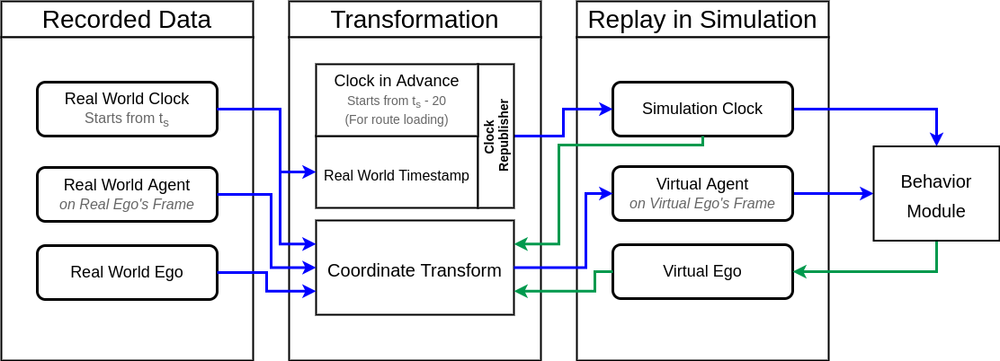

# scenario_tools

## Usage

### Replay rosbag with new behavior ego

#### Build and run scenario_tools to replay rosbag without unused dependencies

##### Tested on
* sdc commit # 73af5840c3a13027e9a7c811bcfd3a2084dbf3e3
* simulation commit # 99569bddb10e0fcbbc146a97fe23f2772a007ded
* semantic-map commit # 33d3f69d65418e55e7a2cff680b1a3428a6ab643

##### Procedure
1. Clone the simulation package
2. set the SDC_DOCKER_USER_VOLUME
    * `[somewhere]/simulation/ros:/project/mmsl_simulation:rw`
3. switch to the branch `feature/replay_tool`
4. modify param `bag` in `scenario_tools/launch/replay.launch`
5. modify param `bag_starts_from_begin_sec` if you wish to run the bag from the middle
6. `[Terminal 1] $ source /repository/ros/devel/setup.bash`
7. `[Terminal 1] $ cd /project/mmsl_simulation/`
8. `[Terminal 1] $ catkin_make --only-pkg-with-deps scenario_tools`
    * which will only build **path_msgs, scenario_msgs, scenario_tools, simulation_adv, simulation_msgs, simulation_srvs, simulation_utils**
9. `[Terminal 1] $ source devel/setup.bash`
10. `[Terminal 1] $ roslaunch scenario_tools replay.launch`
11. Wait until the vehicle model is loaded in rviz
12. `[Terminal 2] $ roslaunch sdc run.launch simulation:=true`
13. Wait until the green waypoints are shown.
14. Press space in `Terminal 1`
15. For details and limits of this tool, please refer to the [How It Works](#how-it-works) part

#### Instuctions

##### How It Works



1. This tool is to frequently transform objects' information from old frame (rosbag recorded base_link) to the new frame (simulation base_link).
2. Each parts of this tool are used to
    * `scenario_tools/replay.launch`: it is used to launch required node, required launch file and play rosbag
    * `detected_objects_transformer.py`: it is used to transform objects' information
    * `rosbag_replay_tool.py`: Calculation and republishing the clock. Also fetch the initial state of recorded ego.
3. To transform the information of objects takes a lot of computations, especially transforming predicted pathes and poses, if you wish to transform these infromation, make sure the `transform_predicted_poses` option in `scenario_tools/replay.launch` is set to true and the `play_rate` option should be adjust if the calculation is slow.
4. To make sure the calculation is fast enough, just press space at the launching terminal a few times too make sure those objects in rviz stopped immediately. If not, lower the `play_rate`.
5. If the simulation result is inconsistent, it is possible that it will get after lower the `play_rate`.
5. The physics and dynamics models of real world ego and simulation ego are slightly different, they will not be 100% synced even on the same branch of `sdc`. It is recommanded to use it within a short period of time (about 10 seconds will be ideal). Use the `bag_starts_from_begin_sec` to adjust starts time.

##### Params
1. ` $ roslaunch scenario_tools replay.launch`
    * This will launch visualization automatically. 
        * Disable rviz visualization by setting headless to true.
    * args:
        * `bag`: full path to bag
        * `bag_starts_from_begin_sec`: -s / --start option for rosbag play CLI
        * `pre_run_secs`: Time to load map and behavior before rosbag starts.
        * `transform_predicted_poses`: whether to transform predicted poses.
        * `play_rate`: [default=0.4] -r / --rate option for rosbag play CLI. A float number that represent the real time factor.
        * `velocity_in_ego_coord`: [default=false] Set to true if recorded detected_objects' velocity were on ego's frame.
        * `headless`: [default=false]
    * **NOTE**: It is important to set the `bag_starts_from_begin_sec` properly. Starting at the moment when dbw was already activated is expected. (It is ok to disable dbw during the simulation. The simulation ego will keep running.)
2. ` $ roslaunch sdc run.launch simulation:=true` when required.
    * Early launching sdc/run ( before ego spawned ) leads to the result that no waypoints will be published.
3. To start the bag, **_press space key_** on the terminal after `[RosBagReplayTool] Press space to run rosbag.` shows.
        
#### Explaination
* Only the following topics are extracted and replayed from a recorded bag:
    * /scenario_visualization
    * /detected_objects
    * /tf
    * /tf_static
    * /points_map_downsampler
    * /no_ground
    * /global_path  (currently not in used)
* topics remapping
    * /clock --> /clock_old
    * /tf --> /tf_old
    * /tf_static --> /tf_static_old
    * /detected_objects --> /detected_objects_old
* /tf remapping
    * transforms related to base_link were mapping to base_link_origin
    * /no_ground was linked by frame velodyne and frame base_link

* Nodes
    * rosbag_replay_tool
        * Read rosbag to get first /car_state of ego vehicle, reset the simulated ego vehicle to that status
        * Publish /clock (pre-run clock) before the start of rosbag in order to
            * load information for behavior
            * load information for simulation
        * Pre-run clock will be stopped under 3 condition:
            1. behavior done loading and /waypoint was published
            2. the rosbag starts playing by user.
            3. pre-run time run out.
        * Remap /clock_old to /clock
    * detected_objects_transformer_node
        * Detected objects from the bag were on base_link_origin frame, this node lookup tf tree and publish the pose observed from base_link frame to simulation_adv as "/external_detected_objects". 
        * In simulation_adv/ego_handler, the topic "/external_detected_objects" was subscribed and will be added to the detected objects list and published together.
    * tf_static_remapper_node
        * static_transform_publisher from tf2_ros does not implemented to remap links in /tf_static, so the node did the job.

#### Known Issues
* /tf_static between (recorded) base_link and velodyne seems not working as expected, hence a static_transform_publisher was added to the launch file
* behavior node might shows the following error but seems not affecting the result.
```
ERROR : Core : /repository/ros/src/itri/behavior/src/core.cpp(734) : Assertion failed : poly.corners.outer().size() > 2
[ WARN] [1626941035.413250319, 1626660763.763907679]: ClosestObjOnLocalPath dead !!!
```

### Run scenario with Simulated Real World Agent

##### 1) Specify interested agent(s)
1. `roslaunch scenario_tools reproduce_recorded_agent.launch`
    * args to specify recorded bag information:
        * `bag` [string]: full path to bag
        * `bag_starts_from_begin_sec` [float]: -s / --start option for rosbag play CLI
        * `time_horizon` [float]: Only get `time_horizon` seconds of time in rosbag from `bag_starts_from_begin_sec`.
        * `route` [string]: route param used by route_mission_handler.
        * `file_name` [string]: file_name param used by route_mission_handler.
    * args to specify interested agents
        * `obj_id` [-1 or list][default=-1]: Used to specify interested agents' object ids in the bag, set to -1 to load all agents. (Loading all agents may take a long time)
        * `filter_out_trajs_shorter_than_n_data` [int][default=10]: Ignore trajectories that has less data point than this value.
        * `filter_out_trajs_shorter_than_n_meters` [float][default=10.]: Ignore trajectories that the traveling distance of each point is less than this value.

    * args to specify saving condition
        * `set_ego_pose_n_sec_before` [float][default=5.]: Set simulation/data/ego.json to pose n second before first triggered agent. Set to -1 to use the first pose acquired from `bag_starts_from_begin_sec`, set to -2 to not set this value. 
        * `save_path` [string][default="$(find scenario)/data/saved_agent_traj.json"]
        * `ignore_item_in_msg` [list]: Ignore items in recorded itri_msgs/DetectedObject.
        * `find_point_in_range` [float][default=2.]: Not recommanded to change.

2. In GUI:
    * Check boxes on left-hand side can toggle specific agent id
    * Mouse events:
        * Scroll: Zoom In/ Out
        * Left: Select a point.
        * Right: Remoce last point / last trajectory.
    * Keyboard events:
        * `w`, `a`, `s`, `d`: Move window of view.
        * space: Save currently selected trajectory as 1 agent.
        * enter/ 'q': Leave and save current selected.

    * After selecting interested agents, the GUI will pop up again to show how agent's trajectories were assigned. Press enter or 'q' to leave.

    * Agents' information (along with trigger condition) will be saved to the path specified in launch file argument `save_path`.

##### 2) Run Saved Simulated Real Agent
1. `roslaunch scenario_tools run_real_agents.launch`
    * General Args:
        * `agent_data_path`: Where agents' information saved in last part.
        * `run`: Whether to launch sdc/run.launch with `simulation:=true` or not.
        * `headless`: Whether to NOT run sdc/visualization.launch or not.
    * To modify trigger time:
        * Trigger condition is satisfied when simulated ego vehicle reaches a circle trigger area.
        * The center of this area is the position when REAL ego vehicle first saw the agent in the rosbag.
        * To modify trigger conditions, 
            1. find the json file generated in last part, 
            2. find the agent by object id
            3. find "triggerCondition" of the agent.
                * triggerRange is the radius of the trigger area
                * triggerTimeOffset is to shift trigger time before (<0) or after (>0) trigger condition is satisfied.
                    * if triggerTimeOffset > 0, tigger time is delayed by this duration after simulated ego reaches the trigger area.
                    * if triggerTimeOffset < 0, 
                        * the triggerRange will not be used.
                        * predicted reach time will be calculated x-wise and y-wise by x_distance/x_speed and y_distance/y_speed, and take mean value.
                        * triggerTimeOffset second before the predicted time, the agent will be triggered.


