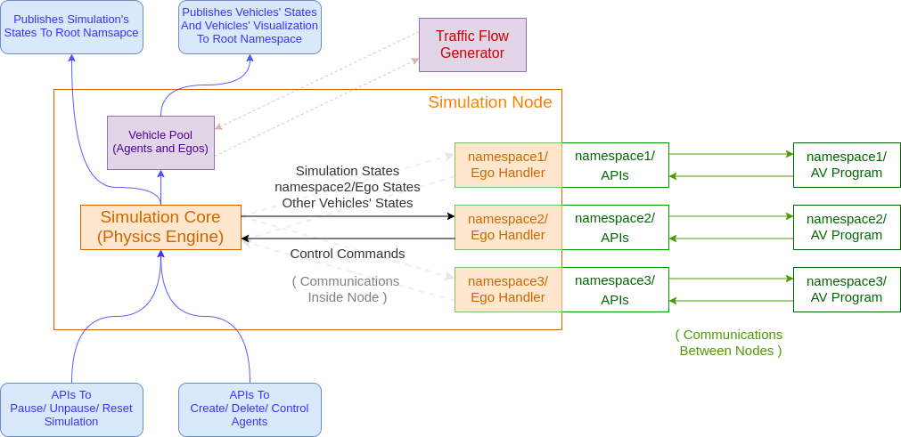

# simulation_adv

## Package Overview

* Features
    * Advanced simulation architecture which enables running simulation independently without ego spawned.
    * The use of Context structure in simulation package was removed, replaced by member variable of Simulation and EgoHelper.
    * The GUI interface was removed.
    * The control options of simulation (Pause/ Unpause/ Reset) were kept and work fine.
    * Newly added module ego handlers are held in simulation node, they work as interfaces which translate simulation informations to informations that AV programs need, then translate the AV programs' commands to control vehicles in the simulation.
* Other Notes
    * To spawn an vehicle, use service name /simulation/agent_srv/create with type SimulationCreatAgent.srv.
    * If a spawned vehicle has "ego" as a substring of agentId, the vehicle will be recognized as a ego vehicle, an ego handler will be created accordingly.
    * To create an ego under a specific namespace, create vehicle with namespace/ego_name as agentId.

## Testing Under
* Behavior repository commit # caa7b3e62256abf5bbc51d3cfd0606bdf2a6d2b3

## Usage
### Simulation
#### Steps
1. $ roslaunch sdc visualization.launch
2. $ roslaunch simulation_adv simulation.launch
3. Spawn Vehicle by /simulation/agent_srv/create service.
    * e.g. $ rosservice call /simulation/agent_srv/create '{"agentId": 'ego', "objectClassId": '', "pose": {"position": {"x": -109.923, "y": 69.962, "z": 0.0}, "orientation": {"x": 0.0, "y": 0.0, "z": 2.45, "w": 0.0}}, "size": {"x": 5.17, "y": 2.2, "z": 0.0}, "color": {"r": 0.0, "g": 0.0, "b": 0.0, "a": 0.0}, "simWithExternalVehicle": false}'
    * Will come out with a better and easier way to spawn vehicle.
4. $ roslaunch sdc run.launch simulation:=true

#### Explanations
* With no namespace assigned in step 3, it works almost the same as the original simulation package.

### Multiple Ego Simulation
#### Steps
1. $ roslaunch sdc visualization.launch \__ns:=ego1
2. $ roslaunch simulation_adv simulation.launch
3. Spawn 2 vehicles with agentId ego1/ego and ego2/ego 
    * $ rosservice call /simulation/agent_srv/create '{"agentId": 'ego1/ego', "objectClassId": '', "pose": {"position": {"x": -109.923, "y": 69.962, "z": 0.0}, "orientation": {"x": 0.0, "y": 0.0, "z": 2.45, "w": 0.0}}, "size": {"x": 5.17, "y": 2.2, "z": 0.0}, "color": {"r": 0.0, "g": 0.0, "b": 1.0, "a": 0.0}, "simWithExternalVehicle": false}'
    * $ rosservice call /simulation/agent_srv/create '{"agentId": 'ego2/ego', "objectClassId": '', "pose": {"position": {"x": -29.211, "y": 0.699, "z": 0.0}, "orientation": {"x": 0.0, "y": 0.0, "z": 2.495, "w": 0.0}}, "size": {"x": 5.17, "y": 2.2, "z": 0.0}, "color": {"r": 0.0, "g": 0.0, "b": 0.0, "a": 0.0}, "simWithExternalVehicle": false}'
4. $ roslaunch sdc run.launch simulation:=true \__ns:=ego1
5. $ roslaunch sdc run.launch simulation:=true \__ns:=ego2

#### Explanations
* To use a namespace argument in step 1 is to show visualization correctly, otherwise, the rviz packages only subscribes to topics like /waypoints, /viz_IA_ROI, /semantic_roadmarker_array under root namespace.
* The simulation_adv package still publishes agent visualizations to root namespace, so please modify topic name of scenario_visualization back to /scenario_visualization, which should be /ego1/scenario_visualization by now because of the namespace assignment in step1.
* To visualize vehicle models, please modify the "TF Prefix" field of "Vehicle Model" to ego1, then duplicate the item and modify to ego2.
* Do "$ rostopic list", "$ rosparam list /", "$ rosnode list" to have a better  understanding what these simulation does.

## Statistic 
#### Calculation time that may be helpful for further acceleration idea in the future:
##### Test for simulation iteration

* Hardware

    * cpu: Intel(R) Core(TM) i9-9900K CPU @ 3.60GHz
    * ram: 64G
    * gpu: Geforece RTX 2080 Ti

* Note

    * Only simulation nodes were executed.

* Test Cases

    * Simulation OneStep() 

        * Calculation: 

            * Record time to execute 1 iteration of simulation::OneStep and only calculate time between 61s. and 120s. to make sure the initial process didn't affect too much.
            * None of vehicles were crossing / having collision with others.

        * Procedure

            * $ roslaunch simulation_adv simulation.launch

        * Data

            * for 1 iteration with no vehicles.
                * mean: 0.0106902 ms, stdev: 0.0067212, max: 0.037310
            * for 1 iteration with 1 ego.
                * mean: 0.0407604 ms, stdev: 0.0271546, max: 1.422140
            * for 1 iteration with 5 egos.
                * mean: 0.1459670 ms, stdev: 0.0632465, max: 1.486510
            * for 1 iteration with 10 egos.
                * mean: 0.421589  ms, stdev: 0.1681910, max: 1.474610
            * for 1 iteration with 1 agent.
                * mean: 0.0339037 ms, stdev: 0.0185964, max: 0.674790
            * for 1 iteration with 5 agents.
                * mean: 0.0748155 ms, stdev: 0.0380095, max: 1.379430
            * for 1 iteration with 10 agents.
                * mean: 0.118167  ms, stdev: 0.0530009, max: 1.409530
            * for 1 iteration with 100 agents.
                * mean: 0.838249  ms, stdev: 0.3475590, max: 1.966280
            * for 1 iteration with 10 egos and 100 agents.
                * mean: 3.59011 ms, stdev: 1.91261, max: 8.56443

    * Triggered By Service

        * Calculation:

            * Write a node to keep calling ther service and calculate the time between sending service call and getting response.

        * Procedure

            * $ roslaunch simulation_adv simulation.launch by_tick:=true
            * $ rosrun simulation_adv trigger_time_test

        * Data

            * for 1 iteration with no vehicles.
                * mean: 2.37408 ms, stdev: 0.650742, max: 3.07388
            * for 1 iteration with 1 ego.
                * mean: 2.33952 ms, stdev: 0.72583, max: 3.9111
            * for 1 iteration with 5 egos.
                * mean: 2.47177 ms, stdev: 0.753638, max: 4.20021
            * for 1 iteration with 10 egos.
                * mean: 2.78722 ms, stdev: 0.848866, max: 4.61223
            * for 1 iteration with 1 agent.
                * mean: 2.26945 ms, stdev: 0.751739, max: 3.95397
            * for 1 iteration with 5 agents.
                * mean: 2.39991 ms, stdev: 0.729829, max: 3.9083
            * for 1 iteration with 10 agents.
                * mean: 2.42587 ms, stdev: 0.748402, max: 4.1889
            * for 1 iteration with 100 agents.
                * mean: 3.36185 ms, stdev: 0.995652, max: 4.56214
            * for 1 iteration with 10 egos and 100 agents.
                * mean: 5.86316 ms, stdev: 2.38561, max: 11.4145

* Possible future improvements
    1. Use libtraci, the c++ API for SUMO, to connect to the SUMO server, uses the built-in mechanism of SUMO server to block simulation steps.
    2. (Not Ideal) Embed SUMO co-simulation in simulation node.