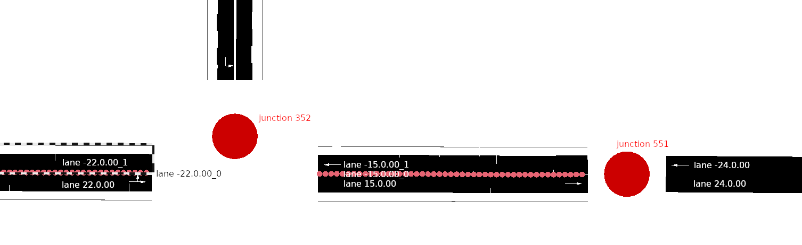
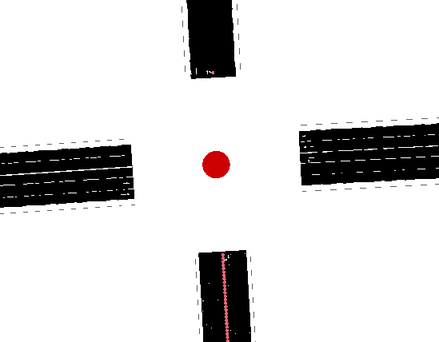
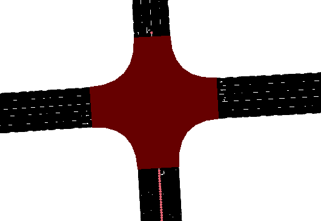

# Add a New SUMO Configuration Using New .xodr Map From Scratch

## Note

## Prerequisition (Take Shuinan map for example)
1. Install sumo and sumo-tools
2. Set environment variable SUMO_HOME
3. OpenDRIVE format map. (shuinan_ceci_3_thi_sidewalk.xodr)

## Touble Shooting
1. Vehicles stop at the end of some edge.
    - Find the id of that vehicle.
    - Check .rou.xml file and find the edge the vehicle is stopped by and the next edge.
    - Find these 2 edge in netedit, check the junction if there is a inLane connection between these two edge.
    - If not, reconnect the junction. (See Procedure-Step 4.-3)
2. Duarouter error
    - Check connection (See Procedure-Step 4.-3)

## Procedure
#### Step 1. Add a config folder under sumo_configuration/data/
e.g. `$ mkdir /project/mmsl_simulation/src/sumo_configuration/data/shuinan/`

#### Step 2. Convert .xodr file to .net.xml file
- e.g. `netconvert --opendrive shuinan_ceci_3_thi_sidewalk.xodr -o /project/mmsl_simulation/src/sumo_cosimulation/data/shuinan/shuinan.net.xml`
- note: There might be serveral warning showing up. It can be fixed in next step.

#### Step 3. Check the warning messages.
- It is possible that the warning won't do any harm, in order to check if they are critical, I suggest firstly check it in raw data.
    - For example, one of the warning message is `Warning: Lane '-15.0.00_0' is not connected from any incoming edge at junction '551'.`
    - Find the lane in shuinan.net.xml and get the following lines:
        ```xml
        <edge id="-15.0.00" from="551" to="352" priority="1" type="driving" shape="...">
            <lane id="-15.0.00_0" index="0" allow="emergency authority" speed="17.88" length="47.31" width="0.20" shape="..." type="driving"/>
            <lane id="-15.0.00_1" index="1" disallow="pedestrian tram rail_urban rail rail_electric rail_fast ship" speed="17.88" length="47.31" width="3.28" shape="..." type="driving"/>
        </edge>
        ```
        - (＊) 
        - The config shows that edge -15.0.00 is connecting junction 551 and junction 352 with 2 lanes. 
        - The lane -15.0.00_0 is connected to lane -22.0.00_0 through junction 352 but not connected to any lane throught 551, hence the warning message.
        - It seems that lane -15.0.00_0 is a region between lanemarks, the warning indicate that it is not connected to the next lane. Which is just fine so I simply ignore it.
- (＊) `$ netedit [MAP_NAME].net.xml`
    - e.g. `$ netedit shuinan.net.xml`
    - Use locate tool in tool bar of netedit to find edge or junction listed in the warning when generating .net.xml file

#### Step 4. Fix map connections.
In MMSL HD Map, the edge parts of each road outside the lane mark were labeled as another lane, which causes a lot of warnings / connecting errors. It is recommanded to manually re-connect every intersections in netedit.

#### 1) Run net edit by `$ netedit shuinan.net.xml`
- Junctions were represented by a red spot looks like below
    - 
- Press F5 to calculate junctions and get the following:
    - 

#### 2) Fix frindge edge u-turn issue
- Fringe edge is the edge that do not have successor edges, this idea is important when we will try to spawn vehicles from fringe edge.
- It is possible that fringe edges were set to u-turn in the net.xml file, use netedit to fix it by
    1. Use connection mode (hotkey: c)
    2. Select a fringe edge, if the opposite lane show in light green, click the lane, then click OK in the left bar, then ctrl-s to save.
    3. Check every fringe edge.
- If frinde edge is not checked, it might cause error when generating routes.

#### 3) Fix inLane connection of junctions
- Junctions contains inLane connections but they were not well formed, hence some edge will not be able to go to an outgoing edge. This will cause vehicle stopped if the routing connect this edge to the unconnected outgoing edge.
- It is recommended to reconnet all junction by hand.
- To reconnect a junction in netedit.
    1. Use inspection mode (hotkey: i)
    2. Right click the junction in brown part and select "Clear Connections"
    3. Switch to conncection mode (hotkey: c)
    4. Click on lanes to connect. 
        - Connect carefully, this may cause routing issue if the connections are too messy. It is recommended to 
            - Choose left-most lane of same edge to connect to the left-most lane of the left turn edge and vice versa.
            - For straight going cases, if do not make the inLane corssing with other straight going lane.
    5. Click OK in the left bar for each target lane and save.

### Step 5. Vehicle demand modelling 
- This instruction demonstrates how to generate vehicle flows by **turning count** of a single intersection.
- For more ways to generate different traffic flow, please refer to [demand_modelling.md](demand_modelling.md)
- First we define a turn file.
    1. Define turn count file. e.g. shuinan.turns.xml
        ```xml
        <edgeRelations>
           <interval id="h1" begin="0.0" end="3600.0">
               <edgeRelation from="-11.0.00" to="14.0.00" count="3" type="carTypeDistribution"/>
               <edgeRelation from="-11.0.00" to="14.0.00" count="4" type="motorcycleTypeDistribution"/>
               <edgeRelation from="-11.0.00" to="-24.0.00" count="178" type="carTypeDistribution"/>
               <edgeRelation from="-11.0.00" to="-24.0.00" count="178" type="motorcycleTypeDistribution"/>
               <edgeRelation from="-11.0.00" to="-0.0.00" count="18" type="carTypeDistribution"/>
               <edgeRelation from="-11.0.00" to="-0.0.00" count="18" type="motorcycleTypeDistribution"/>

               <edgeRelation from="-14.0.00" to="-24.0.00" count="38" type="carTypeDistribution"/>
               <edgeRelation from="-14.0.00" to="-24.0.00" count="38" type="motorcycleTypeDistribution"/>
               <edgeRelation from="-14.0.00" to="-0.0.00" count="260" type="carTypeDistribution"/>
               <edgeRelation from="-14.0.00" to="-0.0.00" count="260" type="motorcycleTypeDistribution"/>
               <edgeRelation from="-14.0.00" to="11.0.00" count="2" type="carTypeDistribution"/>
               <edgeRelation from="-14.0.00" to="11.0.00" count="2" type="motorcycleTypeDistribution"/>
               
               <edgeRelation from="24.0.00" to="-0.0.00" count="24" type="carTypeDistribution"/>
               <edgeRelation from="24.0.00" to="-0.0.00" count="24" type="motorcycleTypeDistribution"/>
               <edgeRelation from="24.0.00" to="11.0.00" count="90" type="carTypeDistribution"/>
               <edgeRelation from="24.0.00" to="11.0.00" count="90" type="motorcycleTypeDistribution"/>
               <edgeRelation from="24.0.00" to="14.0.00" count="12" type="carTypeDistribution"/>
               <edgeRelation from="24.0.00" to="14.0.00" count="12" type="motorcycleTypeDistribution"/>
               
               <edgeRelation from="0.0.00" to="11.0.00" count="40" type="carTypeDistribution"/>
               <edgeRelation from="0.0.00" to="11.0.00" count="40" type="motorcycleTypeDistribution"/>
               <edgeRelation from="0.0.00" to="14.0.00" count="253" type="carTypeDistribution"/>
               <edgeRelation from="0.0.00" to="14.0.00" count="253" type="motorcycleTypeDistribution"/>
               <edgeRelation from="0.0.00" to="-24.0.00" count="186" type="carTypeDistribution"/>
               <edgeRelation from="0.0.00" to="-24.0.00" count="186" type="motorcycleTypeDistribution"/>          
           </interval>
        </edgeRelations>
        ```
    2. Then we define vehicles, which should already exist as [sumo_cosimulation/data/vehicles.add.xml](sumo_cosimulation/data/vehicles.add.xml)
    3. We are using [duarouter](https://sumo.dlr.de/docs/duarouter.html) to generate from .flow.xml file to .rou.xml file. So first we convert .turns.xml file to .flow.xml file.
        - e.g. `[sumo_cosimulation/data/shuinan] $ python ../../script/generate_by_turn_count.py -n shuinan.net.xml -t shuinan.turns.xml -v ../vehicles.add.xml -f shuinan.flow.xml -o shuinan.rou.xml --begin 0 --end 3600 --count-param 1`
        - This will generate a new file named shuinan.flow.xml
    4. The script calls duarouter afterward.
        - This will generate 2 new files shuinan.rou.xml and shuinan.rou.alt.xml

### Step 6. Run SUMO
1. Write a .sumocfg file. [(Find details here)](https://sumo.dlr.de/docs/Tutorials/Hello_SUMO.html#configuration)
    - Minimum Example
    ```xml
    <?xml version="1.0" encoding="UTF-8"?>

    <configuration xmlns:xsi="http://www.w3.org/2001/XMLSchema-instance" xsi:noNamespaceSchemaLocation="http://sumo.dlr.de/xsd/sumoConfiguration.xsd">
        <input>
            <net-file value="shuinan.net.xml"/>
            <route-files value="shuinan.rou.xml"/>
        </input>
        <time>
            <step-length value="0.05"/>
        </time>
    </configuration>
    ```
    - Recommended (Take highway off_ramp scenario for example)
        - extra files `vehicles.add.xml` and `viz_settings.xml` are needed
            - `vehicles.add.xml` defines different type of vehicles and should be already exists under `[sumo_cosimulation]/data/`
            - `viz_setting.xml` modify the visual effect of sumo-gui and should be already exists under `[sumo_cosimulation]/data/` as well.
    ```xml
    <?xml version="1.0" encoding="UTF-8"?>

        <configuration xmlns:xsi="http://www.w3.org/2001/XMLSchema-instance" xsi:noNamespaceSchemaLocation="http://sumo.dlr.de/xsd/sumoConfiguration.xsd">
            <input>
                <net-file value="itri_68_gateway.net.xml"/>
                <route-files value="off_ramp.rou.xml"/>
                <additional-files value="../vehicles.add.xml"/>
            </input>
            <time>
                <step-length value="0.05"/>
            </time>
            <processing>
                <extrapolate-departpos value="true"/>
                <lateral-resolution value="0.5"/>  <!-- Enable lane spliting behavior -->
                <max-num-vehicles value="200"/>
                <random-depart-offset value="1.6"/>
                <time-to-impatience value="0.5"/>
                <default.speeddev value="15.0"/>
                <ignore-route-errors value="true" />
            </processing>
            <gui_only>
                <gui-settings-file value="../viz_settings.xml"/>
                <delay value="0"/>
                <tracker-interval value="0.01"/>
                <start value="false"/>
            </gui_only>
        </configuration>
    
    ```
2. Now try it by running the following command
    - `[sumo_cosimulation/data/shuinan] $ sumo-gui -c shuinan.sumocfg`

3. Setting offset.
    - There is a x-y offset between sumo map and mmsl HD Map (no orientation offset)
    - To compensate the offset, refer to [data/offsets.json](data/offsets.json)